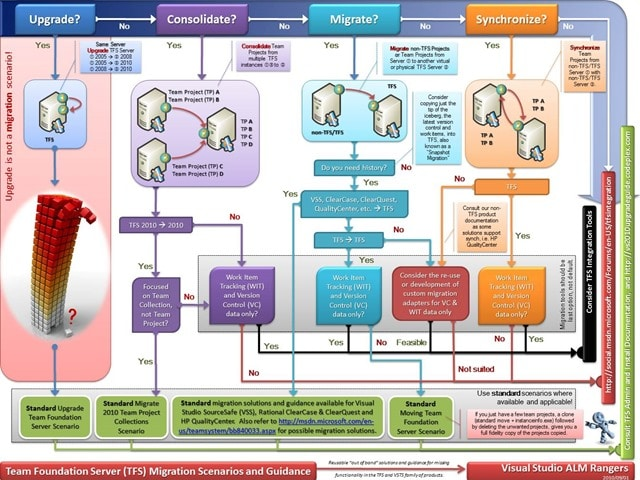

If you have ever had to migrate data from any system that contains lots of data and especially history then you will have run into this problem. Effectively you have two choices:

- **Upgrade with full history, correct dates and uninterrupted reporting**
- **Migrate with tip/full history with truncated dates and no past reporting**

This is also the case with Team Foundation Server and every customer that we have that wants to do a migration of data voices the same concern:

> “We can’t be the first company to make such a request, as financial institutions and other companies need to have the history moved, have it searchable and reportable.”  
> \-Anonymous Customer

In order to support little things like Sarbanes Oxley (SOX), CRF11, HIPPA, FDA or NRA you need to, generally, be able to prove tractability from “Source Code | Builds | Tests| Requirements”. You need to be able to show, on demand, how a line of code got into your application, why, who requested it and how it was tested. This is hard at the best of times and impossible most of the time if you have separate systems that all authenticate differently or store data differently.

  
{ .post-img }
**Figure: Visual Studio ALM Tractability Matrix**

Do a test on your software. Pick a like of code and figure out who added it to the system and how it was changed over time. Now, for each of those changes figure out why that change was done and who authorised it. Can you do that?

Now consider a couple of…modifiers. How sure are you that the system told you the truth? It is is not Active Directory integrated can you really be sure that this is a traceable user? When was the last time that you changed that Visual SourceSafe account password? If it was not in the last 90 days then you may be out of compliance.

Its not just for enterprises; if your software in any way contributes to the decisions made by executives of public companies then you need to be able to provide that tractability. What about banks? Has your software ever been used by a financial institution to figure out what to do? Yes, that means Excel is covered by SOX and if an algorithm was not interpreted correctly then the SOX folks would be going through the Excel source with a tooth comb.

Because of these small requirements it is impossible to edit data in the past in Team Foundation Server and indeed to add data to the past. That means that when you do a “migration” and not an “upgrade” you are effectively replaying all of that history at speed against a new instance. All of your dates will be consecutive and be as close together as the API can cope with. This for some is just not good enough. In these circumstance I have to aske them to choose:

1. **Upgrade in place**
2. **Migrate to new place**

Which is more important? Migrating and “starting fresh” with clean data unburdened by legacy fields or Work item Types (can make your cube a little clogged). Or do you require to have all of the dates exactly as they are. This is not a Team Foundation Server thing, or a Microsoft thing but a simple tractability thing and all of the oversight rules mentioned above require it. Really, if you are concocting any sort of Application Lifecycle strategy then you need it too…

When you migrate however all is not lost. You don’t loose the history of the dates, nor your tractability it is just moved a little and becomes a little less discoverable, but no less traceable. In the case of the TFS Integration Platform you retaining the original date and user in the “history” for work items and the “comment” for source control. While not ideal, it does allow you to maintain that fidelity of history. In addition you can have the TFS Integration Platform retain the ID from the old system and thus you can even keep the old system alive for those infrequent spelunking sessions. If you must retain the integrity of dates then the only option is [Process Template Upgrade #7 – Rename Work Items and Import new ones](http://blog.hinshelwood.com/process-template-upgrade-7-overwrite-retaining-history-with-limited-migration/) and all of the migration options with pros and cons documented on [Upgrading your Process Template in Team Foundation Server](http://blog.hinshelwood.com/do-you-know-how-to-upgrade-a-process-template-but-still-keep-your-data-intact/) .

Using method #7 you will be able to:

- **Move to a single process template**
- **Retain history and dates in Work Items**
- **Retain history and dates on Source files**

You will however NOT be able to:

- **Consolidate to a single Team Project Collection**
  MSDN: [Visual Studio TFS Team Project and Collection Guidance](http://msdn.microsoft.com/en-us/magazine/gg983486.aspx)
- **Remove old fields until their history is no longer required**
  We can rename the legacy Work Item Type Fields so that they all appear as “\[legacy\] My Old Field” until teams no longer need the data. Do you know what your records retention policy is?

If you need help deciding then there is some Rangers guidance and my aforementioned [Process Template migration](http://blog.hinshelwood.com/do-you-know-how-to-upgrade-a-process-template-but-still-keep-your-data-intact/) guidance.

  
{ .post-img }
**Figure: TFS Integration Platform - Migration Guidance Poster**

There are a bunch of other workarounds to this that I have discussed on many occasions with customers but they still need to choose … which do you want? Make sure that you look at all of the pros and cons carefully and decide what you want to do. An additional thing to note is that migration is very expensive in time and expertise, so choose carefully.
