I need a TFS environment to use for demos and what better time to do a full upgrade than when we get some nice prizes from Microsoft. Today the Release Candidate for both Windows and for Visual Studio was released to the public. You can download it off the public sites or you can use you MSDN account to get all of the goodies.

[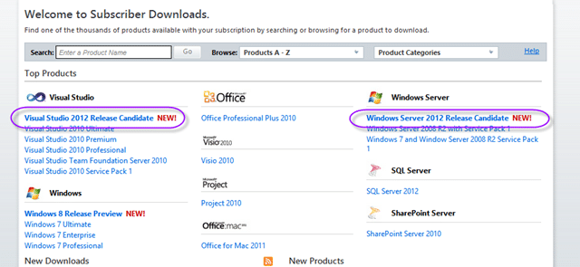](http://blog.hinshelwood.com/files/2012/05/image8.png)  
{ .post-img }
Figure: MSDN Subscriber Downloads

My very favourite feature of Windows 8 is the ability for me to run Hyper-V on the client. So all I need is a nice new “Kraken” server to run.

  
{ .post-img }
Figure: Running Hyper-V on my Windows 8 laptop (not RC yet)

You can see my other machines there, and yes; I can run them all at once thanks to my awesome laptop provided by NWC.

[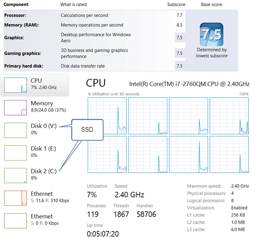](http://blog.hinshelwood.com/files/2012/05/SNAGHTML11c6369.png)  
{ .post-img }
**Figure: VM’s Galore (with 3 running)**

This allows me to be ready to demo in almost any situation without requiring access to the internet. The only thing I really cant demo is Lab Management and I don’t want to have to cart around a data centre like [Brian Rendell](http://mcwtech.com/blogs/brianr/) does.

I configure all of my VM’s with two network adapters, Public is connected to the internet and Private links all of the VM’s and the Host.

  
{ .post-img }
**Figure: Public is wired to my Internet**

This allows me to connect to my VM’s with an IP address that I already know, versus having to look up the IP that some DHCP gave it.

I have three stages to this install that will allow me to have a good demo instance:

1. Install and Configure Windows Server 2012
2. Install and Configure SQL Server 2012
3. Install and Configure TFS 2012

I need to know how long this stuff takes as I have 2 Team Foundation Server 2012 installs next month. Its in high demand and almost every single customer demo of Visual Studio 2012 I have don has resulted in a customer wanting to “Go-Live”. Yes, its that good and that much of an improvement. One of our customers that is going live on the Release Candidate is a large US Manufacturing company with a projected 40k users in TFS. No hints…

### Install and Configure Windows Server 2012 (30 minutes)

As I want to have a demo box that is all singing and dancing I need to have Server 2012. I will be on the road for the next 3 weeks doing demos and I want to blow folks away with all of the new stuff. Server 2012 is not really for demo but more to frame the demos. I have 2 Windows 8 VM’s for client demos, but some server side bells and whistles always go down well.

[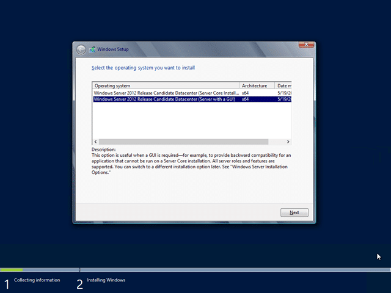](http://blog.hinshelwood.com/files/2012/05/image9.png)  
{ .post-img }
Figure: Currently only Datacenter is available

Don’t b e afraid of Datacenter, it really just means that it includes all of the features, you don't need to use them all. I will however recommend that you select the GUI mode rather than the Core if this is a demo box. You may only have one box running and it would suck to have to remote into another box just to manage this one. If however you will have many server boxes then the recommended would be to use Core.

  
{ .post-img }
**Figure: Takes just a few minutes on SSD**

You will likely be familiar with the windows install and it is the same as previous versions, if a little simpler and prettier.

[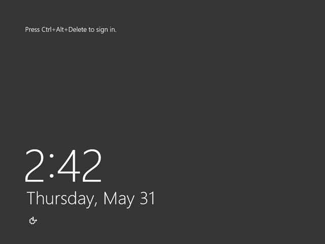](http://blog.hinshelwood.com/files/2012/05/image11.png)  
{ .post-img }
**Figure: Log in in no time**

It takes very little time to get to a login , but remember that there are still a few things to do.

  
{ .post-img }
**Figure: Woooo… new**

It may be a siney new server, but it does not have a name I would like nor can I connect over Remote Desktop. You might be wondering why I want to use RDP! Well, it has to do with configuration. I get way more options and I don’t have to settle for an ugly 4x3 display. I want everything to be a nice HD 16x9 . To achieve that I need to:
{ .post-img }

1.  **Enable Remote Desktop**
    By default you do not have RDP enabled. It is easy to enable.

        [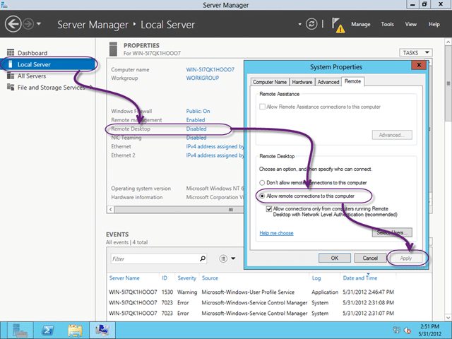](http://blog.hinshelwood.com/files/2012/05/image13.png)

    { .post-img }
    **Figure: Enable Remote Desktop**
    Note: If you are going to connect from a pre Windows 7 computer then you will need to un-tick the “Network Level Authentication” box.

2.  **Set an IP Address (no DHCP on Windows 8 client)**
    As I do not run DHCP on my Windows 8 box I need to set the IP, this is the way you want to do it anyway for demo boxes so you remember what to connect to.

        

    { .post-img }
    **Figure: Set a static IP for your Private network**
    Note: I cheat and don’t really remember. I put the IP in the name

        [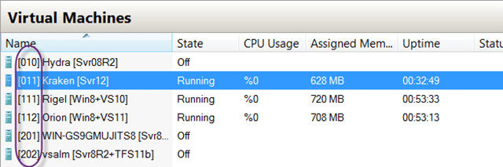](http://blog.hinshelwood.com/files/2012/05/image15.png)

    { .post-img }
    **Figure: Put the IP in the name**

3.  **Give my server a real name like “Kraken”**
    [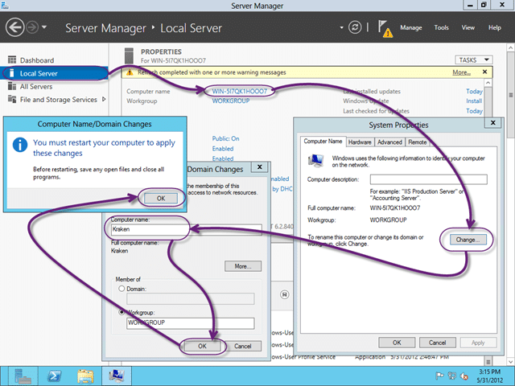](http://blog.hinshelwood.com/files/2012/05/image16.png)
    { .post-img }
    **Figure: New name, then reboot**

Now I can access my new server by name or by IP. I tend to use IP as the name can sometimes go awry as it often can with no Active Directory.

  
{ .post-img }
**Figure: Sigh, nice HD 128x720 (16x9) screenshots**

DONE – Server 2012 installed and configured

### Install and Configure SQL Server 2012 (30 minutes)

I will be install SQL Server 2012 for this box and just like 2008 you can’t just click an Install button, you have to go through a bunch of menus to get there. Not perfect, but they are trying to prevent the average muppet from messing up their system. I however am and exemplary muppet and can mess it up anyway. As I am in a VM, and this may not go well, My first task is to Snapshot my VM. That way if I mess it up I can always try again without having to completely reinstall.

  
{ .post-img }
**Figure: Snapshots can save your bacon**

You have probably done an install 100 times for SQL server, so I will just note the differences and any problems.

SQL 2012 has been out for a couple of months so there must be at least 10 Cumulative Updates by now!

[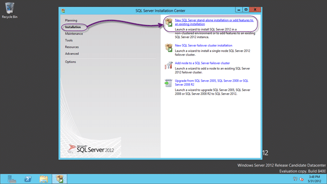](http://blog.hinshelwood.com/files/2012/05/image19.png)  
{ .post-img }
**Figure: We are installing a stand-alone instance**

The installation for SQL is surprisingly uneventful when I do it, but I find that customers tend to ignore the TFS requirements for SQL and just install it the way they always do it.

  
{ .post-img }
**Figure: Pick and Mix**

I want to be able to choose what is installed, and I certainly don’t want everything.  And, no, you can’t use SQL Server in Power Pivot for SharePoint mode as it is not currently supported. I had a nice long discussion with [Jeff Levinson](http://blog.nwcadence.com/author/jefflevinson/) about this and you certainly don’t want to select that option. I may be Scottish but Jeff can turn the air blue 
{ .post-img }

  
{ .post-img }
**Figure: Select the features**

As I am creating a server only box I don’t really want any of the client tools for working on this box but I do want the SQL Management tools. I expect to only be logging onto this box to demo server configuration, not client connectivity.

I should also point out that I am a vanilla kind of guy that believes that there are only two reasons to change the defaults:

1. The documentation tells me so
2. Long painful experience

So, here are the small changes to the default configuration that I do specify:

1.  **Change default accounts for Active Directory ones**
    If you are wanting to use Kerberos or you have more than one server in your environment then you need AD Accounts. In this case I am leaving it alone and trusting that they guys that wrote the product kew what they were doing.

        

    { .post-img }
    **Figure: If you are part of an AD environment use AD accounts**
    _note: I cant stress this enough: **Never change the collation… ever…
    **_

2.  **Add Administrators or some other group to SQL**
    This is a long painful experience one. Many time I have seen SQL become inaccessible cox and account got changed. Add a group in here…

        [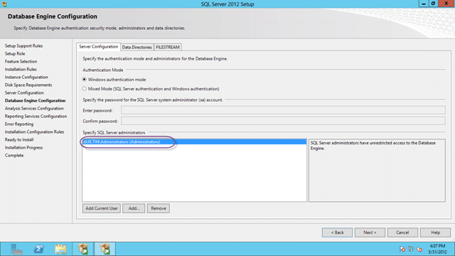](http://blog.hinshelwood.com/files/2012/05/image23.png)

    { .post-img }
    **Figure: Add permissions to SQL**
    
    { .post-img }
    **Figure: Add permissions to Analysis Services**
    If you forgot to add permissions go back now and add them in manually. You will kick yourself if you do not.

  
{ .post-img }
**Figure: All components installed successfully**

DONE – Install and configure SQL Server 2012

The very last thing you would do, if everything went well is to remove the snapshot. They take up space and require extra processing and disk access to resolve. Not much you understand, but enough that it make sence to clean up after yourself. The purpose of the snapshot was to get back to a stable OS in SQL failed. It installed just fine, so we are all good.

### Install and Configure TFS 2012 (30 minutes)

Now the money shot. I need a all singing and dancing TFS 2012 installation with Reporting and SharePoint. In order for me to back out again I will perform a snapshot so that I can get back to a good state without having to rebuild.

  
{ .post-img }
Figure: Run the Install;

Don’t blink after you click “Install Now” coz you might miss the install. Once it is complete you will be presented with your choice of wizards.

[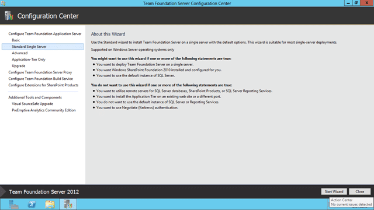](http://blog.hinshelwood.com/files/2012/05/image27.png)  
{ .post-img }
**Figure: What flavour would you like**

In this case I want a single box that does everything so “Standard Single Server” looks like the best option. In TFS 2010 this installed SQL Express, but it looks like they have improved the experience and I will give it a go.

[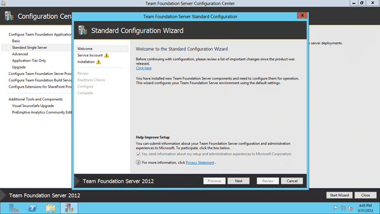](http://blog.hinshelwood.com/files/2012/05/image28.png)  
{ .post-img }
**Figure: Launching the wizard**

The wizard will lead you through the installation process, but with Standard there are only a few options anyway.

[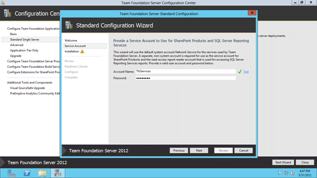](http://blog.hinshelwood.com/files/2012/05/image29.png)  
{ .post-img }
**Figure: Enter the Reporting & SharePoint account**

It is a requirement of both SharePoint and Reporting Services that this be a separate account from the one that they are running under. I just created a local administrator account called “TfsServices” that can be used for anything.

At this point I ran into “TF400079: The amount of RAM on this computer is not sufficient”. What the heck I have tones of RAM…

  
{ .post-img }
**Figure: TF400079 SharePoint… Ahhhhh….**

> _TF400079 : The amount of RAM on this computer is not sufficient to support SharePoint 2010 with Team Foundation Server. You must have the following amount of ram available: 4 GB_

While it is nice that it checking, I have dynamic memory enabled and this server can demand up to 20GB of RAM (that's what I can give it).

[****](http://blog.hinshelwood.com/files/2012/05/image31.png)  
{ .post-img }
**Figure: Should demand what it wants and windows shall provide!**

I need to shutdown the VM to add more memory so lets do that now. I will try to give it 4 GB of start-up memory and se if that does it. It will still be dynamic, but the OS should report as having 4 GB even if it is only using 1 GB. We Will see.

  
{ .post-img }
**Figure: Add Startup RAM to the required amount.**

Note: Due to SharePoint installing TFS 2010 / TFS 2012 has a minimum 10GB RAM requirement. This goes away with SharePoint. After a reboot we can launch the wizard again.

  
{ .post-img }
**Figure: Run the Admin console again**

Did you spot my mistake? There was another error message listed below the RAM one! Did you see it! Well I have it now…

  
{ .post-img }
**Figure: TF400080: SharePoint 2010 can not be installed on Windows 8**

That would be OK if I was running Windows 8, but I happen to be running Server, and after a little goggling, it looks like it was working on he Beta. Hey-ho… lets skip that for now…

  
{ .post-img }
**Figure: Validation Checks**

So without SharePoint everything runs smoothly.

I should point out that all problems either stem from Reporting Services or SharePoint.

I can install and configure SharePoint later when someone else has gone through the pain of dealing with the SharePoint team.

I love the TFS team for not letting me screw up my system because some component part has a problem.

Once the checks are complete you can go ahead and run the configuration for real. Now while I have had it fail at this point, that occurrence is so rare and the resulting issue so complex that I doubte that you will run into anything like that. That said there is Murphys Law and a very wise wizard once said “1 in a million chances happen 9 times out of 10”.

  
{ .post-img }
**Figure: I love green ticks**

Just two checks left… First to make sure that everything is healthy in the Admin…

[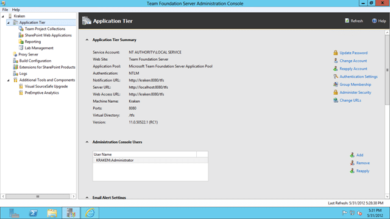](http://blog.hinshelwood.com/files/2012/05/image36.png)  
{ .post-img }
**Figure: TFS Administration Console looks happy**

And second to check out the web UI.

[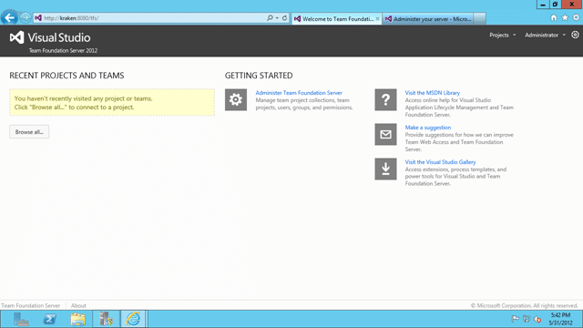](http://blog.hinshelwood.com/files/2012/05/image37.png)  
{ .post-img }
**Figure: Web UI works**

Now you cant create team projects in the '”on-premises” from the portal like you can in TFS Preview, so we will need to wait until I have a client to create one before I can really exercise this puppy. Everything does however look good with no errors…so I am calling it.

DONE - Install and Configure TFS 2012

### Conclusion

So, no SharePoint on Server 2012. Can’t say I am going to miss it. I have been spending a lot of time on the Team Foundation Service Preview which does not have SharePoint. And you know what. I don’t miss it. I have figured out other less painful ways to store documents (Skydrive, Version Control, SugarSync) that can all be made public, or close to it, which actually makes things easier.

> You solve a problem with SharePoint, and now you have two problems.

Good luck with your 2012 deployments, I have a bunch of production upgrades this month (none with Server 2012 as well) so I will keep you posted to any issues or problems.

_\-Are you deploying or upgrading to tfs 2012? Northwest Cadence has experts ready to help you with all possible configurations. Contact [info@nwcadence.com](mailto:info@nwcadence.com)_ _today to find out how we can help you…_
