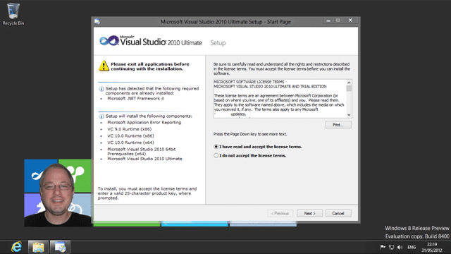
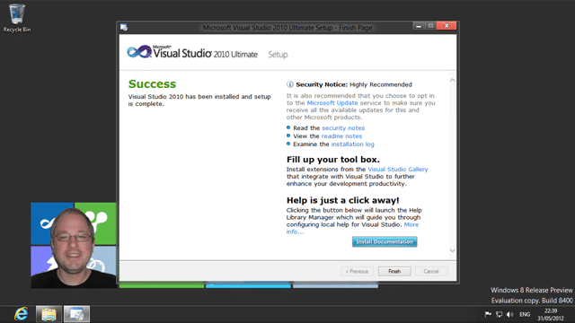
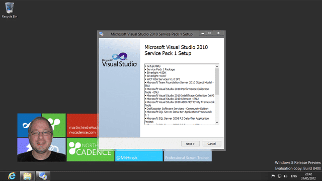
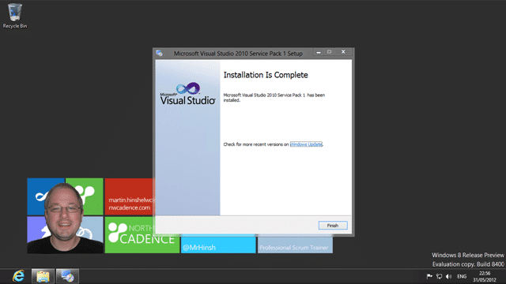
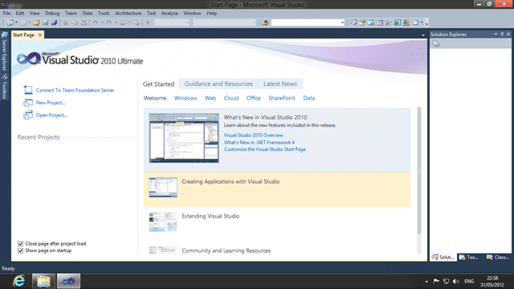

As I [have mentioned before I run all of my heavy weight software in a VM](http://blog.hinshelwood.com/installing-tfs-2012-on-server-2012-with-sql-2012/). That is one of the reasons that I love Windows 8… I can run Hyper-V. I want to be able to reinstall my local computer quickly, and to get back up and running fast.

I run many apps on my local computer, but they are things like Outlook, Windows Live Writer, Camtasia, Snagit and Diablo as well as any coms apps I need. I run Visual Studio in a VM so that I can reinstall my host and get back working fast, and I can also reinstall my Visual Studio VM while using my current one .
{ .post-img }

Now VM’s can be slow, so I got me a faster system…

Figure: Booting Windows 8 on Hyper-V in under 10 seconds

… Thus I can boot any of my VM’s in 8-15 seconds depending on what I am running. The exceptions I have are older OS’s that don’t support the faster boot model.

The problem at hand is to create a VM with Visual Studio 2010, but running on Windows 8. I always install on a clean install. I don’t do upgrades as frankly its less painful to figure out how to bite the bullet and reinstall everything efficiently than to take the pain later of errors that I really don’t know wither they are coz of the product or the beta versions of some widget that I used to have two operating systems ago.

  
{ .post-img }
**Figure: Rigel is running Windows 8**

Unlike the Server 2012 environment I don’t need to Snapshot. I don’t want the overhead and it makes the VM itself un-portable…

  
{ .post-img }
**Figure: Installing Visual Studio 2010 on Windows 8**

I will be using the VM to both work and demo with Visual Studio 2010 against any version of Team Foundation Server. I have a VM with TFS 2010 and my new one with TFS 2012. I will be doing a full install of 2010 for two reasons. First I don’t know what I will be called upon to demo until I am, sometimes with little or no prep time coz customers like you to “jump to”. Second is that I hate going to use a feature and it wither is not there, or pops a modal dialog asking for a DVD ROM or some other crap. I just want it to work.

  
{ .post-img }
**Figure: The install is running**

I have often seen teams being required to use an old version of Visual Studio on a newer OS. I see many team using Visual Studio 2008 and even Visual Studio 2005 on Windows 7. I even used to do that myself. These days I tend to be only one version back. I count that from the latest supported version of Visual Studio and since Visual Studio 2012 has been supported in production since the Beta was released I am going with 2010 and 2012 
{ .post-img }

Boy but Visual Studio installs fast on SSD’s…

  
{ .post-img }
**Figure: Almost all done**

Well that went a lot smother than I was expecting… I really don’t know what I was expecting, but I am a little disappointed that everything just worked. Nothing for us geeks to fix!

  
{ .post-img }
**Figure: I don’t expect any problems here**

Now why can’t the SharePoint team get their bits together to be able to do this? I bet I could install Visual Studio 2003 on here with no problems even if MSFT has not tested it. Could you imagine of Office did not work on the new OS? Heads would  roll…

  
{ .post-img }
Figure: Woohoo….

Now lets fire this thing up…

  
{ .post-img }
**Figure: Looking good…**

Now with no extra patch I will preform the miraculous feet of connecting to TFS 2012…

[****](http://blog.hinshelwood.com/files/2012/05/image44.png)  
{ .post-img }
**Figure: Look… no really long names forward compatibility update**

### Conclusion

Running Visual Studio 2010 on Windows 8 not only works, but works well. Don’t be afraid of Windows 8 for Visual Studio’s sake… just jump in and get going…

_\-Are you still deploying software to older OS's? Did you know that that you can flip between VS 2010 SP1 and VS 2012 with no problems? Well we do and we know how. Contact [info@nwcadence.com](mailto:info@nwcadence.com?subject= Recommended through MrHinsh - Installing Visual Studio 2010 on Windows 8) today..._
