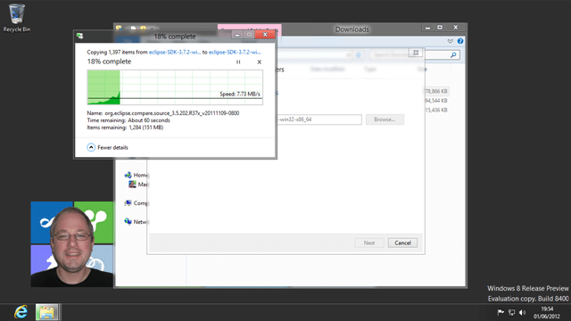
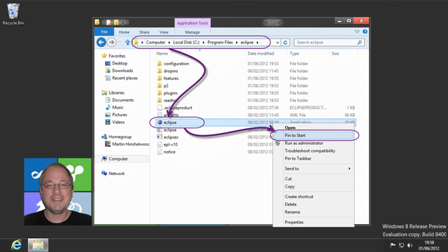
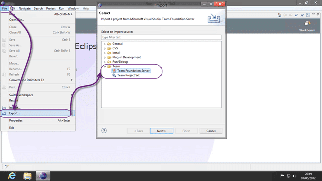
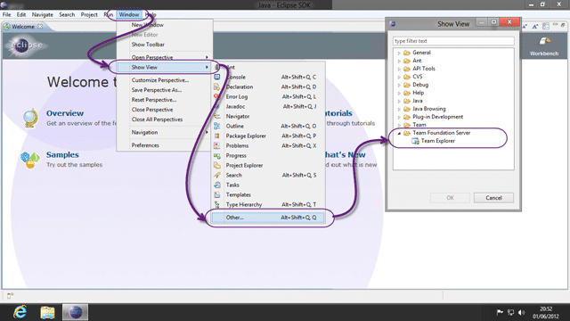
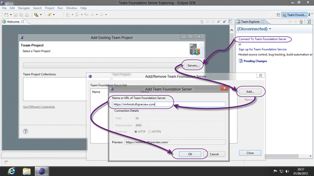

I will be running a bunch of demos on a couple of weeks with TFS & Eclipse working together. Although I have a cloud instance that I can connect to, what about when I have no network.

So I have to get familiar with the interface and what better way to start than to get everything working on Windows 8.

- **Java Developer Kit**  
   [http://www.oracle.com/technetwork/java/javase/downloads/index.html](http://www.oracle.com/technetwork/java/javase/downloads/index.html)
- **Eclipse**  
   [http://www.eclipse.org/downloads/](http://www.eclipse.org/downloads/)  
   I will go with Eclipse Classic, basically because I have little idea of the deference and this is the one I was told to use 
  { .post-img }
- **TFS Plugin for Eclipse**  
   [http://dl.microsoft.com/eclipse/tfs/preview](http://dl.microsoft.com/eclipse/tfs/preview)  
   Note: Don’t download this one… you will see why later.

I have pre-downloaded Java and Eclipse so I just need to copy them to my VM to begin. The JDK is first as nothing will work without it.

  
{ .post-img }
**Figure: First install the JDK**

Its a really uneventful install that involved lots of “Next” clicking…

  
{ .post-img }
**Figure: Unpack Eclipse**

Eclipse does not require an install so you just unpack and run… from habit I always drop the Eclipse folder into Program Files. Come on… it gives me warm fuzzies…

  
{ .post-img }
**Figure: Pin Eclipse to Start**

I want to be able to launch Eclipse without having to find the folder. To add the Eclipse icon to the new Metro interface all you do is right click the executable and “Pin to Start”…

  
{ .post-img }
**Figure: New metro Start screen**

To make sure that everything is in the right place I want to start Eclipse and connect to TFS.

  
{ .post-img }
**Figure: Install new software**

I don’t know how Martin Woodward did it but he managed to get Microsoft to host an update site for the Eclipse plugin. I am loading the latest Team Explorer Everywhere preview, but you can get the released version as well.

- **Team Explorer Everywhere 2010 SP1  
   **[http://dl.microsoft.com/eclipse/tfs](http://dl.microsoft.com/eclipse/tfs)
- **Team Explorer Everywhere 2012** [http://dl.microsoft.com/eclipse/tfs/preview](http://dl.microsoft.com/eclipse/tfs/preview)

The new version works against Team Foundation Service, TFS 2008, TFS 2010 and TFS 2012 so I feel no compulsion to load anything but the latest and greatest.

  
{ .post-img }
**Figure: Enter the Update site link**

A couple of clicks later and the plugin will be downloaded and installed by Eclipse.

  
{ .post-img }
**Figure: Auto download and install**

After the install you will be asked to restart Eclipse and voila, you now have the TFS plugin installed.

  
{ .post-img }
**Figure: Where ma stuff!**

As the Eclipse plugin follows the Eclipse paradigm if you are looking for the same look and feel of everything presented on a plate for you then you will be disappointed…

So where is it hiding? How do I get stuff from Version Control?

  
{ .post-img }
**Figure: Import and Export from Version Control**

But where is my team Explorer?

  
{ .post-img }
**Figure: Team Explorer**

Now we just  connect to TFS, in this case I am connecting to the new TFS Preview, but it could just as well be a local TFS 2010 or TFS 2012.

  
{ .post-img }
**Figure: Adding a Team Foundation Server**

And that's about it. I am no Java expert, but it is like any other Version Control system except I am able to associate my Check-In’s with the work that I was asked to do 
{ .post-img }

So really its way better than just Version Control…

_\-Don't leave your Java developers out of your Application Life-cycle Management (ALM) strategy. According to Gartner Visual Studio ALM is the best, most feature-full ALM platform and it supports Java just as well as .NET. Contact [info@nwcadence.com](mailto:info@nwcadence.com?subject= Recommended through MrHinsh - Installing Eclipse on Windows 8 and connecting to TFS 2012) today..._
