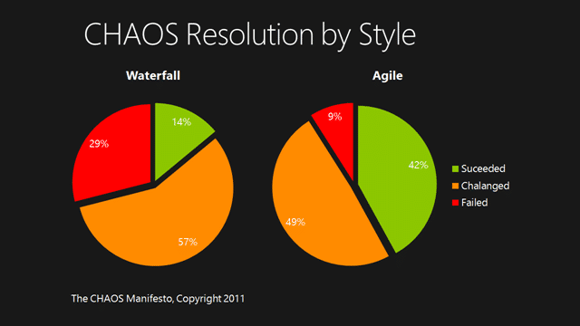
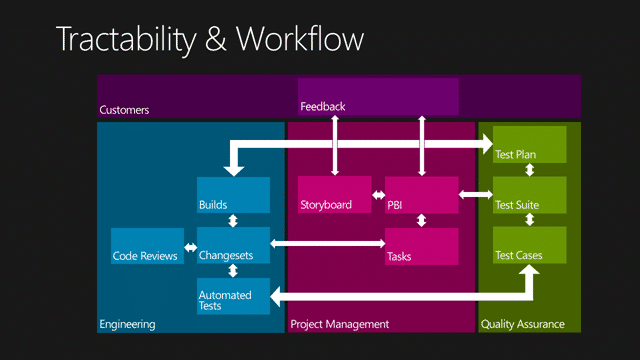
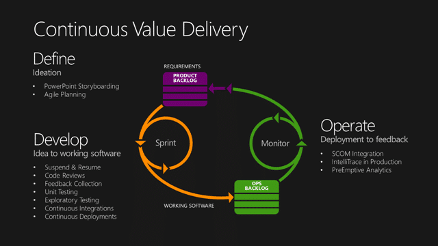

I was actually a little surprised by one of my customers this week. I was there to help them finalise their deployment of TFS 2010 (that they were currently using only for Source Control) and to present the features to them and ended up upgrading them to TFS 2012 as well!

The first thing that they wanted was a management level presentation of the capabilities of TFS and how everything goes together. I have both a 2010 and a 2012 soup-to-nuts presentation so I though I would hybridise. With the Visual Studio 2012 Release Candidate being so recently launched and combining that with the knowledge that Windows 8 needs to be in stores for Christmas and the full production “Go-Live” licencing provided by Microsoft it is a no-brainer to use Visual Studio 2012 Team Foundation Server now rather than wait for RTM. In fact, if you are currently just using TFS for source control, or are in the process of deploying TFS 2010 now, I would wholeheartedly recommend jumping in with 2012. If you are using more features you will need to do a little more planning, but you should still consider it…

This particular company is a major utility company and I had little hope of convincing them to move directly to 2012, but as I am so convicted that TFS 2012 is the way forward, it would be remiss of me if I did not try. I presented on Monday, and I upgraded them to TFS 2012 on Wednesday. Amazingly they immediately wanted to upgrade… no planning… just do it! Not my usual method…. but…

From the products perspective this was a very strait-forward upgrade. From their environment, which I had no knowledge of to start with, it was a little more complicated. They were running SQL Server 2008 and would have needed to upgrade to 2008 R2 as a minimum, but the DB was on a central all in one cluster so that was going to be a big deal.

So the we moved the DB’s to a new SQL 2012 on the TFS Server. With a very long lead time for upgrades (they just moved to 2008) and a longer lead time for servers, this was the most realistic way forward.

We did run into a problem on our first go around on Tuesday that the server was not service packed and we had to wait for their server management company to apply it. Other than that there was only the normal issues that you get with a TFS environment that has been locked down after the last deployment… you know… no SysAdmin on SQL, locked down Analysis Services, remote SharePoint owned by another team…

### So what does it take to convince your organisation to move to Visual Studio 2012 Team Foundation Server?

So I had a full half day to present to their senior management so I talked about:

1. **Vision – what are you buying into with Visual Studio ALM**
    
    We looked at what TFS gives you out-of-the-box as well as some of the more recent additions. They had a minimum of Premium for all of their engineers so they already had a foundation of features to start with.
    
      
{ .post-img }
    **Figure: Visual Studio ALM**
    
    Even just his list of things can be a little overwhelming, so I stayed away from the three new Russian doll models and concentrated on the breadth of capabilities from a high level. At this point I assess my audience and decide wither I need to bang the Agile drum…
    
2. **Agile – we can do better**
    
    Although the war had been won and it is now accepted as fact that Agile is a better way to build software than more traditional approaches there are still some hold outs. I talk about how “Agile” is now so widely used that it is now just “agile” and like “Waterfall” before it has become so diverse as to be more difficult than ever to pin down.
    
      
{ .post-img }
    **Figure: More folks are doing agile than ever before**
    
    I am sure that in another 50 years we will still hear stories of the loan company sticking its head out of the sand and saying “What do you mean the war is over?”
    
      
{ .post-img }
    **Figure: The CHAOS Manifesto**
    
    You are just more likely to succeed with agile… so lets accept things and move forward on that premise.
    
3. **Tractability in Team Foundation Server**
    
    This is key to most companies and is true of both 2010 and 2012. The crux of the argument is that everything in Visual Studio ALM is interconnected and that gives us the ability to trace from every line of code written through the Tasks to the PBI (Requirement, User Story, Bug) that elicited tat change.
    
      
{ .post-img }
    **Figure: Visual Studio 2010 Tractability**
    
    Better than that we can then relate our requirements to builds, and the icing on the cake is full test case tractability back to the builds. Awesome…
    
      
{ .post-img }
    **Figure: Visual Studio 2012 Tractability**
    
    Then we can hit the 2012 features and add tractability for Customer Feedback to PBI’s and for full integrated code reviews of every check-in.
    
    This one premise in the main killer feature for any company that has auditors…
    
4. **Process Improvement**
    
    At this point I really need to introduce the reality that TFS is just a Tool…and a tool does not solve your problems. It may help, but it can only improve your process as part of a concerted effort to…well… improve you processes.
    
      
{ .post-img }
    **Figure: TFS can be use to improve you process**
    
5. **Continuous Value Delivery**
    
    I then finish up with lots of demos on the various areas TFS and Visual Studio depending on the audience. In this case it was mostly managers and execs so I stayed in Storyboarding, Work Item Tracking and Feedback.
    
      
{ .post-img }
    **Figure: Delivering Value is the key**
    

So if you are presenting TFS to your management there is a lot for them to like. So much so, that if done right you should have no trouble convicting them that TFS will provide them with value. You do however need to remember that if your processes suck then TFS will not magically make them all better unless you also change your processes.

Good luck with your convincing…

