I have been onsite this week in California to deploy TFS 2012 and Lab Management for a company in the computer game industry. Because of limited time I am doing the full install in one day and thus will not be getting any of their builds or environments to work today. This is purely an install and test of the happy paths. I have loads of time over the rest of the week running workshops for the customer to bring their guys up to speed on how to do everything else.

- **UPDATED 2012-06-20** – [Adam Cogan](http://www.adamcogan.com/) sent me a bunch of corrections that I incorporated. He also suggested a diagram or summary. How about both!
- **UPDATED 2012-06-21** – Finally got the Lab issues ironed out. Now that you can no longer edit the environment details (Lab Manager honours what your SysAdmins  say goes) you really need to make sure that they are right before you start ) I did get further in setting up an environment, but ran into an issue that I think should work…
  { .post-img }
- **UPDATED 2012-06-22** – Updated with working recipe. Make sure that you enable “File and Print Sharing”.

So, what's involved in this?

### Summary

There are a lot of moving parts to a TFS deployment and when you add Lab Management you get a bunch more. It looks and sounds like a scary thing to deploy. But you just make a list and start at the beginning.

  
{ .post-img }
**Figure: I have a number of moving parts**

1. DONE- Install SQL Server 2012 (40 minutes)
2. DONE- Install & Configure Team Foundation Server 2012 (30 minutes)
3. DONE- Install & Configure Team Foundation Build Controller 2012 (10 minutes)
4. DONE- Install & Configure Team Foundation Build Agent 2012 (10 minutes)
5. DONE- Install & Configure Team Foundation Test Controller 2012 (10 minutes)
6. DONE- Install System Centre Virtual Machine Manager 2012 (20 minutes)
7. DONE- Integrate TFS 2012 and SCVMM 2012 (5 minutes)
8. DONE- Test Automated Build (20 minutes)
9. DONE- Test Environmental Deploy

### Implementation

Well I have a number of things that I need to do to achieve this. Lets start at the beginning and walk through all of the steps. I will be recording all of the thing that did not go well in the hopes that I can make your deployment easier.

1.  DONE - **Install SQL Server 2012 (40 minutes)**

    Just make sure that you select "Full Text Search" and the "Client Tools". Then select Database Engine, Analysis Services and Reporting Services as required.

2.  DONE – **Install & Configure Team Foundation Server 2012 (30 minutes)**
    As we are installing TFS in a Single-Server configuration we can use the Standard wizard and have it configure everything. The down side of this version of the wizard is that it will use the TfsService account for all of the uses including the reports account and the SharePoint account. For this install and due to the time limitations I am going to stick with this configuration and I will change it later if I need.

        

    { .post-img }
    **Figure: Selecting your Wizard**
    This is by far the quickest way to install TFS and while I would get to configure every little detail using the “Advanced” wizard, it is of little benefit here.

        [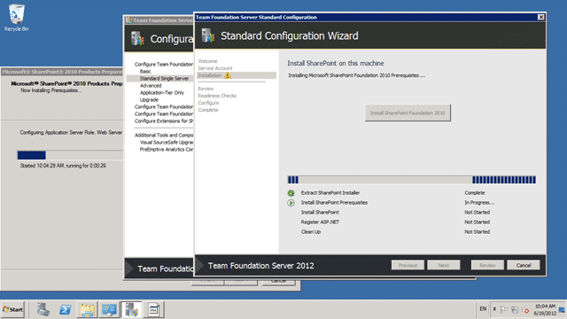](http://blog.hinshelwood.com/files/2012/06/image19.png)

    { .post-img }
    **Figure: Installing SharePoint**
    SharePoint is a necessary evil for many companies and while I don’t see the benefit myself, many organisations really like it. Yes it can be a useful tool, but you know what they say:

        > You have a problem… you solve it with SharePoint… now you have two problems…

        [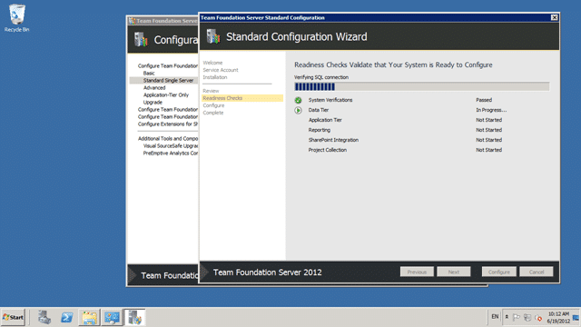](http://blog.hinshelwood.com/files/2012/06/image20.png)

    { .post-img }
    **Figure: Running the Readiness Checks**
    TFS 2010 went a long way to east the problems of installing and configuring a product with this many moving parts and integration points. TFS 2012 takes it one step further by adding the experience of 100’s of installs by 100’s of professionals that have fed back to the Product Team to make this experience as slick as possible.

        [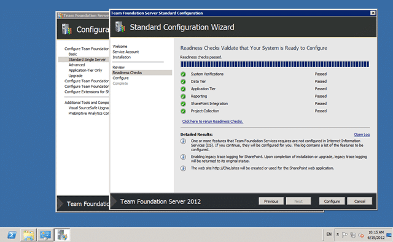](http://blog.hinshelwood.com/files/2012/06/image21.png)

    { .post-img }
    **Figure: All Good, now we can configure…**
    Just because all of the checks have completed successfully, this does not means that you will not get any errors or problems. It just means that you should not get any that folks have had before 
    { .post-img }
    [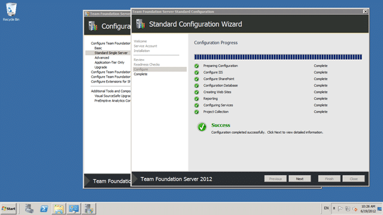](http://blog.hinshelwood.com/files/2012/06/image22.png)
    { .post-img }
    **Figure: All good, TFS 2012 configured**
    All going well you should now have all of the green ticks of a successful configuration. When the Product Team proposed this separation of install and configuration for TFS 2010 it was greeted with optimism… it is now regarded with love by those that worked through the dark ages of TFS 2005 and TFS 2008…

        [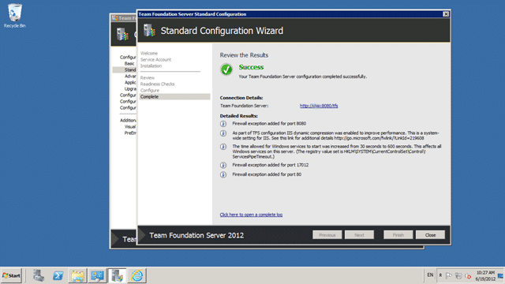](http://blog.hinshelwood.com/files/2012/06/image23.png)

    { .post-img }
    **Figure: Now we can test a few things**
    Not only has TFS been configured properly but a bunch of other checks and changes have been performed for those regular gotchas. Like dynamic compression in IIS and opening ports on the firewall.

        [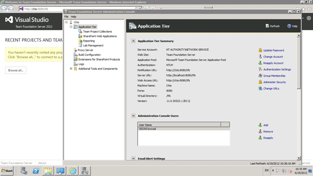](http://blog.hinshelwood.com/files/2012/06/image24.png)

    { .post-img }
    **Figure: App Tier and Portal are working**
    A quick test of the App-Tier components shows that all is well and working. We did a few things to tidy up after this, for example we added a friendly URL of [http://tfs.domain.com](http://tfs.domain.com) for all of the services. This was not required, but it helps round things off so that users feel more love.

        In addition we created a new CompanyCollection and CompanySandbox team project to get folks started with messing around.

        NOTE: Do not think you are done with a TFS install until you have created a Team Project with all of the trimmings (SharePoint and Reporting Services) as well as checked the data.

3.  DONE –**Install & Configure Team Foundation Build Controller 2012 (10 minutes)**
    This was an uneventful install. No errors on Server 2008 R2 and no additional requirements above all of the Windows Updates.

        

    { .post-img }
    **Figure: Select “Configure Team Foundation Build Service” and start the wizard**
    Again all of the configuration happens separately from the install. This eases the burden if things go wrong and allows us to snapshot our virtual environments prior to configuration actions.

        [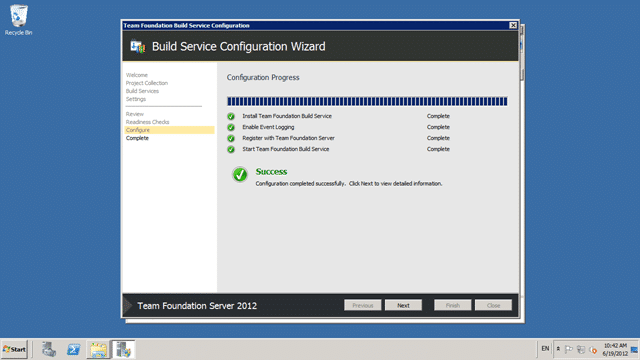](http://blog.hinshelwood.com/files/2012/06/image26.png)

    { .post-img }
    **Figure: Configuring a Build Controller is as easy as installing**
    After you have selected your Team Project Collection make sure that you configure with zero agents. This is going to be the Controller and should not have any Agents installed locally. I specifically made this server less powerful so a not to take up resources unnecessarily. If you are only going to have one Agent, or one server with Agents then you can put the controller on that box or even on the TFS server. However if you pan to have more Agents you should get the box sorted now…

4.  DONE – **Install & Configure Team Foundation Build Agent 2012 (10 minutes)**
    This was an uneventful install. No errors on Server 2008 R2 and no additional requirements above all of the Windows Updates.

        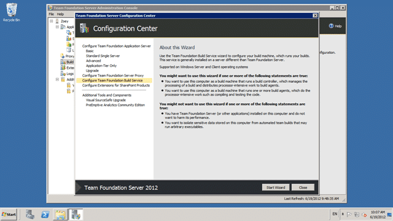

    { .post-img }
    **Figure: Just like the Controller**
    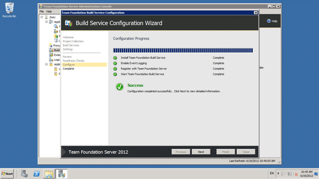
    { .post-img }
    **Figure: Easy configuration**
    It is pretty much identical to the Controller configuration except that we are adding two agents to the existing Controller. This is obvious from the options and easy to follow.

5.  DONE – **Install & Configure Team Foundation Test Controller 2012 (10 minutes)**
    This was another uneventful install although it is different from the other installs. It has a stand alone installer and a different UI that is a throwback from its past as a lowly Load Test Controller. Now that it is part of TFS is does way more than simple Load Testing, but still has not been fully integrated with the look and feel of the other Agents. Never mind… there is always the next version. No errors on Server 2008 R2 and no additional requirements above all of the Windows Updates.

        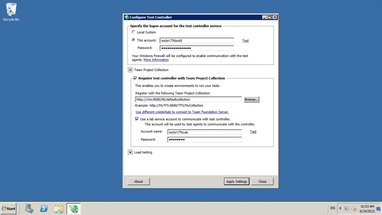

    { .post-img }
    **Figure: Configuring the Test Controller**
    In order to configure the Test Controller for Load Testing you need to install some form of SQL Server. Express will do fine, but my customer has no need of Load Test for now. The purpose of this server is to gather results from the Lab Environments…

6.  DONE - **Install System Centre Virtual Machine Manager 2012 (20 minutes)**
    I was installing SCVMM 2012 for the first time and they have moved all of my buttons, and not just in the install. Now technically you don’t need the SCVMM Console to be installed on the TFS Server any more with 2012, but I don’t have another box to control the Hosts. So my TFS Server is also my SCVMM Manager.

        

    { .post-img }
    **Figure: Installing VMM Management Server**
    I am usually just installing the VMM Console, which is no longer required. But this is the VMM environment 
    { .post-img }
    
    { .post-img }
    **Figure: You require to install the Windows Automated Installation Toolkit**
    The TFS Product Team has spoiled us and we now expect all pre-requisites to be listed as one list and preferably installed automatically. Not so here and note that the Link to the page does not even work… arg… google bing… found… downloaded…

        Suggestion for SCVMM team: If you are going to provide a link, make sure that it works… better yet… put an install button and do it for me.

        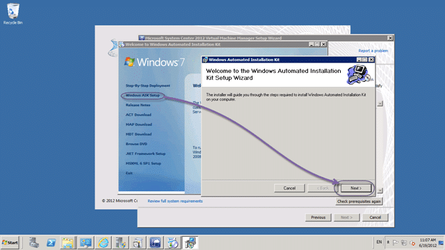

    { .post-img }
    **Figure: Installing the Windows Automated Installation Kit**
    I am amused by having to install the Automated Installation Kit manually!

        

    { .post-img }
    **Figure: Arg.. Have all errors listed**
    Suggestion for SCVMM team: If you are going to do checks, don’t stop on the first failure unless you have to. Run all of the checks and tell me about all of the Hoops in one go.

        

    { .post-img }
    **Figure: Take me to the install**
    Although this link worked it took me to the top of a massive page with many installs. Luckily I have been here before…

        

    { .post-img }
    **Figure: SCVMM Requires a SQL DB to store its configuration**
    Make sure that you get everything setup correctly…otherwise…

        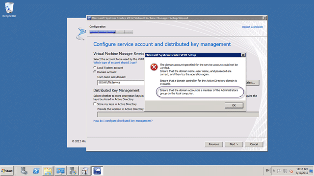

    { .post-img }
    **Figure: Needs permissions**
    Suggestion for SCVMM team: If you are doing checks don’t make the User restart the install and enter everything from scratch… have the courtesy that if I rerun the same action that I have probably taken some action and rerun the check….close install… restart … fill out everything again… woot…

        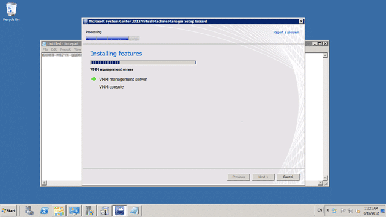

    { .post-img }
    **Figure: Smooth install**
    After that everything was clean sailing…

        

    { .post-img }
    **Figure: Now add the Hosts**
    After you have installed and run the console you need to tell SCVMM where the hosts are that it should own.

        

    { .post-img }
    **Figure: Make sure you have admin**
    You need to add the account that you are running the console under, “TfsLab” in this case, to the administrators group on the server. This will allow your console to configure everything it needs on the box.

        

    { .post-img }
    **Figure: SCVMM configures your host for you**
    As we don’t yet have a SAN attached (happening tonight) I created a Library Store on the local TFS Server to get moving. This will need moved tomorrow which will free up space… see later problem…

7.  DONE - **Integrate TFS 2012 and SCVMM 2012 (5 minutes)**
    Its 11am and the thing that took the longest was installing SQL Server 2012. I now have all of my servers configured and installed, SharePoint has been integrated and now to plug TFS and SCVMM together to create the all powerful “Lab Manager”…

        

    { .post-img }
    **Figure: You can now configure Lab Management**
    When you first hit this screen you will not have a “Configure” button, but once you have SCVMM installed you can click refresh (are you hearing this SCVMM Product Team) and I now see the “Configure” button.

        

    { .post-img }
    **Figure: TFS must be running under a domain account to configure Lab Management**
    Because I used the “Standard Single-Server” install TFS was configured to use NT AuthorityNetwork Service instead of a domain account. Well it takes about 30 seconds to change this from the Admin Console (Server | Application Tier | Change Account) and that fixes that pesky TF255484. Once in however you only need to enter the server name and click OK.

        [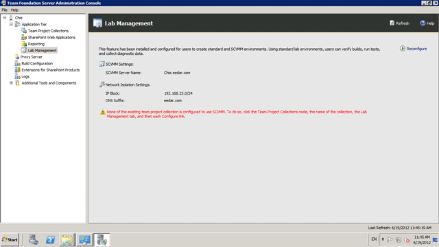](http://blog.hinshelwood.com/files/2012/06/image42.png)

    { .post-img }
    **Figure: Now you need to configure**
    Now that you have TFS and SCVMM configured into Lab Manager you get a lovely message letting you know that none of your Team Project Collections are configured yet… so lets take care of that…

        

    { .post-img }
    **Figure: Configure Lab Management**
    Now that we have communication we need to tell the Collection that it can use Lab Management. If you go to “Server | Application Tier | Team Project Collections | DefaultCollection” you will see a “Lab Management” tab that has popped into existence. All you need is to configure a Library Share and Host Groups and you are done.

        Note: If like us you created a temporary Library Share until your main data store becomes available you will have to reconfigure this. But as it takes all of 2 minutes it is no biggie.

8.  DONE - **Test Automated Build (20 minutes)**
    We are now technically DONE, but I like to give the environment a little exercise before it meets my [definition of Done](http://rules.ssw.com.au/Management/RulesToSuccessfulProjects/Pages/DoYouGoBeyondDoneAndFollowADoneCriteria.aspx).

        

    { .post-img }
    **Figure: Create and run a build**
    I walk though creating a build, first with an empty solution and then with a new Test Project and a single Unit Test. This proves out a bunch of things and allows you to pick up the missing Drop Folder and Symbols folder while we still have admin support to create them for us.

9.  DONE - **Test Environmental Deploy**
    I ran into a couple of problems creating a test environment that are to do with SCVMM 2012, and the temporary Library Share.

        

    { .post-img }
    **Figure: Can’t change guest settings**
    I always wondered why I had to change the settings in TFS 2010 and why they were not fixed to what the administrator set, now with them being read only in Lab Manager I missed that capability. I as an administrator can easily switch back to SCVMM to configure things, but it means that you need a little more close Infrastructure (or DevOps) support during initial setup. I am not complaining, just a consideration. I like that the engineers and testers can’t give boxes unlimited RAM. It’s a matter of capacity…

        

    { .post-img }
    **Figure: Rather cryptic 22022 error from deployment**
    The error “22022: the customizable template must contain exactly one virtual disk marked as ‘contains an operating system’” is very cryptic. For some reason SCVMM 2012 did not set the HDD to be bootable, and even though there was only one HDD it could not figure it out? Anyway…

        

    { .post-img }
    **Figure: Fix for 22022 error “contains the operating system”**
    Easy fix that I found just by clicking around with minimal education in SCVMM. So not really a big deal, but the very reason I like to have a dry run…

        

    { .post-img }
    **Figure: Woot, Lab Environment under Construction**
    Now that I cleaned out those errors the servers start to build, but then… bang…

        [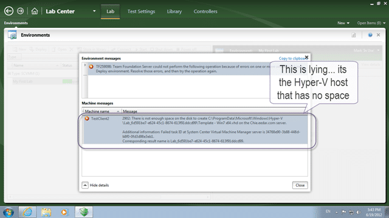](http://blog.hinshelwood.com/files/2012/06/image49.png)

    { .post-img }
    **Figure: No more space**
    Although this says that there is no space on the C: drive of the TFS box there is actually plenty, but the Host has been maxed out. This was fairly easy to fix with the help of the SysAdmins here.

        [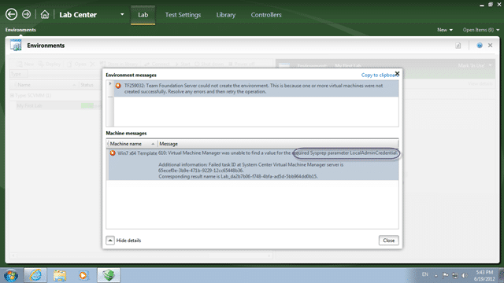](http://blog.hinshelwood.com/files/2012/06/image59.png)

    { .post-img }
    **Figure: Required Sysprep parameter LocalAdminCredentials what?**
    If you get an error 610, Virtual Machine Manager was unable to find a value for the required Sysprep parameter LocalAdminCredentials, then you likely need to get your SysAdmin to add Admin credentials to the box and make sure that they are entered as part of the configuration settings. To prove this out get them to instantiate the template and see it fail 
    { .post-img }
    
    { .post-img }
    **Figure: We are rocking now**
    With all of the above fixed the new environment is started and boots successfully and all that is left is to install the agents.

        [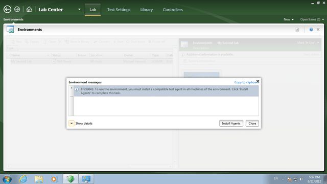](http://blog.hinshelwood.com/files/2012/06/image61.png)

    { .post-img }
    **Figure: TF259641: To use this environment, you must install a compatible test agent**
    This is expected as part of the process so lets go ahead and install the test agent.

        [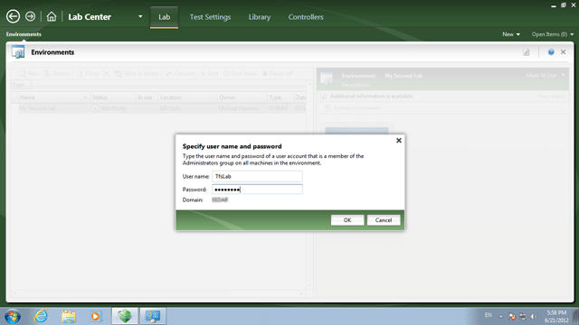](http://blog.hinshelwood.com/files/2012/06/image62.png)

    { .post-img }
    **Figure: You need an account with Admin access on the box**
    You should have already setup an admin account that you can give to the folks to set things up. You need it now.

        

    { .post-img }
    **Figure: Bang… Test Manager cannot communicate**
    So close and yet so far. I now get a “Test Manager cannot communicate with these machines because they are not running or they are not available on the network” which will now need resolved.

        

    { .post-img }
    **Figure: I can RDP to the box!**
    Even though I can RDP onto the box with the credentials that I specified it will not let me on.

        [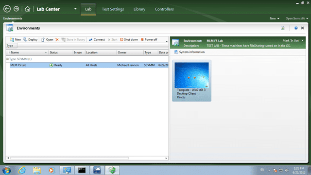](http://blog.hinshelwood.com/files/2012/06/image65.png)

    { .post-img }
    Figure: Woot, got everything working
    The thing to remember is to make sure that File and Print Sharing is enabled… phew…

DONE.

I have emailed the product team as I followed the steps, but there may have been something missed and indeed there was. I had neglected to enable File and Print Sharing which is required by Lab/p>

How have you been getting on with your 2012 Lab setups?
