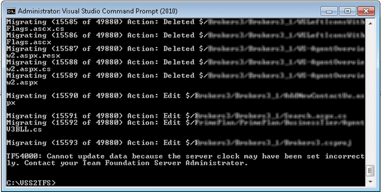

### Issue

During a VSS import you get a TF54000 error with a message of “Cannot update the data because the server clock may have been set incorrectly”

  
{ .post-img }
**Figure: TF54000: Cannot update the data because the server clock may have been set incorrectly**

### Applies to

- VSSConverter.exe
- Visual Studio 2010 Team Foundation Server

### Finding

What looks to have happened is that the scheduled time synchronisation just happened to occur during the migration and threw TFS a curve ball. Essentially you cant add data in the past when there is data in the future. I have blogged about [Full-fidelity history and data migration are mutually exclusive](http://blog.hinshelwood.com/full-fidelity-history-and-data-migration-are-mutually-exclusive/) and the tractability features in TFS that require this if you are interested. The root cause of this is likely to be the normal time sync from Active Directory being applied mid migration. While this is not normally going to cause a glitch, if you are making the number of calls that a migration does and the clock is set back only a few seconds you can encounter this.

### Workaround

Just wait for a minute (or so) and resume (thanks Cheryl) the migration by re-running the command.
