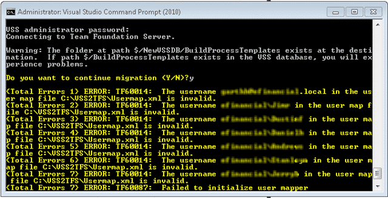

When running a VSS to TFS import using the VSSConverter.exe you may recieve a “TFTF60014: The username domainusername in the user map file c:tempusermap.xml is invalid”.

  
{ .post-img }
**Figure: TF60014 & TF60087: Failed to initialise user mapper**

### Applies to

- VSSConverter.exe
- Visual Studio 2010 Team Foundation Server

### Finding

When you are doing a mapping and you map a user that is valid as far as Active Directory is concerned, but has not been granted permission against the Team Project Collection to which you are doing the import you will receive this message.

### Workaround

Adding the mapped users to the Contributors group on the target server will remove this error.

> Add a further error, or change the wording to make it clear where the user does not exist. First check AD, then check that it can access TFS.  
> \-Suggestion to TFS Team

**Did this deal with your problem?**
