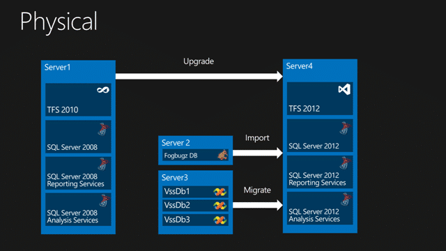
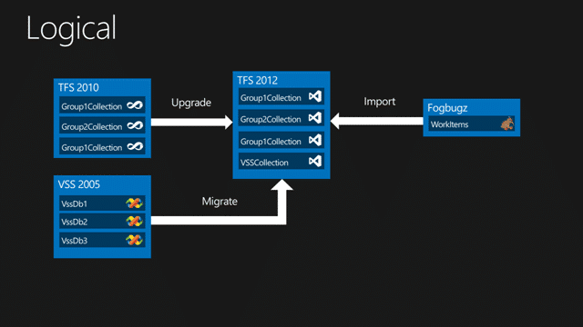
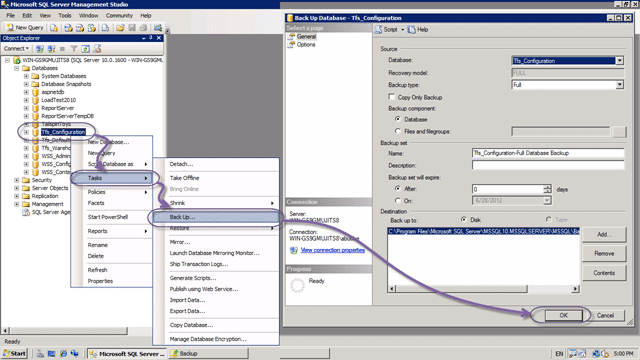
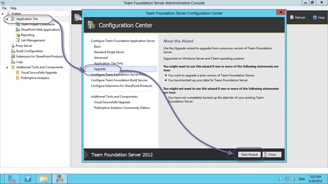
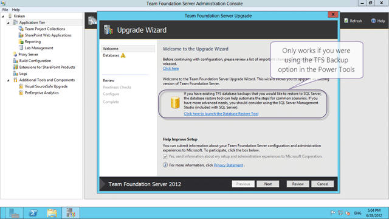
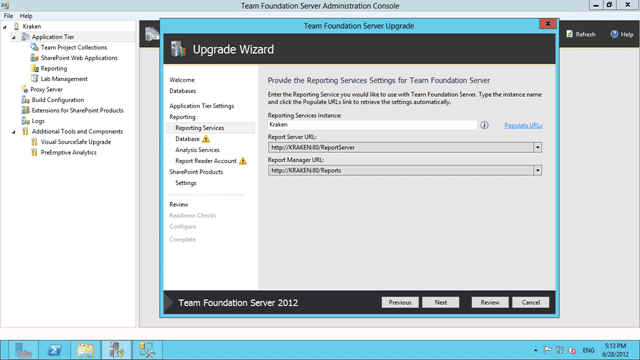
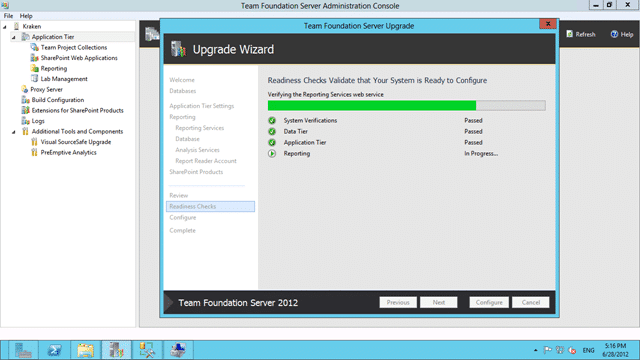
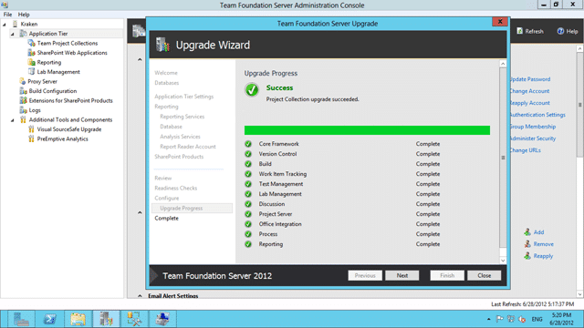
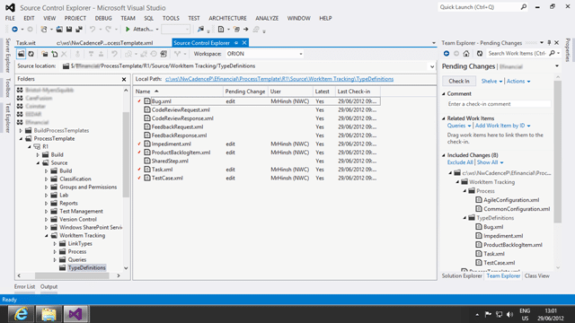

Back in Seattle and another awesome engagement, this time with a local company to upgrade their version of TFS from 2010 to 2012 and migrate all of their legacy VSS databases. Additional they want to take advantage of the new team features of TFS 2012 and need to consolidate all of their team projects

I have been looking forward to this engagement for a while and we have a lot to do and get through. I try to create documentation for each customer and for the Team Foundation Server 2012 timeframe I have been trying to feedback as many experiences as possible to Microsoft. To that end these posts are more documentation of experiences rather than full How-To’s and I always try to link to the documentation on MSDN or other blog posts that I used to figure things out. This post is a work in progress, so I will be posting updates as we work through the remaining items for migration…

Warning There should be code example as part of this post with XML configuration. Unfortunately something keeps eating them. No idea what...

This post is part of a series of posts that document a Upgrade of TFS 2010 to TFS 2012 with a VSS Migration, Process Template consolidation, Team Project consolidation and a FogBugz migration:

1. **Part 1:** [**Upgrading TFS 2010 to TFS 2012 with VSS Migration and Process Template consolidation**](http://blog.hinshelwood.com/upgrading-tfs-2010-to-tfs-2012-with-vss-migration-and-process-template-consolidation/)
   1. [VSS Converter – Issue: TF60014 & TF60087: Failed to initialise user mapper](http://blog.hinshelwood.com/vss-converter-issue-tf60014-tf60087-failed-to-initialise-user-mapper/)
   2. [VSS Converter – Issue: TF54000: Cannot update the data because the server clock may have been set incorrectly](http://blog.hinshelwood.com/vss-converter-issue-tf54000-cannot-update-the-data-because-the-server-clock-may-have-been-set-incorrectly/)
2. **Part 2:** [**One Team Project Collection to rule them all–Consolidating Team Projects**](http://blog.hinshelwood.com/one-team-project-collection-to-rule-them-allconsolidating-team-projects/)
   1. [TFS Integration Tools – Issue: Access denied to Program Files](http://blog.hinshelwood.com/tfs-integration-platform-issue-access-denied-to-program-files/)
   2. [TFS Integration Tools – Issue: Error occurred during the code review of change group](http://blog.hinshelwood.com/tfs-integration-tools-issue-error-occurred-during-the-code-review-of-change-group/)
   3. [TFS Integration Tools – Issue: “unable to find a unique local path”](http://blog.nwcadence.com/tfs-integration-tools-issue-unable-to-find-a-unique-local-path/)
   4. [TFS 2012 Issue: Get Workspace already exists connecting with VS 2008 or VS 2010](http://blog.nwcadence.com/tfs-2012-issue-get-workspace-already-exists-connecting-with-vs-2008-or-vs-2010/)
3. **[Part 3: Migrating data from FogBugz to TFS 2012 using the TFS Integration Platform](http://blog.hinshelwood.com/migrating-data-from-fogbugz-to-tfs-2012-using-the-tfs-integration-platform/)**
   1. [TFS Integration Tools–Issue: AnalysisProvider not found](http://blog.hinshelwood.com/tfs-integration-toolsissue-analysisprovider-not-found/)
   2. [TFS Integration Tools: TF237165: The Team Foundation Server could not update the work item](http://blog.hinshelwood.com/tfs-integration-tools-tf237165-the-team-foundation-server-could-not-update-the-work-item/)

- Updated 2012-06-30 - [Phil Hodgson](https://twitter.com/PGHodgson) one of the developers for TFS has been able to repo my typeNames  issue and resolved it by clearing the browser cache. While that was one of the first things that I tried onsite, I will need to give it a further look. This will most likely be the solution and I just did not do it right on the day  Kudos to Phil…
  { .post-img }
- Updated 2012-07-05 - [Phil Hodgson](https://twitter.com/PGHodgson) hit it right on the nose and this let us complete the Process Template Consolidation this morning.

#### Summary

What we are essentially trying to do is consolidate all of the Version Control, Work item Tracking and any other data used by the development team into a single supportable solution.

[](http://blog.hinshelwood.com/files/2012/06/image66.png)  
{ .post-img }
**Figure: Physical structure of environment**

We have 3 separate systems that we want to merge and luckily there are out-of-the-box tools for two of them but we will have to see what the story is with Fogbugz.

[](http://blog.hinshelwood.com/files/2012/06/image67.png)  
{ .post-img }
**Figure: Logical grouping of Systems**

We have a whole bunch of steps that need to be preformed in a certain order to be successful. With the VS 2012 RC the only supported way to move source from VSS to TFS is to do a tip migration only. If you want the full history you are going to have to migrate your VSS data into TFS 2010 and then upgrade. This is not a big deal, but it does delay the production TFS upgrade a little.

1. **DONE - Day 1- Trial Upgrade of TFS 2010 SP1 to TFS 2012 RC in Test Environment**  
   This was completed as a “disaster recovery” migration and tool little more than 20 minutes.
2. **DONE - Day 1 - Plan for upgrade of TFS 2010 SP1 to TFS 2012 RC**  
   We have a plan detailed below to achieve this tomorrow.
3. **DONE - Day 1 - Plan for upgrade of VSS 2005 to TFS 2010 SP1 with Configuration files**   
   We have successfully created the mapping files and a plan to migrate this tomorrow morning.
4. **DONE - Day 1 - Trial upgrade of VSS 2005 to TFS 2010 SP1  
   **We have successfully migrated your largest VSS database to a trial collection in TFS 2010..
5. **DONE - Day 1 - Verify migration from XP to TFS 2010 using the MSSCCI Provider**
6. **DONE – Day 2 - Production upgrade of VSS to TFS 2010**
7. **DONE – Day 2 - Production upgrade of TFS 2010 SP1 to TFS 2012 RC**
8. **DONE – Day 3 - Customisation of Process Template**
9. **DONE – Day 3 - Upgrade of existing Team Projects to Visual Studio Scrum 2.0 Process Template**

This is just the summary the implementation is way more fun…

#### Implementation

I always like to test everything first so I do trials of everything before I start doing the real thing. So I tend to have all of the errors, exceptions and wackier things as part of the and it should then just be a case of following the steps and dealing with the know errors and issues.

1.  **DONE - Trial Upgrade of TFS 2010 SP1 to TFS 2012 RC in Test Environment**
    As per [Installing TFS 2012 with Lab Management](http://blog.hinshelwood.com/installing-tfs-2012-with-lab-management-2012/) the install was easy and flawless. We did have to reboot to install .NET 4.5, but that is common. We did a full configuration of TFS 2012 in its native state to verify that we could get everything working in the environment before trying an upgrade.

        \[ARG… The Problem Steps recorder does not record Admin apps unless running in admin!\]

        > Warn when you hit the default number of screen shots so that I know that I have to save and start recording again. Better yet, do that automatically as I hit the limit. because of this I am having to mock my documentation.
        > **\-Suggestion for Problem Steps Recorder Team**

        As part of any upgrade I like to do a trial upgrade on the new hardware before I do anything else. There are many reasons for this but the two that spring to mind are problems, and timing. We need to take the current TFS environment offline in order to do an upgrade and that can take time… but how much? Well, that depends on two things, the problems and the time it takes to execute the upgrade. Due to the PSR issue I have created a suggestion for above I have had to create screenshots by doing an Upgrade locally but all of the other screenshots are from the customers own environment. I did however follow exactly the same steps…

        [](http://blog.hinshelwood.com/files/2012/06/image68.png)

    { .post-img }
    **Figure: Un-configuring TFS is easy with tfsconfig setup /uninstall:all**
    Just in case you need it, TFS 2012 has an Uninstall option that really just un-configures it. This is a fantastic feature that helps after a trial upgrade to reset things so that you can follow the same steps.

        [](http://blog.hinshelwood.com/files/2012/06/image69.png)

    { .post-img }
    **Figure: Backing up TFS 2010**
    Some folks script this out… I am old school and clicked away for the 5 db’s that I needed. Once you have everything backed up, head on over to new TFS 2012 server and restore all of the 2010 DB’s there. SQL Server 2012 will automatically upgrade them to its new format. Remember to take across the tfs_Warehouse as well as this will be upgraded as well.

        [](http://blog.hinshelwood.com/files/2012/06/image70.png)

    { .post-img }
    **Figure: Upgrading and moving server at the same time… the Upgrade Wizard is your friend**
    Even though we are moving server, same as [my previous TFS 2010 to TFS 2012 upgrade](http://blog.hinshelwood.com/presenting-visual-studio-alm-upgrading-tfs-2010-to-tfs-2012-in-production-done/), I did not require to do a TFS 2010 move first as I did before. I think that this was a simpler install as it was single server with the DB local and I was not changing configuration, just hardware. I did everything in one go.

        [](http://blog.hinshelwood.com/files/2012/06/image71.png)

    { .post-img }
    **Figure: New database restore**
    You can use the new database restore if you are currently using the [TFS 2010 Power Tools backup](http://blog.hinshelwood.com/creating-a-backup-in-team-foundation-server-2010-using-the-power-tools/) facility to backup you server, but as I did a manual backup I need to do a manual restore. However this new feature makes it far easier and faster to get up and running in a disaster recovery scenario…

        [](http://blog.hinshelwood.com/files/2012/06/image72.png)

    { .post-img }
    **Figure: Even better than TFS 2010**
    I don’t know how the product team managed it after the awesomeness that was a TFS 2010 upgrade, but they have made it even slicker. The feel of the install is one of spit and polish applied in abundance. All other product installs pale in comparison when you consider what it is doing…

        [](http://blog.hinshelwood.com/files/2012/06/image73.png)

    { .post-img }
    **Figure: Set your TFS Service Account**
    As we are working in a single server environment we need not use a Domain Account. I usually do anyway, but there is more setup on the domain front and although I had a tame domain admin available, it is not worth the extra hassle unless you are branching out to multi server. It is easy to change later, so I took the easy path…

        [](http://blog.hinshelwood.com/files/2012/06/image74.png)

    { .post-img }
    **Figure: Connecting to Reporting Services**
    There are a lot of cool features that Reporting Services and Analysis services offers so it is worth configuring it, and this should be painless as long as you have permission and access to both RS and AS. If they are managed / shared services you will be in for a world of hurt if the respective owners are not cooperative. That hurt not being the TFS teams fault is no consolation to that mess. This being a Single-Server deployment, we have a much easier time..

        [](http://blog.hinshelwood.com/files/2012/06/image75.png)

    { .post-img }
    **Figure: Auto detect the warehouse**
    I love the green ticks that let you see that you have all of the information correct before you either get an error installing, or get to the end and something does not work..

        [](http://blog.hinshelwood.com/files/2012/06/image76.png)

    { .post-img }
    **Figure: Verification Step**
    As well as validation at each and every stage of the wizard the product team have done an extensive verification system that checks everything it can to make sure that the actual configuration goes smoothly.

        [](http://blog.hinshelwood.com/files/2012/06/image77.png)

    { .post-img }
    **Figure: The green tick of Success**
    The full process for upgrading from beginning the backup process to having TFS 2012 up and running too less than 1 hour… yes that's 60 minutes. We only had around 3GB of data in 4 collections so that is not unusual and your times may vary. That is why I always insist on a trial upgrade first.

2.  **DONE - Plan for upgrade of TFS 2010 SP1 to TFS 2012 RC**
    The trial upgrade took around 10 minutes to backup and copy all of the data across to the new server and then only 20 minutes to do the actual Upgrade to TFS 2012. This means that at most the upgrade will take 1 hour and then the developers can get access to start coding away again.

        We will plan for 2 hours worth of down time to complete:

        1. Reset environment to an un-configured state

            ```
            tfsconfig setup /uninstall:ALL
            ```

            **Figure: Uninstalling is really un-configuring**

            I have found the uninstall feature particularly useful in the upgrade scenarios where I want to run through a trial upgrade first and then do a production one. This way I can run both the same way and from the same starting state.

            [](http://blog.hinshelwood.com/files/2012/06/image78.png)

    { .post-img }
    **Figure: You can un-configure your TFS environment easily** 2. Delete all configuration and collection databases from TFS including tfs_warehouse 3. Email all TFS user to get off the system 4. Stop all user access to TFS 2010 (wait 10 minutes for the usual last minute check-in screams)
    Quesee the TFS 2010 server 5. Backup all TFS 2010 databases 6. Copy to TFS 2012 server and restore to SQL 2012 7. Run “Upgrade Wizard” for TFS 2012 8. Done

        Note: Based off [http://msdn.microsoft.com/en-us/library/ms404883(v=vs.100).aspx](http://msdn.microsoft.com/en-us/library/ms404883(v=vs.100).aspx)

3.  **DONE - Plan for migrations of VSS 2005 to TFS 2010 SP1 with Configuration files**
    As with all migrations of data from one system to another this can be fraught with dangers. For a VSS to TFS migration you first need to find the documentation, which is no easy matter when all you get are 2005 and 2008 documentation and you are using 2010. Which if you look hard enough you can find as the [Migrate from Visual SourceSafe](http://msdn.microsoft.com/en-us/library/ms253060.aspx) document that comes in many flavours.

        If however you google bing “VSS to TFS 2010” none of the top items will get you to 2010 documentation, although it will very much look like it.

        

    { .post-img }
    **Figure: The wrong VSS to TFS migration documentation**
    { .post-img }
    You need to spell out what you need a little more specifically. This just a case of the right keywords for the task not resulting in the correct document.

        

    { .post-img }
    **Figure: The Correct VSS to TFS migration documentation**
    { .post-img } > Make sure that your documentation cross references, or redirects to the right thing. In the TFS Teams defence the content on MSDN is both extensive and detailed. I don’t know how they keep it all strait. > \-Suggestion to TFS Team

        Once you have this figured out you have a few things to do. First things first, make sure that your VSS databases are valid and have very little inconsistencies. In this case my customer takes great pains (as any VSS user should) to check their VSS databases often. There were only a few errors and hopefully they will not impact the migration itself.

        In order to bring the VSS data across you need a couple of configuration files and a command line. Some of the bits are however done for you and are relatively easy. If you follow the documentation described above it will lead you through all of the big steps.

        The main thing is to make sure that you create the correct settings file and then modify it for the final run with the TFS server and mapping information.

        ```
        < ?xml version="1.0" encoding="utf-8"?>


        ```

        **Figure: The convertor takes lost of parameters, not all are needed for both Analysis and Migration**

        The first time you run this it should be in “analysis” mode before you run it in “migrate”. To do that just run:

        ```
        vssconverter Analyse settings.xml
        ```

        **Figure: Analyse and generate the User Settings file**

        The usermap file has a list of all of the Users in VSS and how the should be mapped to Active Directory.

        ```
        < ?xml version="1.0" encoding="utf-8"?>


          ...


        ```

        **Figure: The usermap.xml file is generated**

        You can map any user that does not exist to a single account. That includes deceived and deleted Active Directory users.

        [](http://blog.hinshelwood.com/files/2012/06/SNAGHTML1a9dd0d1.png)

    { .post-img }
    **Figure: Detailed Analysis Report**
    You may get a few errors here that you can do something bout, but I found that the TF227010 could be gotten rid of by following the instructions and installing a patch, but that the TF227026 could be safely ignored unless you want to get everyone to check in.

        After the analysis you can run the migration for real and I would suggest that you do this to a test collection first so that you can verify and rerun to your hearts content until you get it write.

4.  **DONE - Trial migration of VSS 2005 to TFS 2010 SP1**
    Actually running the migration was fairly simple and we only ran into one little hiccup. It should however be noted that this is a one-time forward-only migration of data and if it messes up you will need to delete / destroy the folders that you have migrated and run it again…

        [](http://blog.hinshelwood.com/files/2012/06/image79.png)

    { .post-img }
    **Figure: You will always get the BuildProcessTemplates exists as… well… it does**
    Make sure that your references are correct and much of the settings.xml file is case sensitive. I don’t know why, and one of my pet hates is case sensitivity, but it is there so watch it…

        Make sure that you have all of the users added as contributors on your target TFS Collection or you will get errors. This can result in a “[TF60014 & TF60087: Failed to initialise user mapper](http://blog.hinshelwood.com/vss-converter-issue-tf60014-tf60087-failed-to-initialise-user-mapper/)” error which is easily resolved. In addition you need to watch out for a server clock issue that can have an affect. As you are hammering the server with check-ins your clock may be automatically reset by Active Directory. Now while this is not normally an issue you may get a  “[TF54000: Cannot update the data because the server clock may have been set incorrectly](http://blog.hinshelwood.com/vss-converter-issue-tf54000-cannot-update-the-data-because-the-server-clock-may-have-been-set-incorrectly/)” that you will need to resolve.

        The actual migration of this 1.2 GB set of data took around 40 minutes to complete once it got all the way through. This is the largest of the 4 VSS’s that we need to migrate and the smallest is 25mb…

5.  **DONE - Verify migration from XP to TFS 2010 using the MSSCCI Provider**
    Just to make sure that we are still able to connect from the legacy system. As we are using XP, everything takes ages to install 
    { .post-img } 1. Install .NET 4.0 2. Install Team Explorer 2010 SP1

            Note: SP1 takes AGES on Windows XP!

        3. Install MSSCCI Provider ([Team Foundation Server MSSCCI Provider 2010](http://visualstudiogallery.msdn.microsoft.com/bce06506-be38-47a1-9f29-d3937d3d88d6))
        4. Connect from “File | Source Control | Team Foundation Server MSSCCI Provider”

        While it was painful to use XP the customer does still have some code in Visual Studio 2003 which is not supported on Windows 7.

6.  **DONE - Production upgrade of VSS to TFS 2010**

    Now that we have the Trial complete and the tests performed it is time to motor on with the production upgrade. The first task is to mark all of the users as read-only. This is likely to go just like the trial, except hopefully we will not have that annoying datetime issue. It is just a case of running thorough all three of the databases on after another and watching the scrolling status.

    1. **VssDb1**– 1.02 GB

       This DB contains mostly Visual Studio 2003 projects and resulted in 49880 actions that took about 65 minutes to commit to TFS 2010.

    2. **VssDb2**– 527mb

       This DB contains mostly Visual Studio 2008 projects and resulted in 30657 action that took about 37 minutes to commit to TFS 2010. It did have a bunch of errors, but they were due to known corruptions in the VSS database and will need to be managed manually if at all.

    3. **VssDb3**– 39.6mb

       This DB contains mostly Visual Studio 2010 projects and resulted in 5830 actions that took about 6 minutes to commit to TFS 2010.

    Its all bout the number of actions and not just the size of the data.

7.  **DONE - Production upgrade of TFS 2010 SP1 to TFS 2012 RC**

    We have around 2 GB of data in TFS 2010 so the upgrade is a little trivial from a size perspective. This was a totally uneventful upgrade that just worked as we did it in the Trial.

8.  **DONE - Customisation of Process Template**
    If you are going to be customising work item then you need to make sure that you have the Power Tools installed for your version of Visual Studio. This is what you will be using to do the customisation unless you can see xml like matrix code 
    { .post-img }
    [](http://blog.hinshelwood.com/files/2012/06/image83.png)
    { .post-img }
    **Figure: Adding customer fields is relatively easy**
    The key to adding fields is to not think about fields. What? But I want fields… well no… not quite.. You want reports. That’s a subtle difference but a difference none the less. Look at what reports that you want to have and loop back to fields from there. You will be surprised at home many fields you just don't need.

        [](http://blog.hinshelwood.com/files/2012/06/image84.png)

    { .post-img }
    **Figure: Always test against a development server**
    I just installed a new TFS 2012 server in a VM in order to test their process template. While the validation rules are good, they do not always catch everything and I like to make sure that I can create and walk through the work item before I push it to the production server!

        [](http://blog.hinshelwood.com/files/2012/06/image85.png)

    { .post-img }
    **Figure: Everything should be under Version Control**
    Make sure that you check in your changes to the process template. I like to download the entire process template and put that under version control so that any changes going forward are captured. Even though I encourage most customers to have very few Team Projects it still makes sense to do this. The single point of truth should always be version control.

9.  **DONE - Upgrade of existing Team Projects to Visual Studio Scrum 2.0 Process Template**
    For this I am going to create a hybrid of [Process Template Upgrade #7 – Rename Work Items and Import new ones](http://blog.hinshelwood.com/process-template-upgrade-7-overwrite-retaining-history-with-limited-migration/) and [Process Template Upgrade #3 – Destroy all Work Items and Import new ones](http://blog.hinshelwood.com/process-template-upgrade-3-destroy-all-work-items-and-import-new-ones/). The customer is only using a few Tasks and a handful of Test Cases that they needs to keep.

        I created a little batch file to upgrade from one of the MSF for Agile 4.x Templates to the Visual Studio Scrum 2.0 without losing any data.

        Warning: Data will disappear wen we upload the new work item types, but it is still all there as orphan fields in the TFS database. You can follow the instructions in #7 to make the data visible gain. This script is provided with no warranties and guarantees. Make really sure by running it against a mock up or clone of your Team Project.

        ```
        set tpc=http://kraken:8080/tfs/DefaultCollection
        set pt=C:wsNwCadencePCustomer1ProcessTemplateR1Source
        set tp=TestWipe1
        //witadmin listwitd /collection:%tpc% /p:%tp%
        // Do Renames
        witadmin renamewitd /collection:%tpc% /p:%tp% /n:"User Story" /new:"Product Backlog Item"
        witadmin renamewitd /collection:%tpc% /p:%tp% /n:"Issue" /new:"Impediment"
        // Apply new Template
        witadmin importwitd /collection:%tpc% /p:%tp% /f:"%pt%WorkItem TrackingTypeDefinitionsBug.xml"
        witadmin importwitd /collection:%tpc% /p:%tp% /f:"%pt%WorkItem TrackingTypeDefinitionsCodeReviewRequest.xml"
        witadmin importwitd /collection:%tpc% /p:%tp% /f:"%pt%WorkItem TrackingTypeDefinitionsCodeReviewResponse.xml"
        witadmin importwitd /collection:%tpc% /p:%tp% /f:"%pt%WorkItem TrackingTypeDefinitionsFeedbackRequest.xml"
        witadmin importwitd /collection:%tpc% /p:%tp% /f:"%pt%WorkItem TrackingTypeDefinitionsFeedbackResponse.xml"
        witadmin importwitd /collection:%tpc% /p:%tp% /f:"%pt%WorkItem TrackingTypeDefinitionsImpediment.xml"
        witadmin importwitd /collection:%tpc% /p:%tp% /f:"%pt%WorkItem TrackingTypeDefinitionsProductBacklogItem.xml"
        witadmin importwitd /collection:%tpc% /p:%tp% /f:"%pt%WorkItem TrackingTypeDefinitionsSharedStep.xml"
        witadmin importwitd /collection:%tpc% /p:%tp% /f:"%pt%WorkItem TrackingTypeDefinitionsTask.xml"
        witadmin importwitd /collection:%tpc% /p:%tp% /f:"%pt%WorkItem TrackingTypeDefinitionsTestCase.xml"
        // Import Link Types just in case comming from 2008
        witadmin importlinktype /collection:%tpc% /f:"%pt%WorkItem TrackingLinkTypesSharedStep.xml"
        witadmin importlinktype /collection:%tpc% /f:"%pt%WorkItem TrackingLinkTypesTestedBy.xml"
        // Import Categories
        witadmin importcategories /collection:%tpc% /p:%tp% /f:"%pt%WorkItem Trackingcategories.xml"
        // Upload the new Common Config and Agile Config
        witadmin importcommonprocessconfig /collection:%tpc% /p:%tp% /f:"%pt%WorkItem TrackingProcessCommonConfiguration.xml"
        witadmin importagileprocessconfig /collection:%tpc% /p:%tp% /f:"%pt%WorkItem TrackingProcessAgileConfiguration.xml"
        Pause

        ```

        **Figure: Scripting out an process template migration**

        Once you have done the process template migration you should heavily test it to make sure that you are not loosing anything or killing your TFS server.

        I have about 40 Team Projects to migrate over 3 Team Project Collections. Once everyone is on a consistent process template we will then begin the process of consolidating all of those into a single Collection, but that is a story for another day.

        [](http://blog.hinshelwood.com/files/2012/06/image86.png)

    { .post-img }
    **Figure: Team Home rename does not take (Invalid argument value: Parameter name: typeNames)**
    The only error I am getting after the migration is only for the Agile->Scrum migration as it required a rename of “User Story” to “Product Backlog Item” which seams to have confused the UI a little. I have tried an IIS Reset to no avail and so emailed the Product Team for advice. I will let you know how that turns out.

        Other than that everything else works. The Visual Studio Scrum 1.0 –> Visual Studio Scrum 2.0 migration went perfectly and they now have all of the native work items and no Sprint item. There are really two other areas to worry about, which I am not right at this moment, and that is Reports and Queries. One the UI hiccup is fixed we are going to be consolidating all of the Team Projects into a single Collection so spending a lot of time on Report is not going to be worth it.

        Check out the afore mentioned [Process Template Upgrade #7 – Rename Work Items and Import new ones](http://blog.hinshelwood.com/process-template-upgrade-7-overwrite-retaining-history-with-limited-migration/) post for a full listing of everything you need to do to complete the process.

10. **DONE – Outstanding typeNames error**  
    This is literally just a caching issue in IE as defined by [Phil Hodgson](https://twitter.com/PGHodgson)

### Troubleshooting

- [VSS Converter – Issue: TF60014 & TF60087: Failed to initialise user mapper](http://blog.hinshelwood.com/vss-converter-issue-tf60014-tf60087-failed-to-initialise-user-mapper/)
- [VSS Converter – Issue: TF54000: Cannot update the data because the server clock may have been set incorrectly](http://blog.hinshelwood.com/vss-converter-issue-tf54000-cannot-update-the-data-because-the-server-clock-may-have-been-set-incorrectly/)

### References

I am always amazed at how many pages, documents and files that I use during an engagement:

- Blog [Update for VS 2008 and TFS 11](http://blogs.msdn.com/b/bharry/archive/2012/06/09/update-for-vs-2008-and-tfs-11.aspx)
- Download [Visual Studio 2010 SP1 Team Foundation Server 11 Compatibility GDR](http://www.microsoft.com/en-us/download/details.aspx?id=29082)
- Download [Visual Studio Team System 2008 Service Pack 1 Forward Compatibility Update for Team Foundation Server 2010](http://www.microsoft.com/en-us/download/details.aspx?id=10834)
- Download [Microsoft Visual Studio Team Foundation Server 11 Beta Power Tools](http://visualstudiogallery.msdn.microsoft.com/27832337-62ae-4b54-9b00-98bb4fb7041a) (works with RC as well)
- Download [Team Explorer for Visual Studio 2012 RC](http://www.microsoft.com/en-us/download/details.aspx?id=29932)
- Blog [Creating a backup in Team Foundation Server 2010 using the Power Tools](http://blog.hinshelwood.com/creating-a-backup-in-team-foundation-server-2010-using-the-power-tools/)
- Download [Team Foundation Server MSSCCI Provider 2010 32-bit](http://visualstudiogallery.msdn.microsoft.com/bce06506-be38-47a1-9f29-d3937d3d88d6)
- Blog [Installing TFS 2012 with Lab Management 2012](http://blog.hinshelwood.com/installing-tfs-2012-with-lab-management-2012/)
- MSDN [Move Team Foundation Server from One Environment to Another](<http://msdn.microsoft.com/en-us/library/ms404883(v=vs.100).aspx>)
- MSDN [Destroy Command (Team Foundation Version Control)](http://msdn.microsoft.com/en-us/library/bb386005.aspx)
- Blog [Full-fidelity history and data migration are mutually exclusive](http://blog.hinshelwood.com/full-fidelity-history-and-data-migration-are-mutually-exclusive/)
- MSDN [Migrate from Visual SourceSafe](http://msdn.microsoft.com/en-us/library/ms253060.aspx)
- Videos [UPGRADE FROM VISUAL SOURCESAFE!](http://www.microsoft.com/visualstudio/en-us/upgrade-visual-sourcesafe) (Rennie is awesome)
- MSDN [Walkthrough: Migrating from Visual SourceSafe to Team Foundation](<http://msdn.microsoft.com/en-us/library/ms181247(v=vs.90)>)
- MSDN [Split a Team Project Collection](http://msdn.microsoft.com/en-us/library/dd936158)

#### Conclusion

That was this week….next week we will be looking at completing the Process Template upgrade, importing all of the FogBugz data and it looks like we will also be consolidating all of the Team Project Collections, Team Projects and Products into a single Team Project .

One project to rule them all…

_\-Are you upgrading tfs from one version to another? Northwest Cadence has experts ready to help you upgrade from any system to TFS. Contact [info@nwcadence.com](mailto:info@nwcadence.com)_ _today to find out how we can help you…_
