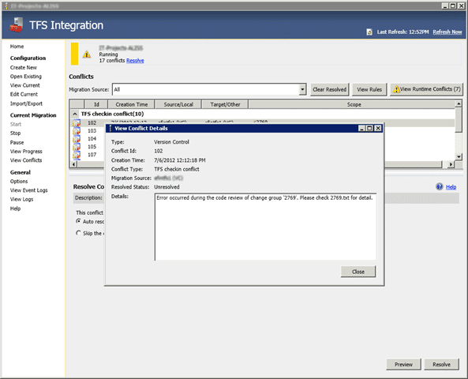

As part of the Migration process the TFS Integration Platform does a whole bunch of checks to make sure that what is being written in indeed what we want to write and what the destination is excepting. as a result, on occasion you will get a “Error occurred during the code review of change group”.

  
{ .post-img }
**Figure: Error occurred during the code review of change group**

### Applies to

- TFS Integration Tools, version 2.2, March 2012

### Finding

Before the TFS Integration Platform does a checkin it will run a bunch of checks to make sure that everything is on track. If any of those “code review” checks fail then you will receive this error. Even if you are running locally, web services, while robust run inside of IIS and can occasionally drop requests. Stuff happens, and this is not that unusual and in this case can cause a request not to be processed correctly.

### Workaround

Using the “Auto Resolve” will usually fix the problem as it is likely caused b y a glitch in the web. Luckily TFS is an Atomic check-in system and you will not damage your server. Just running the request again will usually result in success.

Once on the rerun I did get another conflict stating that the data being pushed across was already done which is likely the same cause as the first message just on the response and not the request. 
{ .post-img }

**Did this fix your problem?**
