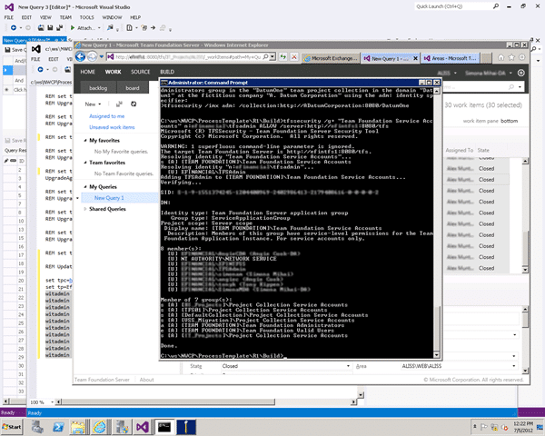
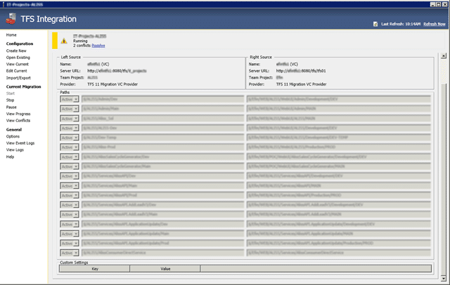
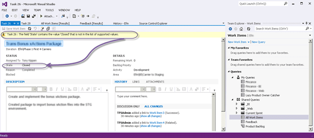

Following on from last weeks successful [Upgrading TFS 2010 to TFS 2012 with VSS Migration and Process Template consolidation](http://blog.hinshelwood.com/upgrading-tfs-2010-to-tfs-2012-with-vss-migration-and-process-template-consolidation/) I finished off the last of the 20-30 Team Project Process Template migration/upgrades to a customised form on the Visual Studio Scrum 2.0. We only added a couple of fields, but we also defined a process and strategy for use of the Template within the organisation.

If you are looking for why you might want one team project:

- [One Team Project](http://blog.hinshelwood.com/one-team-project/ "One Team Project")
- [Project of Projects with team Foundation Server 2010](http://blog.hinshelwood.com/project-of-projects-with-team-foundation-server-2010/)
- [When should I use Areas in TFS instead of Team Projects in Team Foundation Server 2010](http://blog.hinshelwood.com/when-should-i-use-areas-in-tfs-instead-of-team-projects-in-team-foundation-server-2010/)

This post is part of a series of posts that document a Upgrade of TFS 2010 to TFS 2012 with a VSS Migration, Process Template consolidation, Team Project consolidation and a FogBugz migration:

1. **Part 1:** [**Upgrading TFS 2010 to TFS 2012 with VSS Migration and Process Template consolidation**](http://blog.hinshelwood.com/upgrading-tfs-2010-to-tfs-2012-with-vss-migration-and-process-template-consolidation/)
2. **Part 2: One Team Project Collection to rule them all–Consolidating Team Projects**
    - [TFS Integration Tools – Issue: Access denied to Program Files](http://blog.hinshelwood.com/tfs-integration-platform-issue-access-denied-to-program-files/)
    - [TFS Integration Tools – Issue: Error occurred during the code review of change group](http://blog.hinshelwood.com/tfs-integration-tools-issue-error-occurred-during-the-code-review-of-change-group/)
    - [TFS Integration Tools – Issue: “unable to find a unique local path”](http://blog.nwcadence.com/tfs-integration-tools-issue-unable-to-find-a-unique-local-path/)
    - [TFS 2012 Issue: Get Workspace already exists connecting with VS 2008 or VS 2010](http://blog.nwcadence.com/tfs-2012-issue-get-workspace-already-exists-connecting-with-vs-2008-or-vs-2010/)
3. **[Part 3: Migrating data from FogBugz to TFS 2012 using the TFS Integration Platform](http://blog.hinshelwood.com/migrating-data-from-fogbugz-to-tfs-2012-using-the-tfs-integration-platform/)**

[](http://blog.hinshelwood.com/files/2012/07/image.png)  
{ .post-img }
**Figure: Consolidate to a single Team Project Collection**

As pert of the process of getting everything onto a single Process Template, namely the Visual Studio Scrum 2.0, we identified that the customer should also move to a single Team Project Collection and more than that, into a single Team Project.

Why you might ask?

As [I have often mentioned before](http://blog.hinshelwood.com/project-of-projects-with-team-foundation-server-2010/) there are a number of reasons that you would want to be on a single Team Project Collection and there are also reasons why you do not. You should have separate Team Project Collections when:

- There is not nor will there ever be a relationship between source or work items between Collections
- You want to  move source from one location to another
- You have more than 300 Team Projects

In this case the things that we do want to do are:

- Link Work Items from one project to another
- Move work items from one project to another

There is only one tool for this job and that is the [TFS Integration Platform](http://tfsintegration.codeplex.com/). While the TFS Integration Platform provides lost of migration options I am interested only in the TFS 2012 –> TFS 2012 variety which greatly simplifies the configuration. In addition to that I am migrating from a Visual Studio Scrum 2.0 Process Template to… well… a Visual Studio Scrum 2.0 Template. I just have 20-30 Team Projects to migrate. The key here is to get the mappings correct.

### Installing TFS Integration Platform with Visual Studio Team Explorer 2012

As soon as I downloaded the TFS Integration platform I ran into a bug where the registry key is not found and the Wix installer does not look for the right Key for the RC. The key it is looking for is only present if a developer edition of Visual Studio is installed.

[](http://blog.hinshelwood.com/files/2012/07/screenie99.jpg)  
{ .post-img }
**Figure:** [**TFS Integration Tools – Issue: “This tool requires the TFS client object model”**](http://blogs.msdn.com/b/willy-peter_schaub/archive/2012/07/04/tfs-integration-tools-issue-this-tool-requires-the-tfs-client-object-model.aspx)

Luckily [Jahangeer Mohammed](http://blogs.msdn.com/b/willy-peter_schaub/archive/2011/04/19/introducing-the-visual-studio-alm-rangers-jahangeer-mohammed.aspx) road to the rescue within 4 hours of me reporting the issue with the root cause and Willy posted the solution the very next day. That's ALM Ranger efficiency… customer was very impressed (although [Neno](http://blog.nenoloje.com/) would have a fit over the offending registry key)

### Running the TFS Integration Platform for the first time on TFS 2012

The first time you run the TFS Integration Platform on any computer you will get a message asking you to add the account that it is running under to a particular group. You can either add it manually or click “Yes” to get it to do it itself…quickly followed by cursing as you need to be in Administrator mode. Restart… Yes… all is good with the world.

I will get into the configuration in just a minute, but first lets solve the very first error message you will run into.

[](http://blog.hinshelwood.com/files/2012/07/image1.png)  
{ .post-img }
**Figure: TFS WIT bypass-rule submission is enabled**

You may not be using an account that is in the “Team Foundation Server Service Accounts” group or the equivalent Collection group. No wait… you can’t just go an add it. This is a special group that does not allow you to populate it through the UI. You can however view it and all of the accounts that you use for your Build Agents, Build Controllers and other bits and bobs will all be in this list already. So how to add your TFS Integration Platform account?

[](http://blog.hinshelwood.com/files/2012/07/image2.png)  
{ .post-img }
**Figure: Updating the TFS Security group**

You use our old friend the command line. There is an application called TfsSecurity that will allow you to add an account directly to that group.

```
tfssecurity /g+ "Team Foundation Service Accounts" n:domainusername ALLOW /server:http://myserver:8080/tfs

```

Now you have that sorted you are ready to rock…

### Migrating Source Control using the TFS Integration Platform

As we are trying to fold 30 Team Projects across 4 Team Project Collections into a single Team Project on a single Team Project Collection we need to be very specific with the mappings. We are also really lucky that there are no relationships between Work items and Version Control which simplifies the process as we can do them separately.

There are a ridicules number of options here and the [rangers have many, many documented](http://blogs.msdn.com/b/willy-peter_schaub/archive/2011/06/06/toc-tfs-integration-tools-blog-posts-and-reference-sites.aspx) options that will allow you to do whatever you want. There is however something interesting that you can do and that we wanted to try... You can move individual branches to new locations while maintaining the relationships. This works really well on codebases that do not have a lot of complex branches or deletes. If you have many deletes outside of the scope, or you have a lot of sub branches of code branches into your solution from outside of the scope of a team project you can run into a few problems.

[](http://blog.hinshelwood.com/files/2012/07/image3.png)  
{ .post-img }
**Figure: Complicated mappings will not always work**

You can skip to the end to see all of the problems and solutions, but if you are doing these complicated mappings you may have issues getting a distinct mapping due to how the TFS Integration Platform creates mappings, but the solution is to ditch the mappings and the root of $/TeamProjectA/ to the single sub folder of  $TeamProjectB/TeamProjectA/ so that everything is just mapped at that level. This solved all of those problems and you can always do the rearranging later.

Regardless of this problem we needed to map all of our existing Team Projects to a new folder underneath a single existing Team Project on our new Collection. We are mapping each Team Project individually as that is how the TFS Integration Platform is setup so we need to create a Migration Configuration for each Team Project.

We actually tried the complex rearrange mapping on all of the projects and called a “destroy” on the migrated source for all of the ones that failed and redid them at the root.

```
tf destroy $/somefolder/somesubfolder/ /collection:http://mytfsserver:8080/tfs/tfs01

```

**Figure: Destroying Migrated data to start again**

[](http://blog.hinshelwood.com/files/2012/07/image4.png)  
{ .post-img }
**Figure: A successful mapping**

Make sure that you check the source after you bring it across for consistency as even if the Platform tells you all is well, it could well be lying and we did find a couple of glitches (again detailed below).

Effectively you just go through each of your source Team Projects, mapping them to the destination Team Project and keep going until you are done. The time it will take will depend on the amount of source code and the number of changes, but the source code will be fairly fast.

There is a neat trick that works pretty well if you don’t have any differences, except for the target folder, for your source to bring everything across from a Collection.

[](http://blog.hinshelwood.com/files/2012/07/image5.png)  
{ .post-img }
**Figure: Just because your pick a Team Project does not mean that is the root**

In this case I want to bring everything across from all of the Team Projects in the Collection to a folder under the new Team Project. Now, you need to initially select a Team Project as the source but I then changed it to “$/” to just bring everything across to its new home of “$/NewTeamProejct/Department/” and have it create folders of the same name as the old Team Projects as plain folders.

[](http://blog.hinshelwood.com/files/2012/07/image6.png)  
{ .post-img }
**Figure: Runs through like a dream**

I had initially worried that it work choke at the Team Project boundary, but I have checked that everything is coming across properly and for a change it is operating exactly as you would expect given the settings.

So, apart from the 7 team projects that I have a block on to see if a fix comes through from the Product Team I have successfully consolidated the Source from

### Migrating Work Items using the TFS Integration Platform

Because we have already completed the [Process Template consolidation](http://blog.hinshelwood.com/upgrading-tfs-2010-to-tfs-2012-with-vss-migration-and-process-template-consolidation/) we only have one Process Template mapping to work about… or do we. If you used [method #7](http://blog.hinshelwood.com/process-template-upgrade-7-overwrite-retaining-history-with-limited-migration/) for migrating  your process template you will be left with extra fields that are not part of the core template. Make sure that the destination Team Project has the same work item type definitions as the source Team Project and you will have no problems 
{ .post-img }

In your configuration file, because we have the same work item types on each end, you can just map all of the Left Work Item Types to all of the Right Work Item Types…

**Figure: Work Item Mappings**

On top of that they only real issue is that you need to enable [WIT Bypass rules submission](http://blogs.msdn.com/b/willy-peter_schaub/archive/2009/11/10/tfs-integration-platform-what-is-the-enablebypassruledatasubmission-in-the-configuration-file-question-answer-7.aspx) which tells the TFS Integration Platform to use the Woeb Services directly and not the API’s. Why, you might ask…. well we need to be able to write historical states that do not actually exist in the workflow so that we can maintain the history.

**Figure: Enabling the WIT Bypass rules submission**

Enabling this will allow us to seamlessly do the migration of Work Item data. If we did have links between Source Control and Work Items we can handle that by either migrating both Source and Work Items in the same session or we can add the relationships later.

A final configuration would include some mapping or transformation of the Area Path so that we can find our merged work items later. The TFS Integration Platform will create any Area Paths that don’t already exist.

```
< ?xml version="1.0" encoding="utf-16"?>

  
    
  
  
  
    
      
        
          
          
          
        
        
          
        
        
      
      
        
          
          
          
        
        
          
        
        
      
    
    
      
        
        
          
            
              
              
                
              
              
                
                  
                    
                  
                  
                    
                      
                      
                    
                  
                
              
              
            
          
          
        
        
          
            
            
          
        
      
    
    
      
      
    
    
    
    
      
    
    
      
      
    
  


```

**Figure: Configuration for Merging Team Projects**

[](http://blog.hinshelwood.com/files/2012/07/image7.png)  
{ .post-img }
**Figure: Save your configuration ready to rumble**

Once you have migrated your work items you will see some invalid data, but this is due to the Process Template consolidation that we have already completed. All you have to do is fix the visible data before you save and all is well…

[](http://blog.hinshelwood.com/files/2012/07/image8.png)  
{ .post-img }
**Figure: Some work items will be invalid**

And that finishes of migrating your data…

### Troubleshooting

There are a couple of errors and exceptions that while outside the norm were a common occurrence for our migration:

- [TFS Integration Tools – Issue: “unable to find a unique local path”](http://blog.nwcadence.com/tfs-integration-tools-issue-unable-to-find-a-unique-local-path/)
- [TFS Integration Tools - Issue: Access denied to Program Files](http://blog.hinshelwood.com/tfs-integration-platform-issue-access-denied-to-program-files/)
- [TFS Integration Tools – Issue: Error occurred during the code review of change group](http://blog.hinshelwood.com/tfs-integration-tools-issue-error-occurred-during-the-code-review-of-change-group/)
- [TFS Integration Tools – Issue: “This tool requires the TFS client object model”](http://blogs.msdn.com/b/willy-peter_schaub/archive/2012/07/04/tfs-integration-tools-issue-this-tool-requires-the-tfs-client-object-model.aspx)
- [TFS 2012 Issue: Get Workspace already exists connecting with VS 2008 or VS 2010](http://blog.nwcadence.com/tfs-2012-issue-get-workspace-already-exists-connecting-with-vs-2008-or-vs-2010/)

### References

There were a number of references that I used as part of this engagement.

- BLOG: [TFS Integration Platform – What is the EnableBypassRuleDataSubmission in the Configuration File? Question & Answer 7](http://blogs.msdn.com/b/willy-peter_schaub/archive/2009/11/10/tfs-integration-platform-what-is-the-enablebypassruledatasubmission-in-the-configuration-file-question-answer-7.aspx)
- MSDN: [Destroy Command (Team Foundation Version Control)](http://msdn.microsoft.com/en-us/library/bb386005.aspx)
- BLOG: [Upgrading TFS 2010 to TFS 2012 with VSS Migration and Process Template consolidation](http://blog.hinshelwood.com/upgrading-tfs-2010-to-tfs-2012-with-vss-migration-and-process-template-consolidation/)
- CODEPLEX: [http://tfsintegration.codeplex.com/](http://tfsintegration.codeplex.com/)

### Conclusion

While it is difficult to migrate data or move data around in Team Foundation Server it is not insurmountable and mist issues can be solved if you can accept the trade-offs.

- Are you interested in consolidating to fewer Team Projects?
- Did you mistakenly create multiple Team Project Collections?

If so then give us a call and we can help you fix it…


