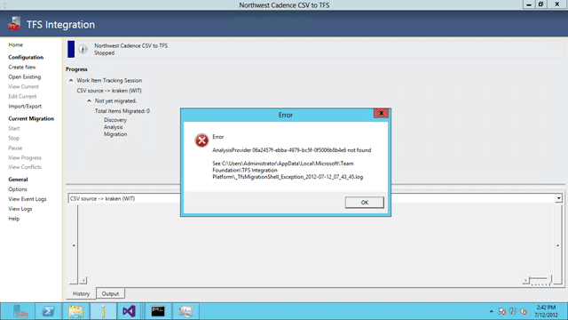
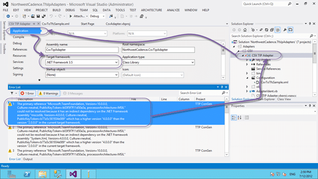

When you are trying to load your custom Adapter you receive a message stating that it does not exist.

[](http://blog.hinshelwood.com/files/2012/07/image14.png)  
{ .post-img }
**Figure: AnalysisProvider 06a2457f-ebba-4979-bc5f-0f5006b8b4e6 not found**

### Applies To

- TFS Integration Tools 2.2, March 2012

### Finding

If you check the logs you will see the same message as the popup:

```
Application Error: 0 : [7/12/2012 2:41:32 PM] Microsoft.TeamFoundation.Migration.Toolkit.InitializationException: AnalysisProvider 06a2457f-ebba-4979-bc5f-0f5006b8b4e6 not found
   at Microsoft.TeamFoundation.Migration.Toolkit.SyncOrchestrator.CreateAnalysisEngine(Session sessionConfig, ProviderHandler leftProviderHandler, ProviderHandler rightProviderHandler, ITranslationService translationService, IConflictAnalysisService conflictAnalysisService)
   at Microsoft.TeamFoundation.Migration.Toolkit.SyncOrchestrator.ConstructSessionPipeline(Session config, Int32 sessionIndex, LinkEngine linkEngine)
   at Microsoft.TeamFoundation.Migration.Toolkit.SyncOrchestrator.ConstructPipelines()
   at Microsoft.TeamFoundation.Migration.Shell.ConflictManagement.ApplicationViewModel.m_constructPipelinesBW_DoWork(Object sender, DoWorkEventArgs e)


```

**Figure: Exception in Log**

No new information there, but it does imply that there is a problem with the DLL, or that it is not there. I confirmed that it existed in the /Plugins/ folder but on starting a Debug session we see that the problem lies in the complication for .NET 3.5. .NET 3.5 relies on the .NET Framework 2.0 and the new TFS DLL’s all rely on .NET Framework 4.0.

### Workaround

This problem is easily solved by changing the application settings from .NET Framework .NET 3.5 to .NET Framework 4.0 and recompiling.

[](http://blog.hinshelwood.com/files/2012/07/image15.png)  
{ .post-img }
**Figure: Using an older version of the framework**

Now we are cooking.

**Did this solve your problem?**
