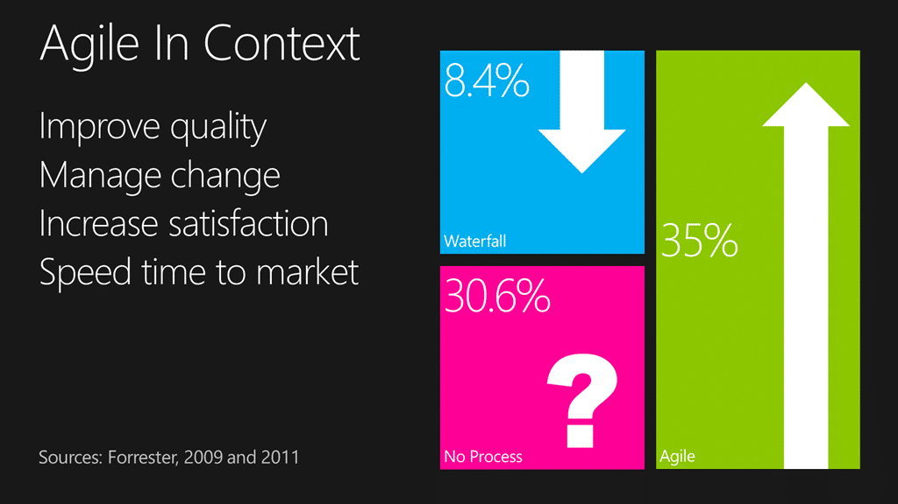
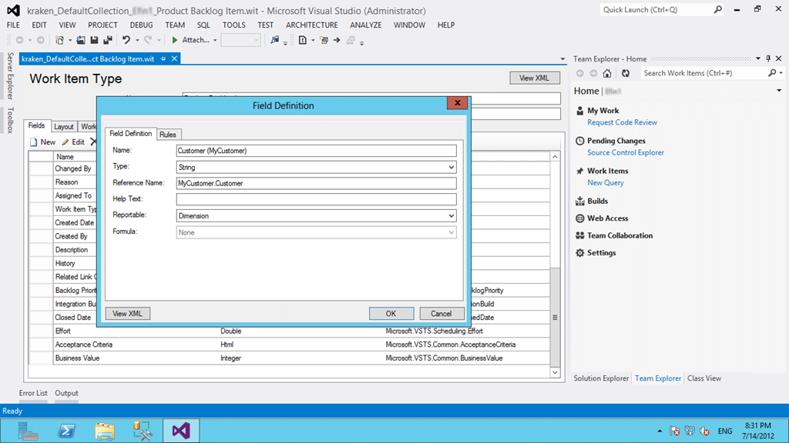
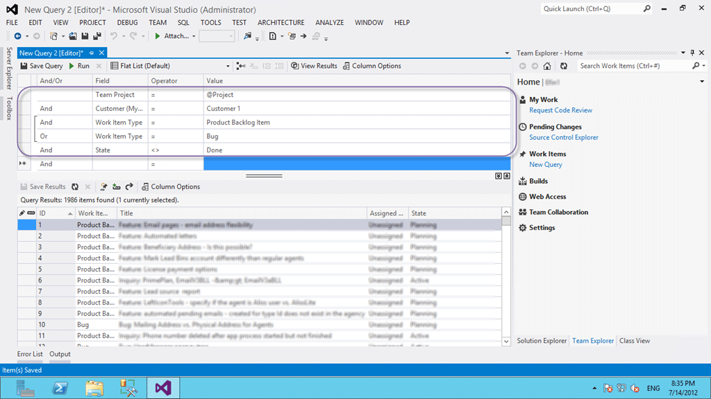

I have talked often of the idea of a [Project of Projects in Team Foundation Server](http://blog.hinshelwood.com/project-of-projects-with-team-foundation-server-2010/) and with the new feature in Visual Studio 2012 Team Foundation Server I though it would make sense to revisit. I will talk a little of the idea of the [Master or Hierarchical Backlogs](http://blogs.msdn.com/b/greggboer/archive/2012/01/27/tfs-vnext-configuring-your-project-to-have-a-master-backlog-and-sub-teams.aspx) using the new Agile Planning tools and I always find an example help with understanding so I will be using a recent engagement as a base. But first lets dispel a few myths.
{ .post-img }

- Team Project ≠ Team
- Team Project ≠ Project
- Team Project ≠ Product
- Team Project = WTF?

You might think that it has been unfortunately named, but the Visual Studio ALM tooling has been designed to have a low barrier to entry and as such the happy path is:

- Team Project = Team
- Team Project = Project

Have I confused you yet?

Well, for the single, or small group of developers the common and easy path is to create a new Team Project for each project and they will only ever have one team. So this is the way that it is out-of-the-box and it serves its purpose.

### One Team Project to rule them all

The rest of us live in a more complicated world of multiple teams, multiple projects and multiple priorities. To achieve this we need to think about the following things in Team Foundation Server:

- Teams (can be mapped to Area or to a Work Item Field Definition)
- Areas (Tree)
- Iteration (Tree)
- Source Code  (has folders)
- Work Item Queries (has folders)
- Build

No matter what our configuration and requirements we can use a single Team Project. There are however a number of circumstances where you will not be able to do this:

- **A large consultancy**If you are in a large consultancy with 1000+ customers then it makes more sense to use a  one Team Project per customer model so as to avoid confusion and scaling issues. Don’t think just because you are a consultancy that you need to use this model. Think carefully about your choice…
- **An organisation with 100’s of Teams**If you are a single organisation that has 100’s of teams than you might also run into limitation of scale. I would in this case recommend that you have one Team Project per Department or Division depending on their scale and organisation.

In these cases there are two limitation that need to be considered carefully. You can only have 254 areas per level and there is a soft limit of about 300 Team Projects per Team Project Collection.

If neither of these apply (or you are at the Customer, Department or Division level within an organisation within which it does) then you can achieve a single Team Project.

### One Team Project to find them

So, what has changed? Well with the advent of the idea and the technical implementation of Team in Visual Studio 2012 Team Foundation Service we can take advantage of the new constructs and reduce our complexity while simultaneously increase our features.

I do however have a reality check for those of you that want to use the new tools but work within a traditionally run organisation.

 **Figure: More than 34% of companies are now doing agile**
{ .post-img }

They are called the “Agile Planning” tools for a reason. They are exclusively targeted at the ~34% of the industry that are working in an Agile manor and that are 3 times more  likely to succeed than a traditionally run project. They are also aimed at the 30% that don’t really know what the want as an easy adoption path.

 **Figure: Agile projects are 3 times more likely to be successful**
{ .post-img }

Does this mean that those of you can’t use the Agile Planning tools? Hell no! It just means that you are not in the happy path so make the most of them that you can.

### One Team Project to bring them all

In a recent engagement my customer needed some rather specific things to be possible but also wanted to take advantage of the new Agile Planning features. They wanted to pull together all of the Teams and individuals from the Business all the way through the Development Teams to Infrastructure. To achieve that we identified a few must haves:

- Must be able to see an ordered backlog per team
- Must be able to see an ordered backlog per department/customer
- Must be able to see what product and product area each work item is assigned to

In order to achieve this all I need to customise is to add a single new field to the Product Backlog Item. Is we add a “\[mycustomer\].Customer” field to the PBI and make it a drop-down-list of all of the existing customers

 **Figure: Adding a field to store the external customer**
{ .post-img }

I can then create a query for each of the customers to show the backlog and allow anyone with permission to view that backlog.

 **Figure: A Query showing an external customers backlog**
{ .post-img }

If I can query it I can then export to excel and reorder it just like we did when connecting to TFS 2010.

 **Figure: Reordering the backlog in Excel**
{ .post-img }

So with a single added field we have enabled not only querying and ordering of data associated with a customer, but we also made the field reportable as a dimension in the data warehouse and cube.

Awesome and easy…

Now all we need to add is [two teams in the new Agile Planning tools in addition](http://blogs.msdn.com/b/greggboer/archive/2012/01/27/tfs-vnext-configuring-your-project-to-have-a-master-backlog-and-sub-teams.aspx) to the default and configure them to only show their own backlog based on the Area Path (or we can configure it to use a Team drop-down).

The point is that we can support most, if not all configurations as long as you are willing to change the way that you work a little. Hopefully not much, but there is always change in adopting a new tool. Although we don’t want our tools to prescribe our workflow, we may actually want to change the way that we work to take advantage of cool things that we just had no access to before.

### And in the Process Template bind them

The key to a successful Team Foundation Server deployment is in the Process Template that is chosen to be the base moving forward. I always start with the Visual Studio Scrum template as a base as it has the most compatible workflow and terminology to the way we tend to speak and discuss about work.
{ .post-img }

Remember that whatever process template that you pick it is but a starting point for building your own process on top of. Don’t be afraid to customise, just don’t go nuts… no one likes a frankin-template…

### Conclusion

Not only is larger Team Projects the recommendation of [almost all of the experts in the field](http://blog.hinshelwood.com/when-should-i-use-areas-in-tfs-instead-of-team-projects-in-team-foundation-server-2010/), it is also the recommendation and expectation of the product team for mature teams and organisations using Team Foundation Server.

**How are Team Projects used at your organisation?**
