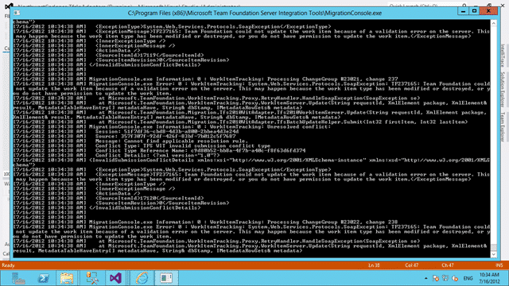

While running an integration platform import you get a “TF237165: The Team Foundation Server could not update the work item because of a validation error on the server. This may happen because the work item has been modified or destroyed, or that you do not have permission to update that work item.”

  
{ .post-img }
**Figure: TF237165: The Team Foundation Server could not update the work item**

Unfortunately it does not tell you what it was trying to save.

### Applies To

- TFS Integration Tools 2.2, March 2012

### Finding

This was a Configuration error that was not really presented effectively. I found it by reducing the dataset to a few known failing items and commenting out all of the field before re-running the migration. I then added each field in one at a time until the error occurred.

I had a missing field migration to map a data value into reason:

And I had an incorrect mapping in the ValueMap:

**Figure: Value mapping for Reason field**

You can see on lines 2 and 3 of the code above I had incorrectly specified the mapping as having a left value for the field that I was mapping as a @@MISSINGFIELD@@.

### Workaround

The mentioned field either needs removed from the mapping or added to the work item. In this case I will be removing it from the mapping as I don’t need that field on the Task WIT.

**Did this solve your problem?**
