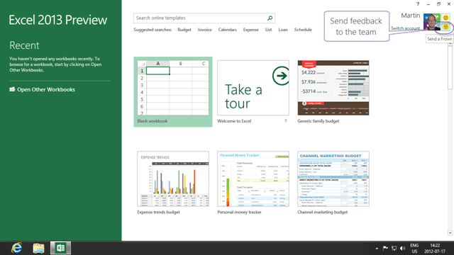

If you have not already seen the Office 2013 Preview has been made available on MSDN and on the Microsoft site. The install is ridiculously easy and includes Outlook 2013, Word 2013 and Communicator 2013. These tend to be the only parts of Office that I use, unless I an connecting to work item tracking in which case I would add Excel 2013 to that list.

  
**Figure: Downloading Office 2013**

Short download of under 1GB on the office network took no time at all.

  
**Figure: The install is uncomplicated**

I tend to always click “customize” if for nothing else to see the options that are available. I do also always install everything if I can. Office defaults to “not quite everything” as most folks don’t need the development tools, but I like to have them.

  
**Figure: Record install time**

It only took about 10 minutes to install which is a record where Office is concerned.

  
**Figure: Run through the welcome**

There is nothing different form before on the configuration and on my production workstation I did an upgrade and did not need ot configure Outlook at all. In act all of my plugins worked as well… awesome…

  
**Figure: Outlook 2012**

Did you notice the little  on the top right of the window?

  
**Figure: Did you miss it?**

No, really, its pretty small, but it has lots of power.

  
**Figure: Sending feedback Office 2013 style**

This is a fantastic feature that is akin to the “Feedback” capability built into Visual Studio 2012 Team Foundation Server. While I di not think that the Office team currently use TFS (they have a lot of code and work items to migrate) you could build a form just like this to submit feedback  into TFS for your application…hmmm… that's an idea for an app.

Watch out for:

- [Office 2013 Issue: Installing Office 2013 breaks Visual Studio 2012](http://blog.hinshelwood.com/office-2013-issue-installing-office-2013-breaks-visual-studio-2012/)

### Conclusion

I love the new feature of Office 2013 and its the spit and polish that makes me most happy.. yea Outlook still freezes (I submitted feedback for that) and they messed up my folders (submitted feedback for that too) in Outlook, but I have more nice things to say then not. [James Tupper](http://blog.nwcadence.com/author/jamestupper/) and I have been oo’ing and ah’ing over the features all morning 

**What do you think of Office 2013?**

