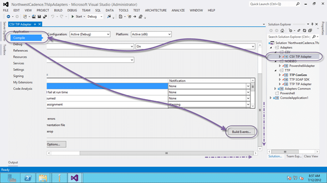
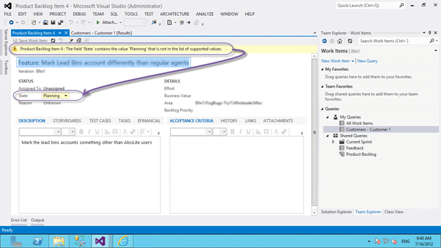

As part of my current engagement I will be moving data from FogBugz via a custom CSV Tip Adapter for the TFS Integration Platform. This an adapter I wrote a while ago to facilitate moving data from Excel to TFS and I just ant to reuse it. The first thing I need is a development environment as I may need to tweak this ancient code.

This post is part of a series of posts that document a Upgrade of TFS 2010 to TFS 2012 with a VSS Migration, Process Template consolidation, Team Project consolidation and a FogBugz migration:

1. **Part 1:** [**Upgrading TFS 2010 to TFS 2012 with VSS Migration and Process Template consolidation**](http://blog.hinshelwood.com/upgrading-tfs-2010-to-tfs-2012-with-vss-migration-and-process-template-consolidation/)
   1. [VSS Converter – Issue: TF60014 & TF60087: Failed to initialise user mapper](http://blog.hinshelwood.com/vss-converter-issue-tf60014-tf60087-failed-to-initialise-user-mapper/)
   2. [VSS Converter – Issue: TF54000: Cannot update the data because the server clock may have been set incorrectly](http://blog.hinshelwood.com/vss-converter-issue-tf54000-cannot-update-the-data-because-the-server-clock-may-have-been-set-incorrectly/)
2. **Part 2:** [**One Team Project Collection to rule them all–Consolidating Team Projects**](http://blog.hinshelwood.com/one-team-project-collection-to-rule-them-allconsolidating-team-projects/)
   1. [TFS Integration Tools – Issue: Access denied to Program Files](http://blog.hinshelwood.com/tfs-integration-platform-issue-access-denied-to-program-files/)
   2. [TFS Integration Tools – Issue: Error occurred during the code review of change group](http://blog.hinshelwood.com/tfs-integration-tools-issue-error-occurred-during-the-code-review-of-change-group/)
   3. [TFS Integration Tools – Issue: “unable to find a unique local path”](http://blog.nwcadence.com/tfs-integration-tools-issue-unable-to-find-a-unique-local-path/)
   4. [TFS 2012 Issue: Get Workspace already exists connecting with VS 2008 or VS 2010](http://blog.nwcadence.com/tfs-2012-issue-get-workspace-already-exists-connecting-with-vs-2008-or-vs-2010/)
3. **[Part 3: Migrating data from FogBugz to TFS 2012 using the TFS Integration Platform](http://blog.hinshelwood.com/migrating-data-from-fogbugz-to-tfs-2012-using-the-tfs-integration-platform/)**
   1. [TFS Integration Tools–Issue: AnalysisProvider not found](http://blog.hinshelwood.com/tfs-integration-toolsissue-analysisprovider-not-found/)
   2. [TFS Integration Tools: TF237165: The Team Foundation Server could not update the work item](http://blog.hinshelwood.com/tfs-integration-tools-tf237165-the-team-foundation-server-could-not-update-the-work-item/)

  
{ .post-img }
**Figure: Finishing up the data consolidation**

We completed the [upgrade to TFS 2012 and consolidated Process Templates](http://blog.hinshelwood.com/upgrading-tfs-2010-to-tfs-2012-with-vss-migration-and-process-template-consolidation/) and then consolidated all of the [Team Projects to a single collection](http://blog.hinshelwood.com/one-team-project-collection-to-rule-them-allconsolidating-team-projects/) and now the last part of this marathon of fun is to get all of the existing FogBugz data into TFS. We could conceivably use a simple Excel import, but this leaves us open for a nightmare of a time getting all of the state transitions through.

### Setting up a development environment for a custom adapter to the TFS Integration Platform

Do not use the ranger guidance for this. That way lies pain and suffering as it assumes that you need to be able to compile the entire TFS Integration Platform. I just set up the bits I need, so what do we need. Well, first we need to install a couple of things:

- Windows Sever 2012
- SQL Server 2012
- Visual Studio 2012 Team Foundation Server
- Visual Studio 2012 Ultimate
- TFS Integration Platform

[](http://blog.hinshelwood.com/files/2012/07/SNAGHTML3073bc7.png)  
{ .post-img }
**Figure: Make sure that you snapshot**

As I always use a VM for development I get to use the power of Snapshots to keep my environments clean and working 
{ .post-img }

Next you need to create a Solution and Project to hold your custom adapter. Use whatever layout that you want, but make sure that your Project has the following references:

- Microsoft.TeamFoundation.Migration.EntityModel.dll
- Microsoft.TeamFoundation.Migration.Toolkit.dll

Both of which you will find in “C:Program Files (x86)Microsoft Team Foundation Server Integration Tools”. But in order to go through a debug cycle (the TFS Integration Platform has no Unit Tests) you need to provide a little magic.

1.  **Select "Right Click Project | Compile | Build Events"**
    [](http://blog.hinshelwood.com/files/2012/07/image24.png)
    { .post-img }
    **Figure: Open the project properties**
2.  **Then in the post build events enter some xcopy statements**
    [](http://blog.hinshelwood.com/files/2012/07/image25.png)
    { .post-img }
    **Figure: Edit the build events**

    ````
    xcopy "$(TargetDir)$(TargetName)_" "$(SolutionDir)..BinariesMyAdapterPlugins_" /y
    xcopy "$(ProjectDir)Configuration*" "$(SolutionDir)..BinariesMyAdapterConfigurations*" /y /s
    xcopy "$(SolutionDir)..BinariesMyAdapter*" "%ProgramFiles(x86)%Microsoft Team Foundation Server Integration Tools\*" /y /s

        ```

        **Figure: Add some xcopy statements** 

    ````

3.  Select the Debug Tab
    [](http://blog.hinshelwood.com/files/2012/07/image26.png)
    { .post-img }
    Figure:
4.  **Select “Start external Program” and enter the path to the Migration Console**

    ```
    C:Program Files (x86)Microsoft Team Foundation Server Integration ToolsMigrationConsole.exe

    ```

5.  **Add a command line argument of the xml config file to run**
6.  **Add a working directory**

    ```
    C:Program Files (x86)Microsoft Team Foundation Server Integration Tools

    ```

Now when you debug your Class Library it will open MigrationConsole.exe with the correct test configuration and attach to the process allowing you to step through your code.

### Configuring your customer adapter to run

If you have configured the above steps correctly then all you need is to select the correct configuration file form the UI and it will pre-populate all of the values for you.

[](http://blog.hinshelwood.com/files/2012/07/image27.png)  
{ .post-img }
**Figure: Select the configuration file for your adapter**

There is some interesting code in the Configuration file to achieve this, and a way of setting the defaults.

```
< ?xml version="1.0" encoding="utf-8" standalone="yes" ?>


```

**Figure: Configuration files can be very detailed**

This file represents the data that needs to be mapped. All the CSV Adapter does is get the data into the TFS Integration Platform and the Configuration file does all of the hard work of mapping the data into TFS. If you noticed our crazy EOL and Delimiter you should also note that we have large amounts of history and description that may contain the usual delimiters so we needed something that would be unlikely to be used.

[](http://blog.hinshelwood.com/files/2012/07/image28.png)  
{ .post-img }
**Figure: It will now list your adapter on the left hand side**

Now that you can select the adapter we are ready to rock…

#### Building a configuration: Mapping States

The real advantage of this over Excel is that we can bypass the API rules and write data directly into TFS. This allows us to write data directly into a particular state even if that state does not exist. While not good is most circumstances this is invaluable when migrating data, otherwise we need to walk the work item through its states to get it to “Done” or “Closed”.

[](http://blog.hinshelwood.com/files/2012/07/image29.png)  
{ .post-img }
**Figure: Some data may need to be updated to enable saving**

To help with this I have created a mapping file, but it is really not that easy. We need to think about a number of things as part of the mapping. What are the old States, when are the new ones and how much do they match up.

**Figure: Mapping from State to State**

The state mappings are the easiest to mess up so take you time with these. I like to have all of my work items in a working state, but some customers either don’t care, or cant decide what the mapping should be. Don’t get confused into adding lots of redundant states into TFS…. why you might ask?

Well, if you change the states or the workflow for the states you are taking on a little more than just updating the states. What bout the Reporting Services reports that rely on them, or the Excel reports, or even the queries. There is a lot dependant on the states and in changing them you take on all of that maintenance…

I am not saying that you should not change the states (when actually I am ) but you need to consider all of the ramifications.

When importing data from another system I always have data that I would want as part of Areas & Iterations, but getting a decision on the format and mapping at the time would be pretty hard so I tend to prefix all Areas and Iterations with the name of the system that I am pulling the data from. The customer can then move and rearrange after the fact.

**Figure: Aggregate fields**

To achieve this you can use the Aggregate fields function and merge one or more fields. They even support mappings as well so that you can do some clean-up or manipulation as you go through.

### Exporting FogBugz data to CSV

This turned out to be a case of SQL Jujitzu and even better, I did not have to do it. My client provided me with a complete CSV file with a custom delimiter so that I could import it into TFS.

I did have to do a bunch of changes to my CSV adapter as I had not really got it working before. Now that it is working it will work for any tabular delimited data to import. Remembering that it is a Tip adapter and does not directly import history however it is aware of changes. If you write an updated file where the “DeltaDateColumn” field has been modified the data for that Work Item will be reapplied over the top of the old one (yes it will overwrite any changes), but this does allow for a staged migration.

Something that we have been doing is some data transformation as part of the output. We have effectively created a temporary table to hold the data and loaded and manipulated the data into that format for export to CSV, but you can just do a data dump depending on your requirements…

**Importing Hierarchy**

The CSV Adapter by default does not support hierarchy. It could, but I have not investigated that part of the TFS Integration Platform so I just wrote a small command line utility to do the import from a CSV.

```
Console.WriteLine(string.Format("Connecting to {0}", args[0]));
TfsTeamProjectCollection tfs = new TfsTeamProjectCollection(new Uri(args[0]));

Console.WriteLine(string.Format("Loading {0}", @"c:tempParentChild.csv"));
StreamReader SR = new StreamReader(@"c:tempParentChild.csv");
Dictionary> relates = new Dictionary>();
while (!SR.EndOfStream)
{
    string rowstring = SR.ReadLine();
    string[] row = rowstring.Split(',');
    if (!relates.ContainsKey(int.Parse(row[1])))
    {
        relates.Add(int.Parse(row[1]), new List());
    }
    relates[int.Parse(row[1])].Add(int.Parse(row[0]));
}

WorkItemStore store = tfs.GetService();
WorkItemCollection wic = store.Query(@"SELECT [System.Id] FROM WorkItems WHERE [System.AreaPath] UNDER 'TestProject2FogBugz' ORDER BY [System.Id]");
foreach (WorkItem sourcew in wic)
{
    // TASKS
    if (sourcew.Type.Name == "Task")
    {
        decimal parent = decimal.Parse((string)sourcew.Fields["TfsMigrationTool.ReflectedWorkItemId"].Value);
        parent = decimal.Negate(parent);

        WorkItem parentw = store.Query(string.Format(@"SELECT [System.Id] FROM WorkItems WHERE [TfsMigrationTool.ReflectedWorkItemId] = '{0}' ORDER BY [System.Id]", parent))[0];
        parentw.Open();

        WorkItemLinkTypeEnd linkTypeEnd = store.WorkItemLinkTypes.LinkTypeEnds["Child"];
        parentw.Links.Add(new RelatedLink(linkTypeEnd, sourcew.Id));
        parentw.Save();

        Console.WriteLine(parent);
    }
    else
    {
        int parentIsMe = int.Parse((string)sourcew.Fields["TfsMigrationTool.ReflectedWorkItemId"].Value);
        sourcew.Open();
        Console.WriteLine(string.Format("Processing Parent {0}", parentIsMe));
        if (relates.ContainsKey(parentIsMe))
        {
            foreach (int child in relates[parentIsMe])
            {
                WorkItem childw = store.Query(string.Format(@"SELECT [System.Id] FROM WorkItems WHERE [TfsMigrationTool.ReflectedWorkItemId] = '{0}' ORDER BY [System.Id]", child))[0];
                childw.Open();

                WorkItemLinkTypeEnd linkTypeEnd = store.WorkItemLinkTypes.LinkTypeEnds["Child"];
                sourcew.Links.Add(new RelatedLink(linkTypeEnd, childw.Id));
                sourcew.Save();
                Console.WriteLine(string.Format("Adding child if {0} to {1}", childw.Id, parentIsMe));
            }
        }
    }
}
Console.ReadKey();
```

**Figure: Crude but effective**

For the most part you don’t even need to know the project name as its all in the ID’s.

### Importing the ForgBugz data into TFS

This is the easiest part now that we have our data format and our configuration but we still had a nightmare getting the TFS Integration Platform to recognise the new Adapter. You need to make sure that you restart the “Windows Service” if you have it running but other than that everything went smoothly.

Practice makes perfect 
{ .post-img }
