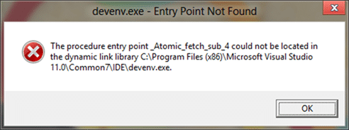
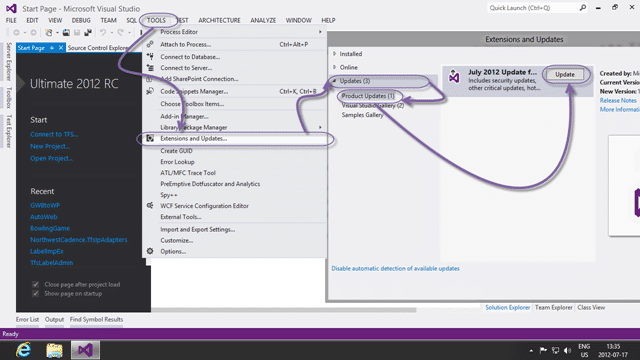

After installing Office 2013 on a machine with Visual Studio 2012 you get a “The procedure entry point \_Atomic_fetch_sub_4 could not be located in the dynamic link library c:Program Files (x86)Microsoft Visual Studio 11.0Common7IDEdevenv.exe” error when trying to load Visual Studio 2012.

  
{ .post-img }
**Figure: \_Atomic_fetch_sub_4 exception**

Some of my colleagues ran into this.

### Applies To

- Visual Studio 2012 RC (11.0.50522.1)
- Office 2013 Preview

### Finding

This is a C++ runtime conflict between Visual Studio 2012 RC and Office 2013 Preview.

> This update addresses incompatibility issues that are caused by installing later versions of the C++ Runtime on a machine with Visual Studio 2012 Release Candidate. The update ensures that the Visual Studio executable file loads the compatible C++ Runtime DLLs in the app-local directory instead of loading the incompatible C++ Runtime DLLs that are installed by other applications in the system-wide directories.  
> \-[KB2703187](http://support.microsoft.com/kb/2703187)

You will not be able to run Visual Studio until you have installed a patch.

### Workarounds

In order to prevent this error you should install the [July 2012 update for Visual Studio 2012 RC](http://www.microsoft.com/en-us/download/details.aspx?id=30178.) prior to installing Office 2013 Preview.

  
{ .post-img }
**Figure: Install the July 2012 Update for Visual Studio 2012**

If you did not install it first and you are unable to launch Visual Studio 2012 then you should [download the July 2012 update](http://www.microsoft.com/en-us/download/details.aspx?id=30178.) from the Microsoft downloads site and install it manually.

  
{ .post-img }
**Figure: Install July 2012 Update**

I found that this does not affect Visual Studio 2012 installs that already have a previous update on Windows 8, but does affect vanilla Release Candidate installs.

**Did this fix your problem?**
