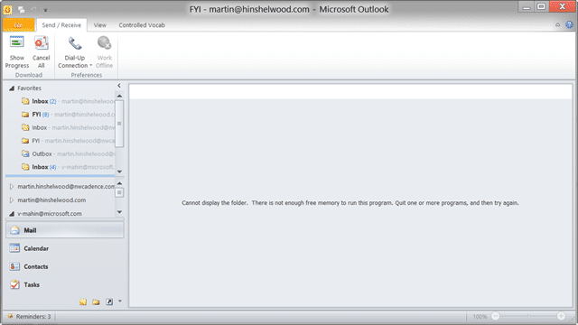
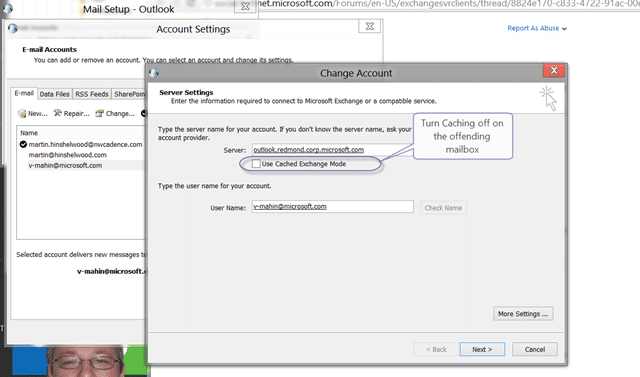

You get a “There is not enough free memory to run this program. Quit one or more programs, and try again.” when trying to do activities in Outlook 2013.

  
{ .post-img }
**Figure: Can’t expand folders without an error**

This affects both the Exchange and IMAP account when you have multiple email accounts enabled.

  
{ .post-img }
**Figure: Can’t select folders without an error**

### Updates

- **Updated 2012-07-27** – I found an additional workaround for my circumstance. Let me know if it helps you! (Looks like this did not work)
- **Updated 2012-07-30** – Solution found - This has been affecting me so much that I moved back to Outlook 2010. This however did not help as I get this error with Outlook 2010 as well which helped me find a fix…
- **Updated 2012-08-13** (Recommended)– Better solution found.. Don’t download shared or public folders

### Applies To

- Outlook 2013 Preview
- Outlook 2010

### Finding

I tried everything that was available online and the only solution that worked for me was to have only one Exchange account active at a time.

  
{ .post-img }
**Figure: I don’t think I have run out of memory! I have 24GB RAM!**

Even with separate profiles this continues to be a problem with my Microsoft Account, but not with my Office 365 account… weird. This may be an exchange issue that I am running into, but I do not know…

  
{ .post-img }
**Figure: there is not enough free memory in Outlook 2010**

As this is happening in Outlook 2010 I looked at reported solutions there and it looks like it is due to one of my mailboxes being associated with “Public Folders” or whatever the equivalent is here. I think they are just mandatory “Mailboxes” but they present as public folders. If I remove this mailbox I get no further issues.

### Workaround 1

If you create two profiles (yuch) and only open one exchange account at a time you can have a world of working instead of a world of hurt.

  
{ .post-img }
**Figure: You can’t currently open more than one exchange account**

This is a workaround as you are supposed to be able to have multiple exchange accounts open… I guess it does say “Preview” in the product name. Although I still get the problem with my Microsoft profile it is not as persistent nor as prevalent.

### Workaround 2

This is a more permanent work around as it looks like unless you have your computer joined to the Microsoft corporate domain you can’s use their email reliably.

  
{ .post-img }
**Figure: Everything works now I can authenticate better**

Now that I have joined my compute to the domain (although I am still logging in with my live id) this problem has abated.

### Solution 1

To remove this issue you need to turn off “Use cached exchange mode” for this mailbox. It will be enabled by default so you will need to deliberately turn it off.

  
{ .post-img }
**Figure: The offending Tick box**

You can do this through Outlook:

1. “Outlook | File | Account Settings | Account Settings…”
2. Select your mailbox and click “Change…”
3. Take the tick out of “Use Cached Exchange Mode”
4. Restart Outlook

Or you can do this through the Mail settings in the control panel.

### Solution 2 (Recommended)

While the above solution worked it made offline viewing of data impossible. A better solution that also stops the error is to change the setting to not allow “Download shared folders” nor “Download Public Folder Favourites” as it looks like these are the culprits.

  
{ .post-img }
**Figure: Don’t download shared or public folders**

You can do this through Outlook:

1. “Outlook | File | Account Settings | Account Settings…”
2. Select your mailbox and click “Change… | More Settings…”
3. Take the tick out of “Download shared folders”
4. Take the tick out of “Download Public Folder Favourites”
5. Click “OK” and Restart Outlook

Or you can do this through the Mail settings in the control panel.

**Did this help with you issue?**
