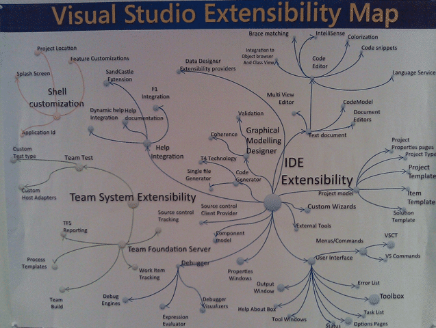
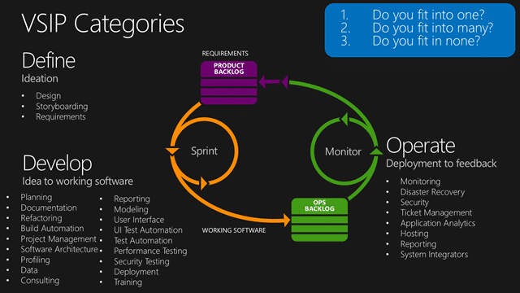

No I am not leaving Northwest Cadence.
{ .post-img }

No I am not going to work at Microsoft… well I am, kind of. I have just started an engagement that will see me working as a Technical Product Manager as part of the Visual Studio Industry Partner Program.

{ .post-img }

- [Visual Studio Industry Partner Directory](http://www.microsoft.com/visualstudio/en-us/partner-directory-industry)
- [Visual Studio Industry Partner (VSIP) Program](http://msdn.microsoft.com/en-us/vstudio/dd637761)

An Orange badge (or “v dash” because of the v-username format) is an external vendor consulting inside of Microsoft. The Director of the VSIP team (Tom) has tagged me to help him better leveraging and understand the space between [Microsoft Visual Studio Industry Partners](https://vsipprogram.com) and the Visual Studio product. This is an awesome opportunity to personally expand and allow the VSIP team to leverage my skills as an ALM Consultant, ALM MVP and ALM Ranger to the fullest to, hopefully, benefit both sides of this awesome sandwich.

  
{ .post-img }
**Figure: Visual Studio Extensibility Map**

My key focus will be on:

- ### Opportunities for partners to extend Visual Studio
  There are many extensibility points in the Visual Studio stack from client to server and back again, but not all of them are being leveraged by the field. There are currently over 180+ VSIP members that are leveraging the benefits of a program designed to foster collaboration and growth of an ecosystem around Visual Studio and we want to grow that. In addition we need to understand where the partners fir, where they are going and what Microsoft can do to support them… a roadmap if you will.
- ### Opportunities for Visual Studio to be extended
  There are many gaps in the extensibility that if this or that API was just tweaked a little we could get some awesome developer tools working. This is where I will be leasing heavily with the Product Teams for Visual Studio and Team Foundation Serve to make use that the extensibility points that the vendors want to leverage are up to par or even exist at all. This will enable Visual Studio to better support the partners and vice a versa.

My first task was defining a new taxonomy to fit out partners into as the old one was a little too low level with “ASP.NET” and “MVC” on the list. We went with parity to the general “Define”, ‘Develop” and “Operate” strategy that will help us better understand where the VSIP partners sit and where any gaps are.

  
{ .post-img }
**Figure: There are many places to integrate with Visual Studio**

I am really exited about this not just as an opportunity to work more closely with the Product Team and get involved in the cool goings on in the vendor community, but also to grow as a consultant and take on new challenges. Over the last year and a half I have gone from being a Technical Consultant to a Process Consultant and Professional Scrum Trainer, and that is no easy transition  while maintaining  your technical competence. I do feel that some of my low level technical skills have dribbled out of my ears to make room for some of the other stuff, but hopefully not much.

Now adding to that the Product Management role which is very different from those that have gone before will be the next challenge. Also balancing that on a part time basis will be even more fun…

**Do you integrate with Visual Studio? Did it fit into the new taxonomy?**
