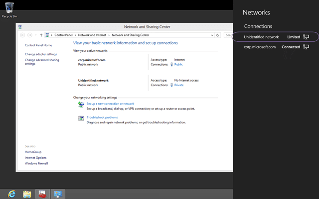

When you are running hyper-v you get the option to create private virtual switches to compartmentalise your network coms. if however you are using Windows 8 it may define those networks as “Public Networks” and tighten up your security so much that you cant communicate with other computers.

  
{ .post-img }
**Figure: Other networks detected as Public when they are Private**

### Applies to

- Windows 8

### Finding

If you are using Hyper-V with Windows 8 clients then you need to set a fixed IP on your clients on Private virtual switches.

  
{ .post-img }
**Figure: Microsoft Hyper-V Network Adapters**

Windows 8 detects the Hyper-V virtual network adapters as Unknown if there is no DHCP or domain identification and classifies them as “public” without the ability to change them

  
{ .post-img }
**Figure: Unidentified Networks are automatically public**

### Workaround

Although domains should be identified correctly I want the ability to change the configuration manually if needed.

1. _Click “Start | run | MMC | press enter”_
2. _In MMC console “File | Add/Remove Snap-in”_
3. _Select Group Policy Object editor  by “Add | select Local computer | OK | OK”_
4. _Open “Computer configuration | Windows Settings | Security Settings | Network list Manager policies”_
5. _Open “Unidentified networks”_

Then you can select the option to consider the Unidentified networks as private and if user can change the  
location.

  
{ .post-img }
**Figure: Network list Manager policies**

Note: If you cant launch the “Local Computer Policy” then you are running Windows 8 and you need Windows 8 Pro to do this.

**Did this help you?**
