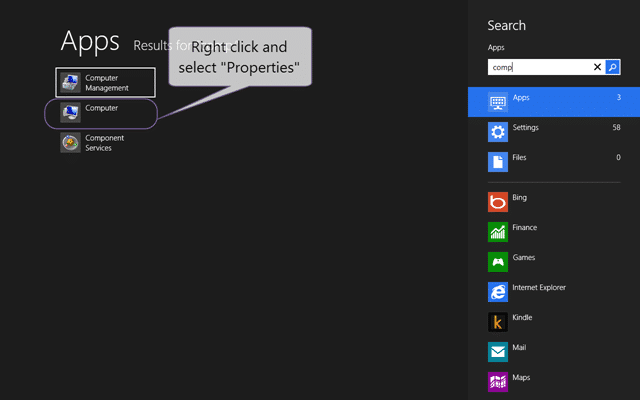
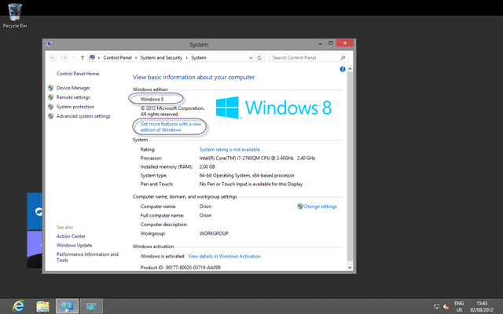
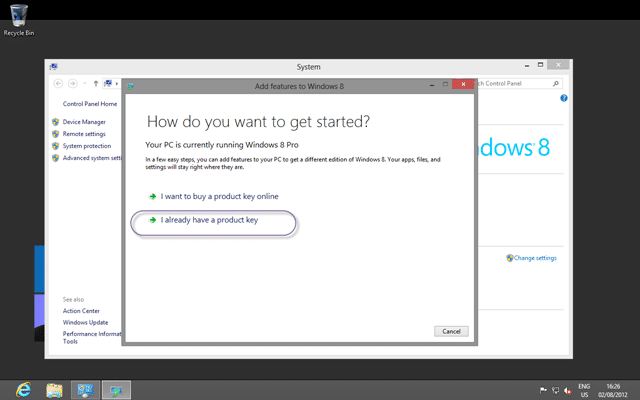

After installing Windows 8 I tried to do a couple of things that I normally do to set up my computer.

I went to enable “Remote Desktop”… but there was no options. Hmm…

I wanted to make a change to the “Local Security Settings…”. Hmmm…

Both of these things were missing and I started to google bing for information on how to change a setting. And, lo and behold I found:

> If you are troubleshooting why secpol.msc does not seem to exist in your copy of Windows 7, then the reason is probably that you have the Home Premium version; unfortunately you need to upgrade, or else try another machine that does have the Ultimate Edition.  
> \-[Secpol: Local Security Policy Editor](http://www.computerperformance.co.uk/win8/windows8-secpol-msc.htm)

But I have Windows 8 Pro? But no… alas I dropped the ball and installed “Windows 8”. Full stop… and not “Windows 8 Pro”…

How do you tell? Simples…

  
{ .post-img }
**Figure: View the Properties of “Computer”**

Which will open the system information about your computer. This will tell you lots of things of use on bare metal, but as this is a Hyper-V box there is little of import. Except the edition of Windows…

  
{ .post-img }
**Figure: Aww nuts… Windows 8 (only)**

I did think that I needed to reinstall, but I thought that should at least give the “Add features” a try…

  
{ .post-img }
**Figure: Get more features the easy way**

You will get asked for a key for the new and higher edition of Windows 8 that you want to move to.

  
{ .post-img }
Figure: But I already have a nice MSDN key at the ready?

You will likely just have selected the wrong key from your MSDN and you can select “I already have a product key” and enter the new one.

  
{ .post-img }
**Figure: Phew… Windows 8 Pro**

Lets just check that we can indeed access the goods…

[****](http://blog.hinshelwood.com/files/2012/08/image12.png)  
{ .post-img }
**Figure: Why is this a Pro only feature?**

I was quite happy not to have to reinstall, but you can choose what you want to do. My suggestion is to use a Pro key the first time round!

**Did you install the wrong version of Windows?**

**How easy was it for you to fix it?**

