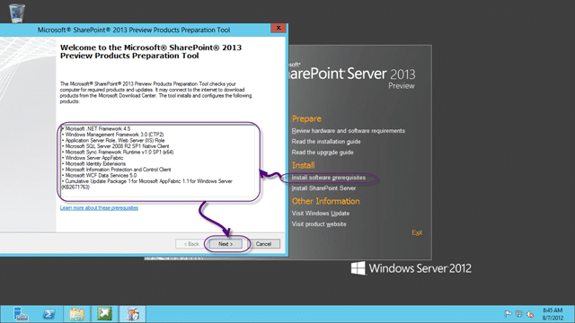
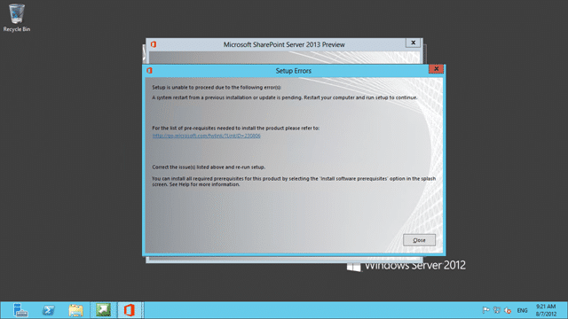
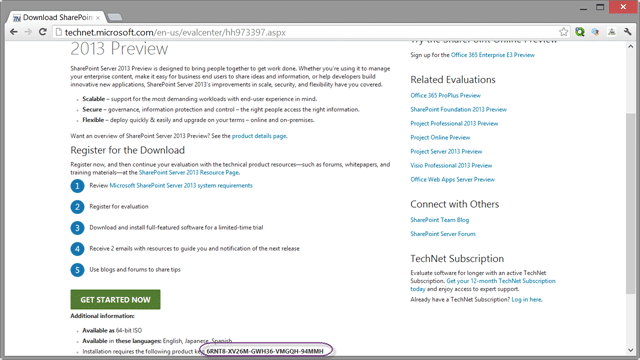
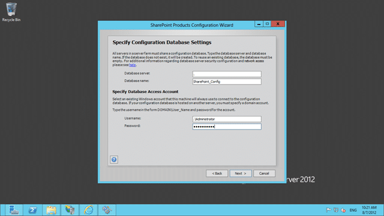
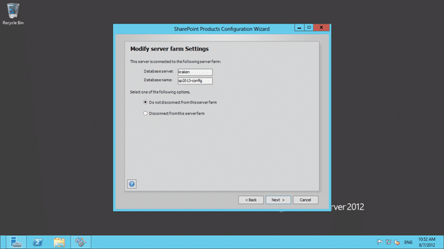
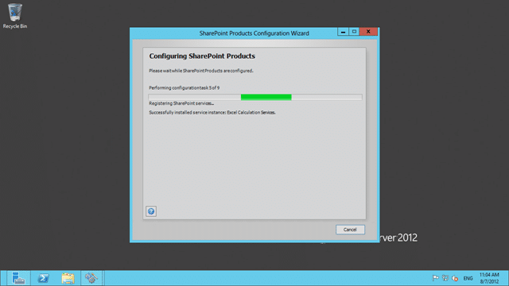
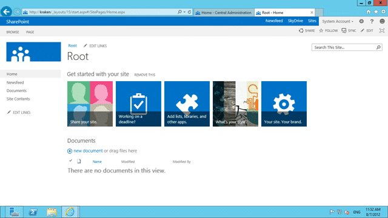

Any setup of Team Foundation Server is not complete until you have at least tried t work with SharePoint. While I have many customers that like to stay away from  SharePoint I also have many that make it an integral part of not just their TFS install, but their corporate network, offerings and culture.

note: To really use SharePoint effectively you have to buy into it as “the” solution or your internal network.

> The questions is irrelevant, the answer is SharePoint
>
> \-[Adam Cogan](http://www.adamcogan.com/)

SharePoint 2013 Preview is fully supported by Visual Studio 2012 Team Foundation Server, but I do not know what the Office teams take on Go-Live or actually using SharePoint 2013 is.

  
{ .post-img }
**Figure: SharePoint Server 2013 Preview**

I have been using Office 2013 for a while and it is fairly solid. I have some high hopes for the interaction as there are some major advances in the new SharePoint.

  
{ .post-img }
**Figure: Install software prerequisites**

There was always a lot of… trial and error… in finding and installing the prerequisites for SharePoint in the past and as of SharePoint 2010 you have an option on the Installation wizard to have it all done for you.

I heartily recommend that approach…

  
{ .post-img }
**Figure: Always run Windows Update**

It may seam like a small thing, but make sure that you run Windows Update both before and after each installation. There may be critical updates that would make your install process as slick as possible. Also if you rely on your organisation to manage windows updates then make sure that your System Administrators have approved all of the updates that you might need. Ask them to approve all updates for:

- **Office 2013**
- **Windows 2012**
- **SQL Server 2012**
- **SQL Server 2008 R2**  
   There are some dependencies in there for 2008 R2 components
- **Visual Studio 2012**

Its a long list, but lacking a windows update can make you life incredibly painful with often little understanding as to why.

  
{ .post-img }
**Figure: Make sure that you restart**

Most of the new generation of Microsoft products do as much auto detection of potential problems before they become a problem. How well they do depends on the product team, but so far SharePoint 2013 is doing ok.

  
{ .post-img }
**Figure: You need the Key from TechNet**

You can get the Key for SharePoint 2013 from [http://technet.microsoft.com/en-us/evalcenter/hh973397.aspx](http://technet.microsoft.com/en-us/evalcenter/hh973397.aspx)

  
{ .post-img }
**Figure: Never select “Stand-alone” install!**

Everyone makes this mistake once so please take note… never… ever… select “Stand-alone” install option. You will not be asked to select a SQL server is it will automatically install and use Express.

  
{ .post-img }
**Figure: Select “Complete” install**

Once you select complete the install of the files progresses. We will do the configuration later.

  
{ .post-img }
**Figure: Poo!**

An error during the setup is not what you want to see and after clicking close I for a little more detail.

  
{ .post-img }
**Figure: An Unspecified 1603**

Don’t you just love the Unspecified error  but as this is a Preview, my first response is to run the install again. My guess would be a timeout, or some other glitch in the bootstrapper so…
{ .post-img }

  
{ .post-img }
**Figure: A rerun solved the problem**

Whatever the problem was just running the installation again seamed to have kicked it into gear.

Now that we have SharePoint 2013 installed we need to configure it.

  
{ .post-img }
**Figure: This is a stand alone instance so a new farm**

Although we selected “Complete Install” earlyer, the configuration we want is a “Stand-alone” one, but configured our way…

  
{ .post-img }
**Figure: Configure the database**

If you don’t see this screen next you need to uninstall SharePoint and re-install selecting “Complete” as the install mode. Like I said, everyone makes that mistake once.

  
{ .post-img }
**Figure: You need a domain to create a farm**

Fudge buckets! I want to configure it myself and I do not want to use SQL Express, so what to-do! So getting a “The username is invalid. The account mist be a valid domain account” is very frustrating… in 2010 the message was “Local accounts should only be used in standalone mode” and was equally annoying… don’t tell me how to install… I will tell you.

Command line to the rescue! You need to [run “New-SPConfigurationDatabase” from the PowerShell command line](http://blog.hinshelwood.com/issue-sharepoint-2013-the-username-is-invalid-the-account-must-be-a-valid-domain-account) to configure with local accounts.

After that small interlude we can now carry on with the configuration to get SharePoint 2013 up and running on my local VM.

  
{ .post-img }
**Figure: Do not disconnect from this server farm**

Just make sure that you don't un-configure our work around for local accounts.

  
{ .post-img }
Figure: Review the configuration

And off it goes…

  
{ .post-img }
**Figure: Takes a few minutes to configure**

It only takes a few minutes to configure SharePoint at this point and that should create everything you need to get into the Admin site.

  
{ .post-img }
**Figure: Now we need to configure the features and services**

I am going to configure everything as it will give me a chance to play, but note that only features you use will be turned on and using memory. If you don’t use them, they stay off/unloaded.

  
{ .post-img }
**Figure: There are tones of optional services**

Here is a list of the available services and what they do:

- **Access Services 2010**  
   Allows viewing, editing, and interacting with Access Services 2010 databases in a browser.
- **Access Services**  
   Allows viewing, editing, and interacting with Access Services databases in a browser.
- **App Management Service**  
   Allows you to add SharePoint Apps from the SharePoint Store or the App Catalog.
- **Business Data Connectivity Service**  
   Enabling this service provides the SharePoint farm with the ability to upload BDC models that describe the interfaces of your enterprises' line of business systems and thereby access the data within these systems.
- **Excel Services Application**  
   Allows viewing and interactivity with Excel files in a browser.
- **Lotus Notes Connector**  
   Search connector to crawl the data in the Lotus Notes server.
- **Machine Translation Service**  
   Performs automated machine translation.
- **Managed Metadata Service**  
   This service provides access to managed taxonomy hierarchies, keywords and social tagging infrastructure as well as Content Type publishing across site collections.
- **PerformancePoint Service Application**  
   Supports the monitoring and analytic capabilities of PerformancePoint Services such as the storage and publication of dashboards and related content.
- **PowerPoint Conversion Service Application**  
   Enables the conversion of PowerPoint presentations to various formats.
- **Search Service Application**  
   Index content and serve search queries.
- **Secure Store Service**  
   Provides capability to store data (e.g. credential set) securely and associate it to a specific identity or group of identities.
- **State Service**  
   Provides temporary storage of user session data for SharePoint Server components.
- **Usage and Health data collection**  
   This service collects farm wide usage and health data and provides the ability to view various usage and health reports.
- **User Profile Service Application**  
   Adds support for My Sites, Profiles pages, Social Tagging and other social computing features. Some of the features offered by this service require Search Service Application and Managed Metadata Services to be provisioned.
- **Visio Graphics Service**  
   Enables viewing and refreshing of Visio Web Drawings.
- **Word Automation Services**  
   Provides a framework for performing automated document conversions.
- **Work Management Service Application**  
   This service provides task aggregation across work management systems.

Everything except the “Lotus Notes” connector are of use 
{ .post-img }

  
{ .post-img }
**Figure: This may take some time…**

…Or considerably longer…

  
{ .post-img }
**Figure: Search error**

I got a search error, but [Soeren L. Nielsen has a solution](http://soerennielsen.wordpress.com/2010/07/15/how-to-install-a-sharepoint-2010-complete-server-without-ad/) and I don’t need search.

  
{ .post-img }
**Figure: Creating your first Site Collection**

I needed to create a default site to use the features, but as this is a “2013” experience site I may need to create a 2010 experience site for some things I may want to do.

DONE

  
{ .post-img }
**Figure: Admin site is up and working**

To make sure things are working, do a little smoke test. Check the Admin site, and then run up the first Collection that you made.

  
{ .post-img }
**Figure: Wooo… nice new portal**

Now I can get on with the fun….
