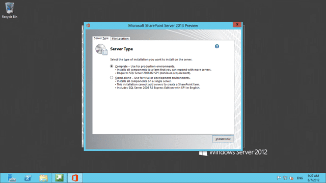

When configuring SharePoint 2013 in “Complete” mode you get a “The username is invalid. The account mist be a valid domain account” when using a local account to configure the farm…

[![image_thumb[15]](images/image_thumb15_thumb-1-1.png "image_thumb[15]")](http://blog.hinshelwood.com/files/2012/08/image_thumb151.png)  
{ .post-img }
**Figure: You need a domain to create a farm**

The implication is that only Domains are supported.

### Applies To

- SharePoint 2013

### Findings

Out of the box SharePoint only supports “Stand-alone” mode for non domain environments, but this forces you to use SQL Server 2008 R2 Express Edition which is most cases is unacceptable.

  
{ .post-img }
**Figure: “Stand-alone” used SQL Server 2008 R2 Express Edition**

The UI is designed for the happy path and you need to drop to the command line to do anything else.

### Solution

Use a PowerShell command to create the initial configuration of the farm with a local account:

1.  **Start the SharePoint PowerShell**
2.  **Run “New-SPConfigurationDatabase” from the command line and follow the instructions**
    [![image_thumb[16]](images/image_thumb16_thumb-2-2.png "image_thumb[16]")](http://blog.hinshelwood.com/files/2012/08/image_thumb161.png)
    { .post-img }
    Figure: New-SPConfigurationDatabase creates the farm for you
    This will create the farm and configure the necessary accounts.
3.  **Rerun the Configurtion wizard**
    After it finishes start the Config Wizard (interactive or not) and configure your server with all components

        [![image_thumb[17]](images/image_thumb17_thumb-4-4.png "image_thumb[17]")](http://blog.hinshelwood.com/files/2012/08/image_thumb17.png)

    { .post-img }
    **Figure: Just don’t disconnect from this server farm**

This works just fine with SQL Server 2012.

**Did this help you?**
