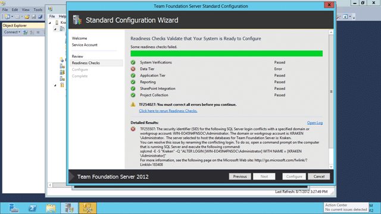

### Issue

When running the installer for TFS 2012 you get an TF255507 error with the following error message.

[](http://blog.hinshelwood.com/files/2012/08/image40.png)  
{ .post-img }
**Figure: TF255507 The security identifier (SID) for the following SQL Server login conflicts**

If you look in the log file you will see a little additional information:

```
[Info   @22:29:03.647] +-+-+-+-+-| Running Verify Admin login: Verifying that the given account does not already have a SQL login that is denied access or with the wrong SID |+-+-+-+-+-
[Info   @22:29:03.647]
[Info   @22:29:03.647] +-+-+-+-+-| Verifying that the given account does not already have a SQL login that is denied access or with the wrong SID |+-+-+-+-+-
[Info   @22:29:03.647] Starting Node: VSQLLOGIN
[Info   @22:29:03.647] NodePath : VINPUTS/Progress/Conditional/VSQLNOTLOCALDB/VSQLISRUNNING/VSQLCONNECT/VSQLLOGIN
[Info   @22:29:03.647] Verifying SQL login of account KRAKENAdministrator does not exist on Kraken, or if it exists, it does not have a different SID and it is not denied access to the server.
[Info   @22:29:03.694] Node returned: Error
[Error  @22:29:03.694] TF255507: The security identifier (SID) for the following SQL Server login conflicts with a specified domain or workgroup account: WIN-EO45N4FNSOCAdministrator. The domain or workgroup account is: KRAKENAdministrator.  The server selected to host the databases for Team Foundation Server is: Kraken.
You can resolve this issue by renaming the conflicting login. To do so, open a command prompt on the computer that is running SQL Server and execute the following command:
sqlcmd -E -S "Kraken" -Q "ALTER LOGIN [WIN-EO45N4FNSOCAdministrator] WITH NAME = [KRAKENAdministrator]"
For more information, see the following page on the Microsoft Web site: http://go.microsoft.com/fwlink/?LinkId=183408

```

**Figure: Error from log**

### Applies To

- Team Foundation Server 2012
- SQL Server 2012

### Findings

It looks like the Server was renamed after the install of SQL Server 2012. The original generated name was “WIN-EO45N4FNSOC” and it was subsequently renamed to “KRAKEN”.

### Solution 1

Rename your server before you install SQL.

### Solution 2

As specified in the error message you need to run the SQL Command to fix. Alternatively you could just remove and add the correct account. However altering the account will maintain any audit trail.

```
sqlcmd -E -S "Kraken" -Q "ALTER LOGIN [WIN-EO45N4FNSOCAdministrator] WITH NAME = [KRAKENAdministrator]"

```

**Figure: Run this on the SQL Server to fix**

[](http://blog.hinshelwood.com/files/2012/08/image41.png)  
{ .post-img }
**Figure: Rerun Readiness Checks**

Once you have run the command you can “rerun Readiness Checks” to clear out the error.

**Did this fix your problem?**
