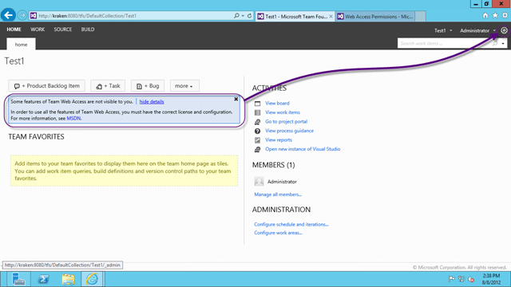
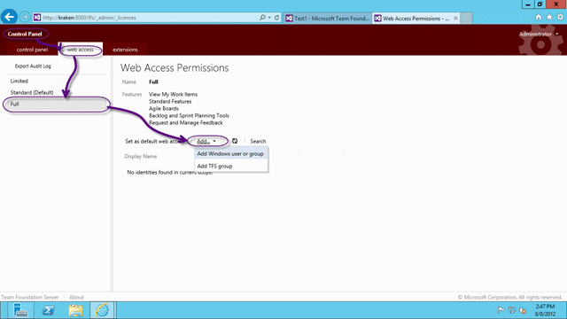
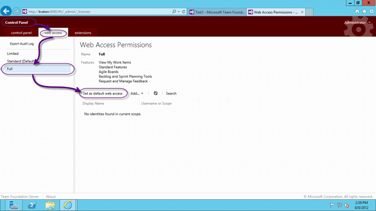

The first time you log into TFS 2012 you may see the message “Some features of Team Web Access are not visible to you” and once you check out the details you see that “In order to use all the features of Team Web Access, you must have the correct license and configuration. For more information”.

  
{ .post-img }
**Figure: Where are my features?**

### Applies to

- Visual Studio 2012 Team Foundation Server

### Findings

Just because you are an administrator does not mean that you have access to all of the features. Features require licences and licences require money. All you need to administer TFS is a CAL (~$300), but some features require Premium (~$5000) or even Ultimate (~$12,000) MSDN licences so don’t expect it. There are a few features that only exist in the higher SKU’s and there are three levels:

- **Limited**
  - View My Work Items
- **Standard**
  - View My Work Items
  - Standard Features
  - Agile Boards
- **Full**
  - View My Work Items
  - Standard Features
  - Agile Boards
  - Backlog and Sprint Planning Tools
  - Request and Manage Feedback

Some of these are only available through the site and the site does not know what MSDN licence you have bought.

### Solution

You need to add individuals to the Licence groups that relate to the respective licencing level that they have purchased.

  
{ .post-img }
**Figure: Go to Administer Server**

Open the Admin system and change the Web Access Permissions from “Control Panel | Web Access | Full | Add…” and add the users that have Premium or Ultimate licences to that group.

  
{ .post-img }
**Figure: Add Premium and Ultimate user to Full feature access**

If you are sure that you have Premium, Ultimate or Test Professional for all of your users you can just set “Full” access as the default!

  
{ .post-img }
**Figure: You can also Set as default**

If you are going to do this you need to make sure that you have licences, but it will make an administrators life a little easier!

**Did this fix your problem?**
