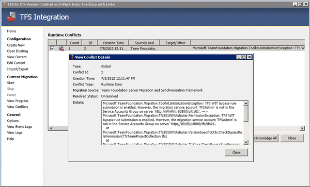
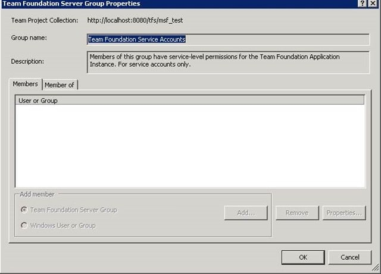

When you run the TFS Integration Platform for the first time with TFS WIT bypass-rule submission enabled you will likely get the following error:

[](http://blog.hinshelwood.com/files/2012/09/image37.png)  
{ .post-img }
**Figure: A Runtime Error**

> Microsoft.TeamFoundation.Migration.Tfs2010WitAdapter.PermissionException: TFS WIT bypass-rule submission is enabled. However, the migration service account 'TFSService' is not in the Service Accounts Group on server 'http://tfsserver:8080/tfs/msf_migrate'.
>
> at Microsoft.TeamFoundation.Migration.Tfs2010WitAdapter.VersionSpecificUtils.CheckBypassRulePermission(TfsTeamProjectCollection tfs)
>
> at Microsoft.TeamFoundation.Migration.Tfs2010WitAdapter.TfsCore.CheckBypassRulePermission()
>
> at Microsoft.TeamFoundation.Migration.Tfs2010WitAdapter.TfsWITMigrationProvider.InitializeTfsClient()
>
> at Microsoft.TeamFoundation.Migration.Tfs2010WitAdapter.TfsWITMigrationProvider.InitializeClient()
>
> at Microsoft.TeamFoundation.Migration.Toolkit.MigrationEngine.Initialize(Int32 sessionRunId)

### Applies To

{ .post-img }

- TFS Integration Platform

### Findings

{ .post-img }

Only accounts in the Team Foundation Service Accounts are aloud to access the web services directly. By default the account used to install TFS is not added to this group.

In addition you will also be unable to add the account through the UI as editing this group directly is disables. It is meant to be used under the covers for Lab or Build accounts, but the TFS Integration Platform is not an out-of-the-box tool.

[](http://blog.hinshelwood.com/files/2012/08/clip_image002.jpg)  
{ .post-img }
**Figure: You can’t edit Team Foundation Service Accounts**

This is a special group that does not allow you to populate it through the UI. You can however view it and all of the accounts that you use for your Build Agents, Build Controllers and other bits and bobs will all be in this list already.

You need to use the the command line 
{ .post-img }

### Solution

{ .post-img }

Use the tfssecurity.exe tool to update the Service Accounts Group and add the “TfsAdmin”.

[](http://vsalm.blob.core.windows.net/blog-store/files/2012/07/image2.png)  
{ .post-img }
**Figure: Updating the TFS Security group**

You use our old friend the command line. There is an application called TfsSecurity that will allow you to add an account directly to that group.

```
tfssecurity /g+ "Team Foundation Service Accounts" n:domainusername ALLOW /server:http://myserver:8080/tfs

```

Now you have that sorted you are ready to rock…

**Did this help you?**
