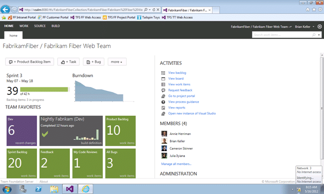
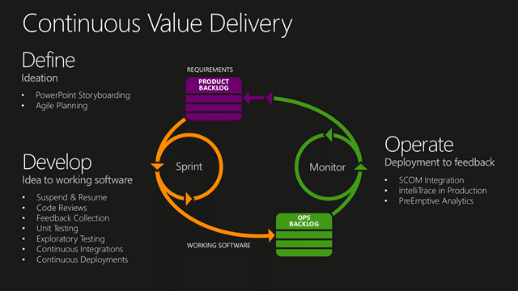

With the availability of [Visual Studio 2012 RTM today on MSDN](http://msdn.microsoft.com/en-US/vstudio/) I wanted to let you know that Northwest Cadence just completed its first Production RTM installation for a customer.

Do not fear this upgrade. If you are moving from TFS 2010 this is a simple upgrade although there are many new features and a brand new Web UI. Even from TFS 2008 this is a fairly straight forward and well documented process.

  
{ .post-img }
**Figure: New Web Access for Team Foundation Server**

If your organisation relies heavily on the Web UI provided by Team Web Access, and your teams are not highly adaptable,  then you may want to take a look and think about some training before you roll it out as it looks and operates very differently.

In addition while it will work out-of-the-box you may want to think about [how your Team Projects are structured](http://blog.hinshelwood.com/one-team-project/) and how your Teams will interact with them.

### Experiences installing Visual Studio 2012 BETA

{ .post-img }

Even the Beta release came with a go-live licence and while this provided full support from Microsoft we only had one customer take up the Beta mantel and they moved to the Team Foundation Service Preview and not an on-premises install.

- [Upgrading from TFS2010 to Visual Studio 2012 Team Foundation Server in production](http://blog.hinshelwood.com/upgrading-from-tfs2010-to-visual-studio-11-team-foundation-server-in-production/) (Northwest Cadence)

- [Upgrade to Visual Studio 11 Team Foundation Service – Done](http://blog.hinshelwood.com/upgrade-to-visual-studio-11-team-foundation-service-done/) (Customer)

Moving to the Beta was a leap of faith, but it paid off for anyone that tried it…

### Experiences installing Visual Studio 2012 RC

{ .post-img }

The RC was provided with a go-live licence as well and many of our customers took advantage of it. Here are the documented scenarios within which I participated although it does not represent all of the installs that Northwest Cadence completed.

- [Upgrading TFS 2010 to TFS 2012 with VSS Migration and Process Template consolidation](http://blog.hinshelwood.com/upgrading-tfs-2010-to-tfs-2012-with-vss-migration-and-process-template-consolidation/) (Customer)

- [Installing TFS 2012 with Lab Management 2012](http://blog.hinshelwood.com/installing-tfs-2012-with-lab-management-2012/) (Customer)

- [Presenting Visual Studio ALM and upgrading TFS 2010 to TFS 2012 in production – Done](http://blog.hinshelwood.com/presenting-visual-studio-alm-upgrading-tfs-2010-to-tfs-2012-in-production-done/) (Customer)

- [Installing TFS 2012 on Server 2012 with SQL 2012](http://blog.hinshelwood.com/installing-tfs-2012-on-server-2012-with-sql-2012/) (just for me)

- [Installing Eclipse on Windows 8 and connecting to TFS 2012](http://blog.hinshelwood.com/installing-eclipse-on-windows-8-and-connecting-to-tfs-2012/) (just for me)

Moving from the RC to the RTM will be as easy as running the new install and having the upgrade take place automatically. Simples…

### Issues

{ .post-img }

While I had very few issues while installing, configuring and upgrading to Visual Studio 2012 Team Foundation Server you can never get away without having at least some issues. Here are the main things that I documented:

- [Office 2013 Issue: Installing Office 2013 breaks Visual Studio 2012](http://blog.hinshelwood.com/office-2013-issue-installing-office-2013-breaks-visual-studio-2012/)

- [TFS Integration Tools: TF237165: The Team Foundation Server could not update the work item](http://blog.hinshelwood.com/tfs-integration-tools-tf237165-the-team-foundation-server-could-not-update-the-work-item/)

- [VSS Converter – Issue: TF54000: Cannot update the data because the server clock may have been set incorrectly](http://blog.hinshelwood.com/vss-converter-issue-tf54000-cannot-update-the-data-because-the-server-clock-may-have-been-set-incorrectly/)

- [VSS Converter – Issue: TF60014 & TF60087: Failed to initialise user mapper](http://blog.hinshelwood.com/vss-converter-issue-tf60014-tf60087-failed-to-initialise-user-mapper/)

### Conclusion

If you are currently running any version of Team Foundation Server you should be looking at upgrading as soon as possible to take advantage of the awesome new features.

  
{ .post-img }
**Figure: New feature for continuous value delivery**

Forget the unbelievably cool features that made it into TFS 2010, these are the cool features that you have been waiting for:

- PowerPoint Storyboarding
- Agile Planning
- Suspend & Resume
- Code Reviews
- Feedback Collection
- Unit Testing
- Exploratory Testing
- Continuous Integrations
- Continuous Deployments
- SCOM Integration
- IntelliTrace in Production
- PreEmptive Analytics

With all of these things built into the product there is even fewer excuses for Development Teams to be unable to deliver high quality product within an agile process that provides value to the customer…

**Are you thinking of installing or upgrading to Visual Studio 2012 Team Foundation Server? Do you need help?**
