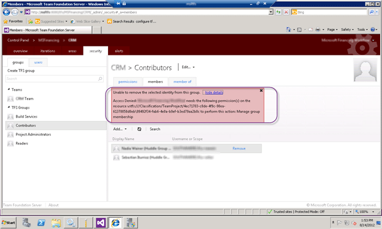
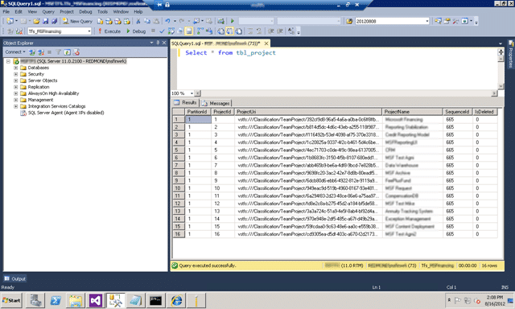

After an upgrade from TFS 2008 you are unable to edit permissions even though you are part of the appropriate groups. In this case it is an upgrade from TFS 2008 to TFS 2012 that did not have any errors on the way through. Everything looked like it worked, but…

[Updated 2012-10-11](#collapseOne) \- Solution improvement for additional circumstances

I found that the solution below did not always do the job and I had to add a second command line to make it work. Effectively adding an additional ACL to the logged in user if they are not in the Project Administrator list.

You get an “Unable to remove the selected identity from this group” error when trying to remove someone from contributors.

[](http://blog.hinshelwood.com/files/2012/08/image50.png)  
{ .post-img }
**Figure: Unable to delete user from group**

### Applies To

- Visual Studio 2012 Team Foundation Server

### Findings

You need to make sure that you are in the appropriate groups first. This could be simply a case of not actually having permission.

1. I am in the Administration Console Users list… (yes I reapplied)[  
    ](http://blog.hinshelwood.com/files/2012/08/image51.png)  
   { .post-img }
   **Figure: Administration Console User List**
2. I am in the Team Foundation Server Administrators group…[  
    ](http://blog.hinshelwood.com/files/2012/08/image52.png)  
   { .post-img }
   **Figure: Team Foundation Server Administrators**
3. I am in the Project Collection Administrators group…[](http://blog.hinshelwood.com/files/2012/08/image53.png)  
   { .post-img }
   **Figure: Project Collection Administrators**

If you have checked all of the permissions then we have a problem. Log in as the “TFS Service” account that you are using and see if you still can’t change things.

Now I can delete users from the Contributors group, woot… but why can’t other accounts that are administrators.

### Solution

You need to add the permissions that you need as they were not part of the upgrade. To do this you need to call TFS Security and this is where things get a little complicated.

```
tfssecurity.exe /a+ Identity vstfs:///Classification/TeamProject/PROJECT_GUID
        ManageMembership adm:vstfs:///Classification/TeamProject/PROJECT_GUID ALLOW
        /collection:http://tfsserver01:8080/tfs/Tfs01

tfssecurity.exe /a+ Identity vstfs:///Classification/TeamProject/PROJECT_GUID
        ManageMembership domainusername ALLOW
        /collection:http://tfsserver01:8080/tfs/Tfs01

```

**Figure: Command to add the missing security**

In order to call TFS Security to add permissions to the Project Administrators group for the Team Project you need the Team Project GUID. Now in Visual Studio 2010 you can just right-click on the project node and you will see the GUID in the properties. But what if, like me, you don’t have 2010 to hand…

If you connect to the TFS Server and view the tbl_project table in the Collection you will see the Project Uri, which contains the GUID.

[](http://blog.hinshelwood.com/files/2012/08/image54.png)  
{ .post-img }
**Figure: Finding the Project GUID**

Now that you have the GUID for the Team Project you can execute the command above to add the missing ability to Modify Membership back into TFS.

[](http://blog.hinshelwood.com/files/2012/08/image55.png)  
{ .post-img }
**Figure: Adding the missing security**

Hopefully there will be a better way to get the Team Project GUID once the RTM version of the Power Tools becomes available and that there will be a hotfix for this annoying bug in the upgrade.

**Did this fix your problem?**
