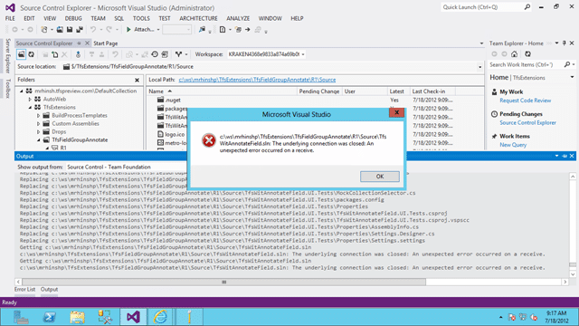
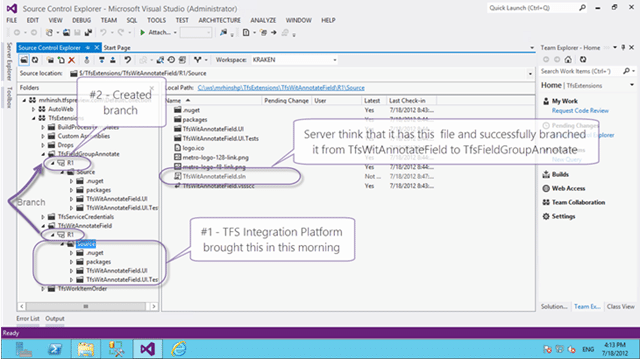
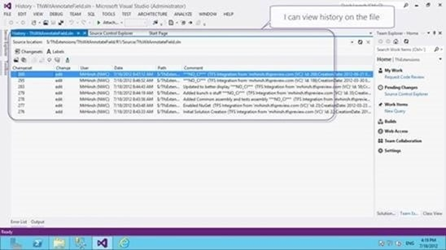

When you try to do a “Get” from TFS Preview you receive a “underlying connection was closed” and often a TF400898.

  
{ .post-img }
**Figure: The underlying connection was closed**

This may happen on one or more files with different files experiencing this problem for different users.

### Applies To

- Team Foundation Service (2012-7 only)
- Visual Studio 2012 RC Team Foundation Server

### Findings

There are a bunch of checks that you want to do in order to make sure that this is indeed a TFS problem and not a local one.

- Restarting VS
- Restarting Machine
- Delete and recreate workspace
- Try on multiple computers

In all circumstances TFS thinks that the file is checked in but that I don’t yet have it locally.

  
{ .post-img }
**Figure: Tfs Preview Lost a file**

I was far more concerned with the fact that TFS can lose a file than in the file that was lost but this is a big complex system and glitches will happen. Its how they are handled that is important.

  
{ .post-img }
**Figure: I can view history on the missing file**

If you find something like this then you need to contact the product team through [http://tfspreview.com](http://tfspreview.com).

### Conclusion

I escalated this to the Product Team and after a few questions and screenshots they investigated and identified a bug in VC subsystem which under certain circumstances can result in deleting files.  Here are the technical details:

> A call to the Upload server call in Dev11 consists of three database calls. Version control is the orchestrator of the operation and it controls these three steps. Steps 1 and 3 are VC steps. Step 2 is owned by the file service.
>
> 1. Pre-upload (prc_PreUploadFile) – checks to make sure the server item ($/…) for which the user is calling is eligible for upload (existence check, etc.)
> 2. Upload – this phase is delegated to the file service. At the end of this call, the row in tbl_File is created and its OwnerId is set to 1.
> 3. Post-upload (prc_PostUploadFile). The row for this item in tbl_PendingChange is modified to get the FileId for the row in tbl_File.
>
> There is no overarching transaction for these three steps. If prc_DeleteUnusedContent runs between steps 2 and 3 above then it will garbage collect the file ID it just created because it appears the file ID is unrooted in VC.
>
> I applied a temporary mitigation to your account through which you should be able to access the file.  Can you please re-try accessing the file and let me know if you still are able to repro the issue now?
>
> We already ported a fix into RTM & will be working on deploying a hotfix to the service on Friday or Monday.  
> \-Madhu Kavikondala

This had now been fixed not just for me, but across both the hosted service and for the TFS 2012 RTM 
{ .post-img }

**Are you having problems with TFS Preview? Don’t sit and fizz… Check the [TFS Preview status](https://tfspreview.com/en-us/support/current-service-status/ "TFS Preview status") or [raise a bug](https://connect.microsoft.com/VisualStudio/feedback/CreateFeedback.aspx).**
