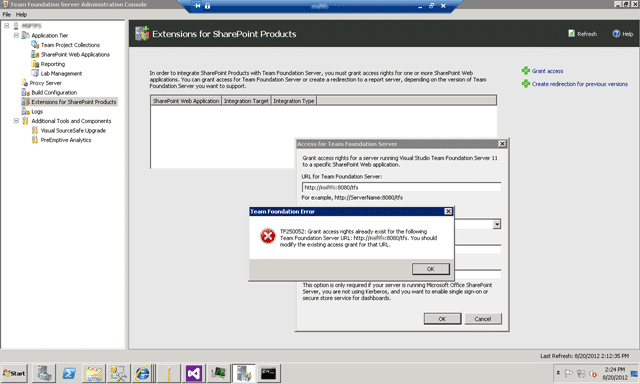

If for some reason you need to re-install SharePoint 2010 as part of your TFS deployment you may get a “TF250052: Grant access rights already exists for the following Team Foundation Server URL: [http://tfs01:8080/tfs](http://tfs01:8080/tfs). You should modify the existing access” but you don’t see anything in the existing list!

  
{ .post-img }
**Figure: Um… where is the existing item and why the TF250052?**

### Applies to

- SharePoint 2010
- Visual Studio 2012 Team Foundation Server

### Findings

Although it is not displayed the previous listing is still there. If you click “Refresh” at the top of the window it will magically appear..

### Solution

Just click “OK” and then “Cancel”. Your display will then refresh with the entry listed! Phew..

**Did this help you?**
