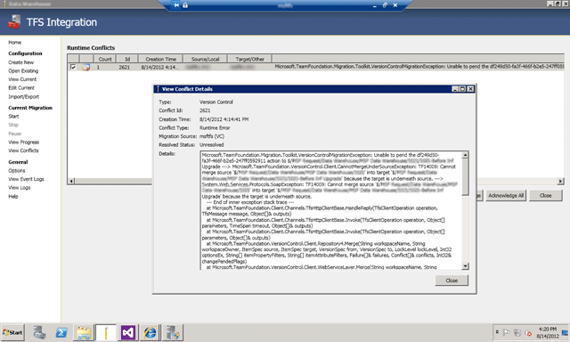
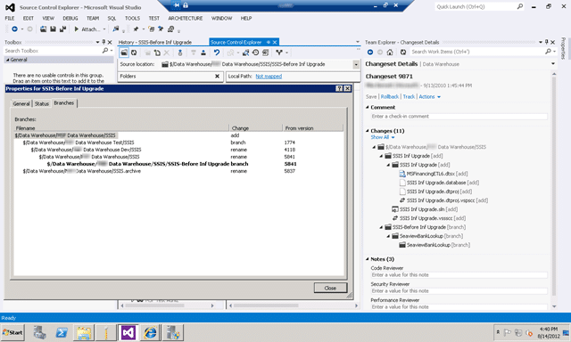
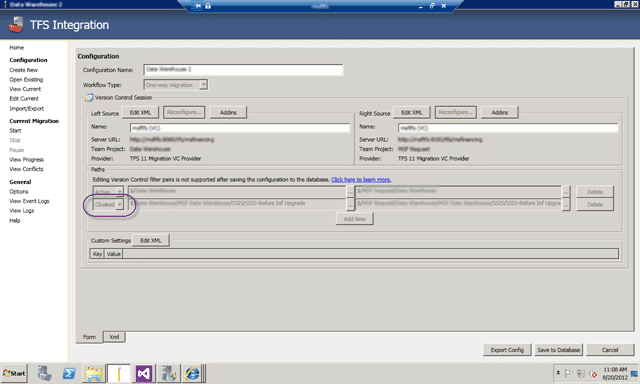

If you are moving source from one team project to another (I am doing a migration of Source Code from “TeamProjectA” to “TeamProjectBTeamProjectA” in the same collection) you can get a TF14009 if there is a bad check-in in TFS from a previous version. In this case  a folder was branched from itself into a sub folder.

[](http://blog.hinshelwood.com/files/2012/08/image56.png)  
{ .post-img }
**Figure: TF14009: Cannot merge source into target because the target is underneath source**

Here is the full error message:

```
Microsoft.TeamFoundation.Migration.Toolkit.VersionControlMigrationException: Unable to pend the df249d50-fa3f-466f-b2e5-247ff0592911 action to $/TeamProject1/Folder1/Folder2 ---> Microsoft.TeamFoundation.VersionControl.Client.CannotMergeUnderSourceException: TF14009: Cannot merge source '$/TeamProject1/Folder1' into target 'TeamProject1/Folder1/Folder2' because the target is underneath source. ---> System.Web.Services.Protocols.SoapException: TF14009: Cannot merge source 'TeamProject1/Folder1' into target 'TeamProject1/Folder1/Folder2' because the target is underneath source.
--- End of inner exception stack trace ---
at Microsoft.TeamFoundation.Client.Channels.TfsHttpClientBase.HandleReply(TfsClientOperation operation, TfsMessage message, Object[]& outputs)
at Microsoft.TeamFoundation.Client.Channels.TfsHttpClientBase.Invoke(TfsClientOperation operation, Object[] parameters, TimeSpan timeout, Object[]& outputs)
at Microsoft.TeamFoundation.Client.Channels.TfsHttpClientBase.Invoke(TfsClientOperation operation, Object[] parameters, Object[]& outputs)
at Microsoft.TeamFoundation.VersionControl.Client.Repository4.Merge(String workspaceName, String workspaceOwner, ItemSpec source, ItemSpec target, VersionSpec from, VersionSpec to, LockLevel lockLevel, Int32 optionsEx, String[] itemPropertyFilters, String[] itemAttributeFilters, Failure[]& failures, Conflict[]& conflicts, Int32& changePendedFlags)
at Microsoft.TeamFoundation.VersionControl.Client.WebServiceLayer.Merge(String workspaceName, String workspaceOwner, ItemSpec source, ItemSpec target, VersionSpec from, VersionSpec to, LockLevel lockLevel, Int32 optionsEx, Failure[]& failures, Conflict[]& conflicts, String[] itemAttributeFilters, String[] itemPropertyFilters, Int32& flags)
at Microsoft.TeamFoundation.VersionControl.Client.WebServiceLayerLocalWorkspaces.Merge(String workspaceName, String workspaceOwner, ItemSpec source, ItemSpec target, VersionSpec from, VersionSpec to, LockLevel lockLevel, Int32 optionsEx, Failure[]& failures, Conflict[]& conflicts, String[] itemAttributeFilters, String[] itemPropertyFilters, Int32& flags)
at Microsoft.TeamFoundation.VersionControl.Client.Client.Merge(Workspace workspace, ItemSpec sourceSpec, String target, VersionSpec versionFrom, VersionSpec versionTo, LockLevel lockLevel, MergeOptionsEx mergeOptions, String[] itemAttributeFilters, String[] itemPropertyFilters, Int32 operationId)
at Microsoft.TeamFoundation.VersionControl.Client.Workspace.Merge(ItemSpec source, String targetPath, VersionSpec versionFrom, VersionSpec versionTo, LockLevel lockLevel, MergeOptionsEx mergeOptions, String[] itemAttributeFilters, String[] itemPropertyFilters)
at Microsoft.TeamFoundation.VersionControl.Client.Workspace.Merge(ItemSpec source, String targetPath, VersionSpec versionFrom, VersionSpec versionTo, LockLevel lockLevel, MergeOptionsEx mergeOptions, String[] itemAttributeFilters)
at Microsoft.TeamFoundation.VersionControl.Client.Workspace.Merge(ItemSpec source, String targetPath, VersionSpec versionFrom, VersionSpec versionTo, LockLevel lockLevel, MergeOptionsEx mergeOptions)
at Microsoft.TeamFoundation.VersionControl.Client.Workspace.Merge(String sourcePath, String targetPath, VersionSpec versionFrom, VersionSpec versionTo, LockLevel lockLevel, RecursionType recursion, MergeOptionsEx mergeOptions)
at Microsoft.TeamFoundation.VersionControl.Client.Workspace.Merge(String sourcePath, String targetPath, VersionSpec versionFrom, VersionSpec versionTo, LockLevel lockLevel, RecursionType recursion, MergeOptions mergeOptions)
at Microsoft.TeamFoundation.Migration.Tfs2010VCAdapter.BatchingContext.pendBranches()
--- End of inner exception stack trace ---
at Microsoft.TeamFoundation.Migration.Tfs2010VCAdapter.TfsVCMigrationProvider.SingleItemError(Object sender, BatchedItemEventArgs e)
at Microsoft.TeamFoundation.Migration.Tfs2010VCAdapter.BatchingContext.OnBatchedItemError(BatchedItem item, Exception exception)
at Microsoft.TeamFoundation.Migration.Tfs2010VCAdapter.BatchingContext.pendBranches()
at Microsoft.TeamFoundation.Migration.Tfs2010VCAdapter.BatchingContext.pendChanges()
at Microsoft.TeamFoundation.Migration.Tfs2010VCAdapter.BatchingContext.Flush()
at Microsoft.TeamFoundation.Migration.Tfs2010VCAdapter.TfsVCMigrationProvider.Flush(BatchingContext context)
at Microsoft.TeamFoundation.Migration.Tfs2010VCAdapter.TfsVCMigrationProvider.ProcessChangeGroup(ChangeGroup group)

```

**Figure: Error log of TF14009**

### Applies to

- TFS Integration Platform
- Visual Studio 2012 Team Foundation Server (from TFS 2008 upgrade)

### Findings

Looking at the actual check-in it looks like both a Branch and an Add was performed at the same time in TFS 2008. This may have been Pre-SP1 where many of these issues were fixed, but it is still biting me now.

[](http://blog.hinshelwood.com/files/2012/08/image57.png)  
{ .post-img }
**Figure: Changeset and Branch relationships**

There does not seams to be an easy solution to this one…

It appears that the customer was a able to pended the new branch and renamed the source branch in the same changeset! This should have been caught by TFS’s internal checks that guard against  getting the system into this state. The Integration Platform may be trying to perform these actions in a different order and thus hitting the TFS 2012 rules.

As the system should not be able to get into this state, I am not sure we want to try and force this branch to be migrated to the target server the same way it is on the source server.

Depending on the requirements of the migration, we could try to:

1. Cloak this path from this particular migration session
2. Destroy the problem branch (if it is a dead branch, that was not used, for instance)
3. Attempt to have the migration tool pend the changes in a different order to get the check-in by TFS (target system would then have this unexpected state)

I would not recommend #3, and #2 removes the data from the Source system. In this case I would go with #1.

### Workaround #1

You can change the mappings while the migration is running by manually changing the XML. The UI will not let you do it as this is an advanced option but if you go to “Edit Current | Xml” you can add the mapping manually.

[](http://blog.hinshelwood.com/files/2012/08/image58.png)  
{ .post-img }
**Figure: Manually adding a cloak to a run**

Find your filter pair mappings and add one for that path that says Neglect=”true”.  Once you swap back to the “Form” tab you should see the new mapping and when you restart the migration the engine will detect the configuration change and will flush all pending migration instructions.

However in my case we had gone too far down the “Resolve” route and we needed to start over. To do that you need to call “tf destroy” to remove the half migrated data from source control and then create a new run with the Cloak already added.

[](http://blog.hinshelwood.com/files/2012/08/image59.png)  
{ .post-img }
**Figure: UI with the Cloak added**

Run again and you will then get your source across. If you want you can then manually move that cloaked folder to complete the data and with it no longer being a branch, our target system is then in a working state.

**Did this help you?**
