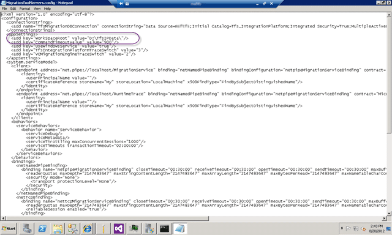

You get error “TF205022: The following path contains more than the allowed 259 characters” when trying to migrate over some folders.

[](http://blog.hinshelwood.com/files/2012/08/image61.png)  
{ .post-img }
**Figure: TF205022: The following path contains more than the allowed 259 characters**

The full error message:

```
TF205022: The following path contains more than the allowed 259 characters:

$/XXX XXXXXXX/XXXXXXXXX XXXXXXXXX/Image Source Files/Promotions/SixZero/XXX
XXXXXXXX XXX-Australia/XX XXXXXXX Materials/XX XXXXXXX web content, banner ads,
and images for localization/Promo XX XXXXXXX Ad Banner and Badge/675x180_XXXXXXX
ads/XXXXXXX_675x180.jpg.

Specify a shorter path.

```

**Figure: OMG that's 264**

You can't make this stuff up!

### Applies to

- TFS Integration Platform

### Findings

The mapped path for the destination TFS server is a might too long. In this case it is 264 (use [http://www.javascriptkit.com/script/script2/charcount.shtml](http://www.javascriptkit.com/script/script2/charcount.shtml) rather than counting manually) and that is just too long for getting data into TFS.

If you end up in this position then you are looking at a manual intervention to fix. Folks that are using these folders can map them at a lower level and you can indeed do that with the Integration Plafrom and achieve the same result. However, you will be left in the same place as they currently are.

1. Perform manual mappings of each folder that is causing problems
2. Manually go a get, clean and checkin.

I am opting for #1 as it maintains my branching and history but the ultimate solution would be to think long and hard about the folder structure that you check into TFS. Its not just a network share and it comes with its own requirements.

### Solution #0

By default the TFS Integration Platform uses “x:TfsIpData” for its workspaces. To gain a few much needed characters you can change this to “x:ipw”.

1. Open “C:Program Files (x86)Microsoft Team Foundation Server Integration Tools”
2. Edit “MigrationToolServers.config” as Admin
3. Edit the AppSettings Value for Key “WorkSpaceRoot”

[](http://blog.hinshelwood.com/files/2012/08/image62.png)  
{ .post-img }
**Figure: Alter the AppSettings Key**

Now you have saved a few characters! Its not enough for me, but may be for you…

### Solution #1

You will need to setup your mappings so that the target is shorter for all folders that end up longer. As you map all of the source and targets or the branches to the new shorter names the merge/branch history is still preserved.

In this case I want to rip out “XX XXXXXXX web content, banner ads, and images for localization” (63) and replace it with “ContentForLocalization”( 22) which will free up 41 characters for the path. If I also shorten “XXXXXXXXX XXXXXXXXX” to “XXX” I get another 16 characters and that I think puts me back into a safe place.

**Figure: Shorten the path in the config**

Now that the path has been shortened the Integration Platform should detect that the config has changed and reset the migration data. The problem is that these errors can be resolved due to a “Sequence contains no matching elements” error.

[](http://blog.hinshelwood.com/files/2012/08/image63.png)  
{ .post-img }
**Figure: Sequence contains no matching elements**

In order to proceed I will need to again recreate the session. Remembering to call “tf destroy” on the source that has already been migrated.

**Did this help you save a few characters from your path?**
