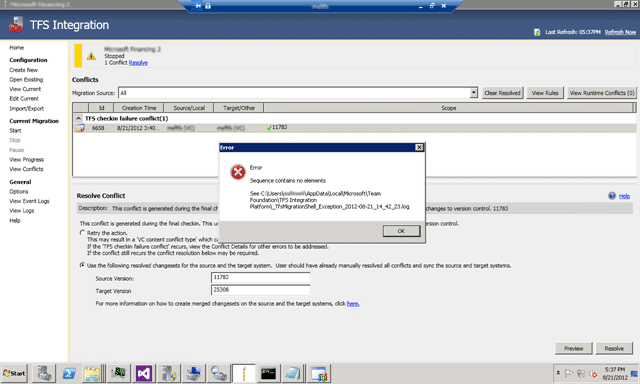
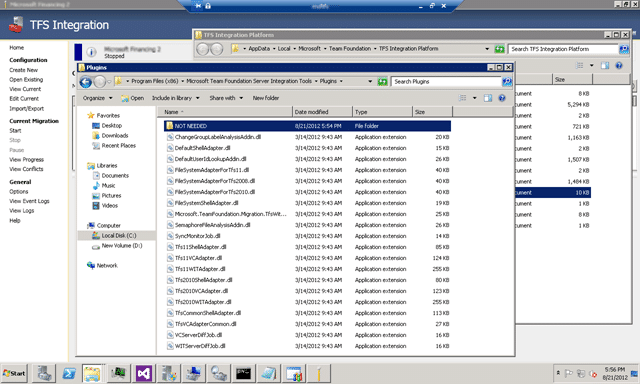

According to [TFS Integration Tools – March 2012 Release](http://blogs.msdn.com/b/willy-peter_schaub/archive/2012/03/20/tfs-integration-tools-march-2012-release.aspx) there was a fix for “Resolving VC namespace conflicts results in System.InvalidOperationException: Sequence contains no elements” in the March release. I am using the March release and:

  
{ .post-img }
Figure: Sequence contains no elements

### Applies to

- TFS Integration Tools (March 2012 Release)

### Findings

On examining the log files it looks like the Migration Shell is trying to load the TFS 2008 VC Adapter even though we are using the TFS 2012 VS Adapter. As I do not have anything to do with TFS 2008 installed I get, as you would expect, an “Unable to load one or more of the requested types”.

> Application Information: 0 : Microsoft.TeamFoundation.Migration.Shell, Version=2.2.20314.1, Culture=neutral, PublicKeyToken=31bf3856ad364e35  
> Application Error: 0 : A failure occurred while trying to load the C:Program Files (x86)Microsoft Team Foundation Server Integration ToolsPluginsTfs2008VCAdapter.dll Plugin:  
> System.Reflection.ReflectionTypeLoadException: Unable to load one or more of the requested types. Retrieve the LoaderExceptions property for more information.  
>    at System.Reflection.Module.\_GetTypesInternal(StackCrawlMark& stackMark)  
>    at System.Reflection.Assembly.GetTypes()  
>    at Microsoft.TeamFoundation.Migration.Shell.Extensibility.PluginManager.DiscoverPlugins(DirectoryInfo\[\] probingDirectories)  
> Application Error: 0 : A failure occurred while trying to load the C:Program Files (x86)Microsoft Team Foundation Server Integration ToolsPluginsTfs2008WITAdapter.dll Plugin:  
> System.Reflection.ReflectionTypeLoadException: Unable to load one or more of the requested types. Retrieve the LoaderExceptions property for more information.  
>    at System.Reflection.Module.\_GetTypesInternal(StackCrawlMark& stackMark)  
>    at System.Reflection.Assembly.GetTypes()  
>    at Microsoft.TeamFoundation.Migration.Shell.Extensibility.PluginManager.DiscoverPlugins(DirectoryInfo\[\] probingDirectories)  
> Application Error: 0 : \[8/21/2012 5:34:01 PM\] System.InvalidOperationException: Sequence contains no elements  
>    at System.Linq.Enumerable.First\[TSource\](IEnumerable\`1 source)  
>    at System.Data.Objects.ELinq.ObjectQueryProvider.<GetElementFunction>b\_\_0\[TResult\](IEnumerable\`1 sequence)  
>    at System.Data.Objects.ELinq.ObjectQueryProvider.ExecuteSingle\[TResult\](IEnumerable\`1 query, Expression queryRoot)  
>    at System.Data.Objects.ELinq.ObjectQueryProvider.System.Linq.IQueryProvider.Execute\[S\](Expression expression)  
>    at System.Linq.Queryable.First\[TSource\](IQueryable\`1 source)  
>    at Microsoft.TeamFoundation.Migration.Toolkit.SqlChangeGroupManager.UpdateConversionHistoryAndRemovePendingChangeGroups(String migrationInstructionName, String deltaTableName, String comment)  
>    at Microsoft.TeamFoundation.Migration.Toolkit.ChangeGroupService.UpdateConversionHistoryAndRemovePendingChangeGroups(String migrationInstructionName, String deltaTableName, String comment)  
>    at Microsoft.TeamFoundation.Migration.TfsVCAdapterCommon.TfsCheckinFailureConflictHandler.updateConversionHistory(MigrationConflict conflict, ConflictResolutionRule rule, IServiceContainer serviceContainer)  
>    at Microsoft.TeamFoundation.Migration.TfsVCAdapterCommon.TfsCheckinFailureConflictHandler.Resolve(IServiceContainer serviceContainer, MigrationConflict conflict, ConflictResolutionRule rule, List\`1& actions)  
>    at Microsoft.TeamFoundation.Migration.Toolkit.ConflictManager.ResolveExistingConflict(RuntimeEntityModel context, ConflictResolutionRule newRule, ConflictResolutionResult defaultResult, RTConflict rtConflict, Guid conflictTypeRefName, Boolean newResolutionRule)  
>    at Microsoft.TeamFoundation.Migration.Toolkit.ConflictManager.ResolveExistingConflictWithNewRule(Int32 internalConflictId, ConflictResolutionRule newRule)  
>    at Microsoft.TeamFoundation.Migration.Shell.ConflictManagement.ConflictRuleViewModel.Save()  
>    at Microsoft.TeamFoundation.Migration.Shell.ConflictManagement.ConflictListView.btnResolve_Click(Object sender, RoutedEventArgs e)  
> Application Error: 0 : \[8/21/2012 5:34:33 PM\] System.InvalidOperationException: Sequence contains no elements  
>    at System.Linq.Enumerable.First\[TSource\](IEnumerable\`1 source)  
>    at System.Data.Objects.ELinq.ObjectQueryProvider.<GetElementFunction>b\_\_0\[TResult\](IEnumerable\`1 sequence)  
>    at System.Data.Objects.ELinq.ObjectQueryProvider.ExecuteSingle\[TResult\](IEnumerable\`1 query, Expression queryRoot)  
>    at System.Data.Objects.ELinq.ObjectQueryProvider.System.Linq.IQueryProvider.Execute\[S\](Expression expression)  
>    at System.Linq.Queryable.First\[TSource\](IQueryable\`1 source)  
>    at Microsoft.TeamFoundation.Migration.Toolkit.SqlChangeGroupManager.UpdateConversionHistoryAndRemovePendingChangeGroups(String migrationInstructionName, String deltaTableName, String comment)  
>    at Microsoft.TeamFoundation.Migration.Toolkit.ChangeGroupService.UpdateConversionHistoryAndRemovePendingChangeGroups(String migrationInstructionName, String deltaTableName, String comment)  
>    at Microsoft.TeamFoundation.Migration.TfsVCAdapterCommon.TfsCheckinFailureConflictHandler.updateConversionHistory(MigrationConflict conflict, ConflictResolutionRule rule, IServiceContainer serviceContainer)  
>    at Microsoft.TeamFoundation.Migration.TfsVCAdapterCommon.TfsCheckinFailureConflictHandler.Resolve(IServiceContainer serviceContainer, MigrationConflict conflict, ConflictResolutionRule rule, List\`1& actions)  
>    at Microsoft.TeamFoundation.Migration.Toolkit.ConflictManager.ResolveExistingConflict(RuntimeEntityModel context, ConflictResolutionRule newRule, ConflictResolutionResult defaultResult, RTConflict rtConflict, Guid conflictTypeRefName, Boolean newResolutionRule)  
>    at Microsoft.TeamFoundation.Migration.Toolkit.ConflictManager.ResolveExistingConflictWithNewRule(Int32 internalConflictId, ConflictResolutionRule newRule)  
>    at Microsoft.TeamFoundation.Migration.Shell.ConflictManagement.ConflictRuleViewModel.Save()  
>    at Microsoft.TeamFoundation.Migration.Shell.ConflictManagement.ConflictListView.btnResolve_Click(Object sender, RoutedEventArgs e)

Well that sucks…

### Workaround

One work around that I found with the help of [Bill Essary](http://blogs.msdn.com/b/willy-peter_schaub/archive/2011/06/03/visual-studio-alm-rangers-champion-awards.aspx) is to remove the “Tfs2008VCAdapter.dll” files from the folder so that they can’t even be loaded.

  
{ .post-img }
**Figure: Get rid of the offending adapters**

1. Create new folder called “NOT NEEDED” under “C:Program Files (x86)Microsoft Team Foundation Server Integration ToolsPlugins”
2. Move all files from “Plugins” that have 2008 in the title to this folder.
3. Rerun action…

**Woot… that solved my issue… did it solve yours?**
