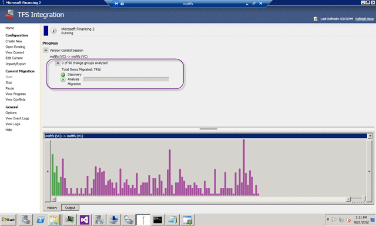
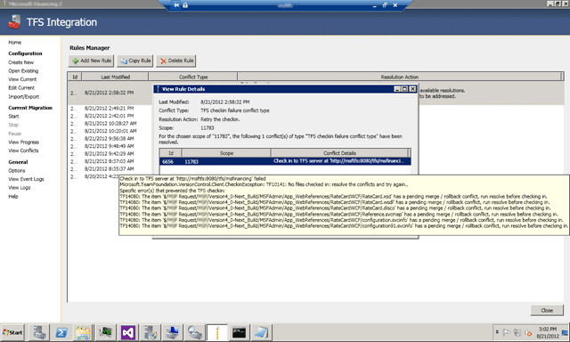
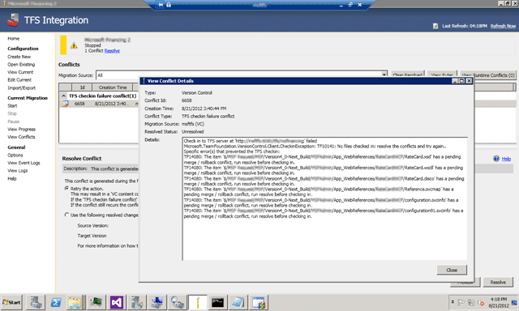
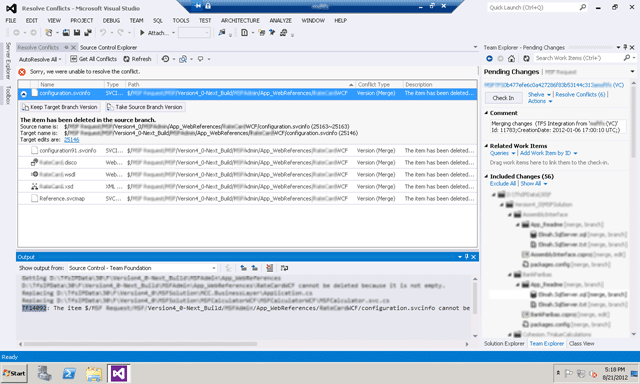

If you encounter a TFS check-in failure conflict type and you try the first option of “Retry the action”.

  
{ .post-img }
**Figure: This conflict is generated during the final checkin.**

The migration exists and you are left with some Purple columns in the UI.

  
{ .post-img }
**Figure: Nice green UI covered with purple crap**

This is followed by a strong sinking feeling after 14 hours of babysitting the migration… there are only 96 items left to go…

- **Update 2012-08-22** – I messed up on the final dialog… thanks to [Jameson Miller](http://www.linkedin.com/pub/jameson-miller/11/90a/257) for spotting this one.

### Applies to

- TFS Integration Tools (March 2012 Release)

### Findings

Your first thought will be to click “Start” and run the migration again and it tells you that there are 96 items to be migrated.

  
{ .post-img }
**Figure: Its going… its going…**

After which you will be greeted with a “your migration was successful”, but don’t be fooled. This migration…. it is lying to you…

You need to look at the logs now, and low and behold:

> Checkin failed - TF14080: The item '$/XXX XXXX/XXX/Version4_0-Next_Build/XXXAdmin/App_WebReferences/XXXXXXXWCF/Reference.svcmap' has a pending merge / rollback conflict, run resolve before checking in.

To start moving forward we need to move back… delete the rule (“View Conflicts | View Rules”) and click “Start” again.

  
{ .post-img }
**Figure: Delete this rule that you just added**

And we end up back at the conflict resolution screen, but now armed with the knowledge that “Retry this action” is not going to work.

  
{ .post-img }
**Figure: See… back to the start…**

Now we need to specifically solve the problem and this problem is a gnarly one. We need to look at what is currently pending in TFS.

  
{ .post-img }
**Figure: Figure out what is conflicting**

Now while you can do this from the command line that is something that I am not comfortable with (sorry… not old enough ) but I can open TFS under that user account and resolve the conflict…
{ .post-img }

  
{ .post-img }
**Figure: TFS Sidekicks to save the day.**

If like me you are command line adverse, then you can install the Team Foundation Sidekicks along with the TFS 2010 API and gain access to the data that you are looking for. In this case it also tells me the Workspace that I need to load…

  
{ .post-img }
**Figure: Load the offending workspace**

Now we need to figure out the problem. To do that we need to look at the offending change and manually resolve the conflicts.

{ .post-img }

**Figure: Woops they are not the same**

This is an issue as the change from the original files is not replicated correctly. This could indeed be a big in TFS, the TFS Integration Platform or both but that small comfort does not help me now…

### Solution

To move past this we need to manually resolve the conflicts and check-in. We can then take the original source check-in and along with the new target changeset resolve the conflict in the Integration Platform.

  
{ .post-img }
**Figure: Resolution causes TF14092**

Attempting to resolve the conflict in favour of the source by clicking “Take Source Branch Version” runs into the same problem that the TFS Integration Platform likely ran into when it was trying to achieve the same result.

> Resolution causes TF14092: The item $/XXX/ cannot be changed. A parent of this item has a pending delete which must be checked in first.

This to me looks like it was because of the order that VC committed items  in TFS 2008 and how it is now committed in TFS 2012. If that is the case then the argument for which service the bug is in could be made either way…

However clicking “Take Target Brach Version” results in a successful merge but will leave those files in source control after the operation. I can however keep track of this additive data and resolve it permanently by deleting them as part of a clean up at the end..

  
{ .post-img }
**Figure: Use the following changesets for the source and target system**

Now that I have manually resolved the issue I can go back to my conflict in the TFS Integration Platform and manually wire up the source check-in to the target one that I just manually checked in…

<warning>

In the context of this Conflict the Source does not refer to the Migration Source as you would think. It relates to the Source of the Conflict instead and in this case it is the “Migration Target”. So the source is the Migration Target and the Target is the Migration Source… and are we confused yet, coz I was!

Reference: [TFS Integration Tools – VC Conflict “A namespace conflict has been detected” … what now?](http://blogs.msdn.com/b/willy-peter_schaub/archive/2012/04/10/tfs-integration-tools-vc-conflict-a-namespace-conflict-has-been-detected-what-now.aspx)

After Jameson pointed this out to me I was muttering like a Pirate that has stubbed his toes for at least an hour…

<warning>

**Did this solve your conflict?**
