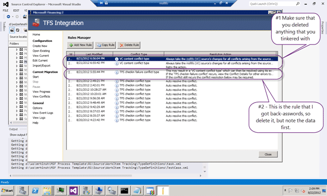
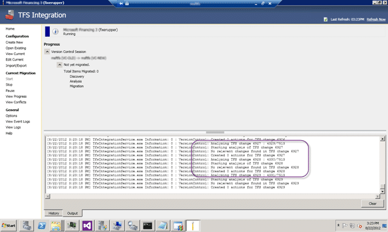
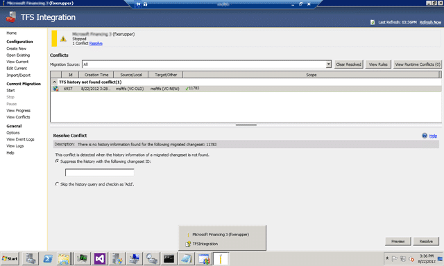
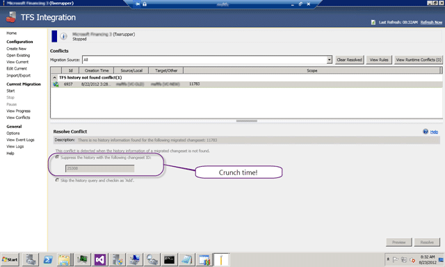
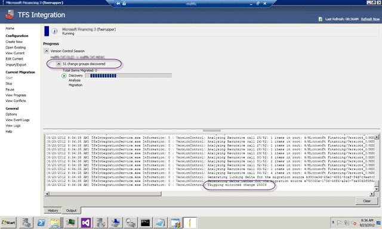
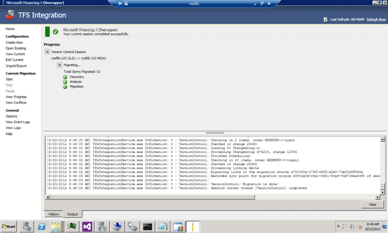

If you say my post on “TFS Integration Tools - Issue: TF10141 No Files checked in as a result of a TFS check-in failure” which I just updated you will know that I messed up the conflict resolution by mixing up the “Source Version” and “Target Version”.

  
{ .post-img }
**Figure: Mixing up the Source and Target context**

Because the context we are talking here is the Conflict and not the Migration the Source Version represents the source of the conflict. Which in this case, as we are completing a checkin is the Migration Target.

> The source is the "Source Version" is the "Migration Target" and the "Target Version" is the "Migration Source". wtf! … WTF!  
> \-MrHinsh upon realisation

So what is the result and how come I realised. Well, after resolving this conflict I re-ran the migration with my figures crossed (did I mention that this was 14 hours into a 14hour migration) and then.. bang…

  
{ .post-img }
**Figure: Conflict after conflict after conflict…**

So now I have ~80 VC Namespace Conflicts and ~40 VC Content Conflicts…

  
{ .post-img }
**Figure: My ineptitude results in many more conflicts**

Now I need to figure out to solve the problem so I am turning to the experts…

After talking at length with [Jameson Miller](http://www.linkedin.com/pub/jameson-miller/11/90a/257), Bill Essary, [Taylor Lafrinere](http://blogs.msdn.com/b/taylaf/), [Curtis Pettit](http://blogs.msdn.com/b/curtisp/) (you need to post more) & [Bill Barnett](http://blogs.msdn.com/b/billbar/)  from Microsoft’s Developer Division and experts on the TFS Integration Tools with some log spelunking thrown in we have an answer.

Because I horked up conflict resolution rule all changes after I entered it are in a conflicted state. So “all” I have to do is undo the rule which will get the TFS Integration Platform to refresh and re-analyse its list of pending changes and I should get back to the original conflict.

  
{ .post-img }
**Figure: Messed up rules to be deleted**

Once I have deleted the offending rules I should be able to “Start” the current migration again and hopefully get back to a state before I messed up the Source / Target things… Aw… dang it…

  
{ .post-img }
**Figure: Nope, no dice with the restart**

There is only one last forlorn hope, from [TFS Integration Platform – I have just moved my VC content, now I want to sync from a specific snapshot … now what?](http://blogs.msdn.com/b/willy-peter_schaub/archive/2010/03/16/tfs-integration-platform-i-have-just-moved-my-vc-content-now-i-want-to-sync-from-a-specific-snapshot-now-what.aspx) that will allow me to create a brand new session, but have it start from Migration Source checkin 11783 and Migration Target checkin 25308 in the target path.

**Figure: New config.. note the Shapshot data**

With the snapshots added to the config we should be good to go… cross your fingers and hope…

  
{ .post-img }
**Figure: Looks ok so far.**

It looks like the Integration Platform is running through its usual and skipping over all of the items before the snapshot. I will not know if it worked until it gets all the way to the end as I only have about 90 changes left to come across…

  
{ .post-img }
**Figure: Arg… nuts…**

Now what, it was supposed to start at 11784 (11783+1) but I don’t know what to do with this strange beast… but after some more confab it looks like it is simply the TFS Integration Tools saying “I did not migrate this! Which changeset is it in the target system?”

If that is the case, then the answer is 25308!

  
{ .post-img }
**Figure: There is no going back now**

And it looks like this was the right choice. I have no idea if it will finish the Migration, but I am now on 25308+1 as it has skipped the mirrored changeset.

  
{ .post-img }
**Figure: Woot it is now re-analysing…**

Wooohooooo…

  
{ .post-img }
**Figure: All of the left over changesets have been migrated**

And thus the padawan becomes the master… or at least… erm… more competent!
