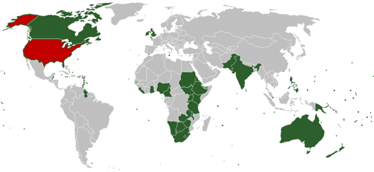
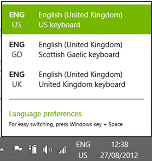

On of the issues that we have had in the office recently is that the rest of the Office, through no fault of their own, speaks and uses American English. I however along with the majority of the English speaking world use British English.

Microsoft have recognised this with the inclusion of Windows 8 (English-United Kingdom) as an edition of Windows that you can install.

[](http://blog.hinshelwood.com/files/2012/08/SNAGHTMLb0f0b01.png)  
{ .post-img }
**Figure: Windows 8 (English-United Kingdom)**

This will then give us the holly grail of Favourite spelled correctly in Windows!

Using the obvious truth of [Wikipedia](http://en.wikipedia.org/wiki/List_of_countries_where_English_is_an_official_language) I make it around **2,121,502,169** people live in countries that have English as their national language and only **309,442,00** of which are American English… give or take…

[](http://blog.hinshelwood.com/files/2012/08/image102.png)  
{ .post-img }
**Figure: Who speaks what where**

Yes, I realise that I am being wholly unscientific and that I currently live smack in that red area, but I just can’t bear to go native where language is concerned. Every time I see an incorrect spelling of “Tire”, “Favourite” or “Serialise” I have and insatiable itch to fix it…

**Macros to the rescue**

Word is easy.. if you want to change the default language all you do is Ctrl+A to select all of the text and change it.

[](http://blog.hinshelwood.com/files/2012/08/image103.png)  
{ .post-img }
**Figure: Changing document language**

Similarly the reverse is true and you can have your bad spelling 
{ .post-img }

PowerPoint is a little more difficult. You need to change it for every shape and there is no way to globally change this. Which does kind of suck, but not is you know macros. So fire up your “Developer” bar, select “Add Code” and create a new module.

[](http://blog.hinshelwood.com/files/2012/08/image104.png)  
{ .post-img }
**Figure: How to get the developer bar**

To that module you can then add the following code.

```
Option Explicit
Public Sub ChangeSpellCheckingLanguageUK()
    Dim j As Integer, k As Integer, scount As Integer, fcount As Integer
    scount = ActivePresentation.Slides.Count
    For j = 1 To scount
        fcount = ActivePresentation.Slides(j).Shapes.Count
        For k = 1 To fcount
            If ActivePresentation.Slides(j).Shapes(k).HasTextFrame Then
                ActivePresentation.Slides(j).Shapes(k) _
                .TextFrame.TextRange.LanguageID = msoLanguageIDEnglishUK
            End If
        Next k
    Next j
End Sub


Public Sub ChangeSpellCheckingLanguageUS()
    Dim j As Integer, k As Integer, scount As Integer, fcount As Integer
    scount = ActivePresentation.Slides.Count
    For j = 1 To scount
        fcount = ActivePresentation.Slides(j).Shapes.Count
        For k = 1 To fcount
            If ActivePresentation.Slides(j).Shapes(k).HasTextFrame Then
                ActivePresentation.Slides(j).Shapes(k) _
                .TextFrame.TextRange.LanguageID = msoLanguageIDEnglishUS
            End If
        Next k
    Next j
End Sub

```

**Figure: Macro to change between English US and English UK**

Now at the click of a button you can change the whole presentation from “Bad English” to “Good English” and back again.

[](http://blog.hinshelwood.com/files/2012/08/image105.png)  
{ .post-img }
**Figure: Change PowerPoint language**

This will help me greatly as I can then write all of my things in the English that I am accustomed to…

[](http://blog.hinshelwood.com/files/2012/08/image106.png)  
{ .post-img }
**Figure: My keyboard settings**

What do you think are my chances at getting the world to switch to Gaelic?
