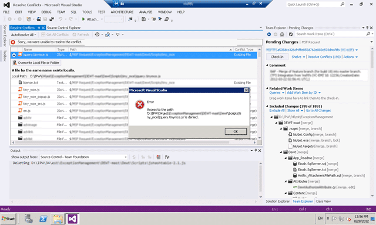
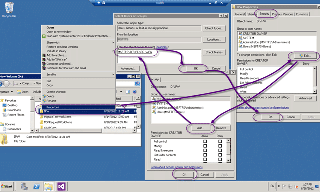

If you change the WorkSpaceRoot in “C:Program Files (x86)Microsoft Team Foundation Server Integration ToolsMigrationToolServers.config” you may get an access to path is denied when manually resolving conflicts as per [TFS Integration Tools – Issue: TF10141 No Files checked in as a result of a TFS check-in failure](http://blog.hinshelwood.com/tfs-integration-tools-issue-tf10141-no-files-checked-in-as-a-result-of-a-tfs-check-in-failure/).

  
{ .post-img }
**Figure: Sorry we were unable to resolve the conflict**

### Applies to

- TFS Integration Tools, version 2.2, March 2012

### Findings

If you altered WorkSpaceRoot  in MigrationToolServers.config because you encountered some path problems then you will not have the correct permissions on the folder.

  
{ .post-img }
**Figure: Permission for TFSIPEXEC_WPG is missing**

This is because when you changed the path the TFS Integration Platform did not add the required permissions to it.

### Solution

Add the TFSIPEXEC_WPG permission to the folder with full rights.

  
{ .post-img }
**Figure: Model dialog galore**

Once you have added permissions you will be able to resolve the conflicts…
