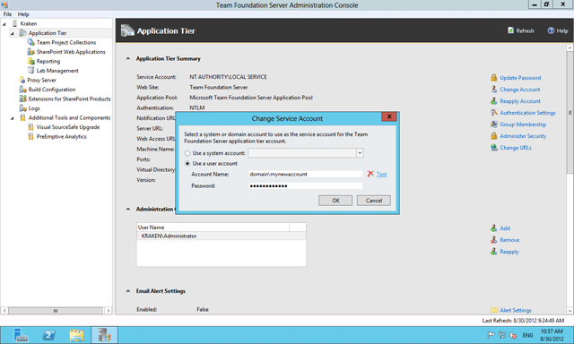

If you have multiple service accounts for TFS 2012 and you are in a corporation chances are that two things are true:

1. **Your accounts are managed out-with your control in Active Directory**
2. **They will expire every 90 days**  
   It is however worth asking your IT department if they can set different expiry rules for service accounts

If these things are true and you work in an awesome origination that his its stuff together you will get an email when they are expiring.

  
{ .post-img }
**Figure: Good example, you get notified when**
{ .post-img }

If you are in an organisation that does not… then you will know when your TFS server stops working . You should review [http://msdn.microsoft.com/en-us/library/ms253149](http://msdn.microsoft.com/en-us/library/ms253149) which will show you all of the service accounts that you might want to look at, but there are 4 main deal breakers to look at: TFS Service Account, TFS Reporting Account, TF Build Account, SharePoint Service Accounts, & SharePoint Secure Cache account.
{ .post-img }

Here is what you need to do:

- [**Change the Service Account or Password for Team Foundation Server**](http://msdn.microsoft.com/en-us/library/bb552178.aspx) 1. Open the admin console on the TFS Application Tier by clicking “Start | Team Foundation Server Administration Console”
          
  { .post-img }
  **Figure: Opening the Admin Console**
      2. Go to “Server | Application Tier | Change Account”

          
  { .post-img }
  **Figure: First change the Service Account**
      3. Enter the new account details

          
  { .post-img }
  **Figure: Add the new username and password**
- [Change the Service Account or Password for SQL Server Reporting Services](http://msdn.microsoft.com/en-us/library/bb552344)
- Change the account or password for Team Foundation Build
      
  { .post-img }
  **Figure: Update the Team Foundation Build Service Account**
      1. Open the admin console on the build server by clicking “Start | Team Foundation Server Administration Console”
      2. Go to “Server | Build Configuration | Properties | Stop the Service | Change…”
      3. Enter the new account details
      4. Start the service again
- [Change the account and password for SharePoint](http://technet.microsoft.com/en-us/library/cc263275)
- [Change the account or password for SharePoint Secure Store credentials](http://technet.microsoft.com/en-us/library/ee806866#section4)
- [Change the account or password for SQL Server](http://technet.microsoft.com/en-us/library/cc263226.aspx)

You will need to go round all of your Team Foundation Application Tiers, Team Foundation Build, Team Foundation Proxy, System Centre Virtual Machine Manager, SharePoint Farms, SQL Server Instances, SQL Server Reporting Services instances and SQL Server Analysis Services instances and make sure that you have changed all of the accounts.

Phew…
