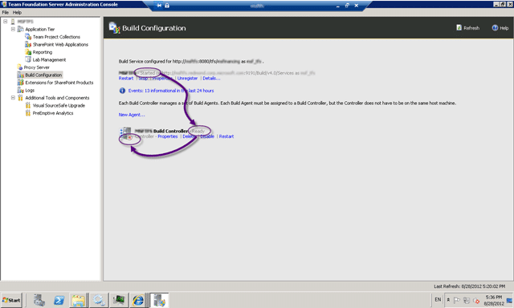
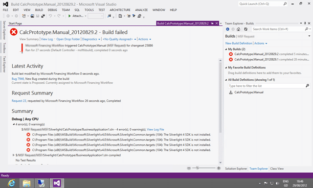

When you queue a build you never get a build number and the build never completes. [](http://blog.hinshelwood.com/files/2012/08/image110.png)  
{ .post-img }
**Figure: Stuck build**

You can see the two previous attempts with no build number.

### Applies to

- Visual Studio 2012 Team Foundation Server

### Findings

If you are having this problem then the first thing to check is the logs…

[](http://blog.hinshelwood.com/files/2012/08/image111.png)  
{ .post-img }
**Figure: Diagnostics has blank logs**

But no… there are no logs to view…

[](http://blog.hinshelwood.com/files/2012/08/SNAGHTML172e6051.png)  
{ .post-img }
**Figure: Nasty red stop sign**

Next thing is to check the controller and see what is going on. In this case the Build Service is in the “Started” state and the Controller is in the “Ready” state, but there is a little red square that I guess signifies “Stopped” on the graphic.

This is a little confusing as it looks like all is well except for the red.

> Please can we make the red square and green play button a tick and a cross so that it is consistent with the rest of the product, or at lease a cross for error, tick for ok and the red stop for… well.. stopped…  
> **\-Suggestion to the TFS Product Team**

As this may have been a problem with this server I moved the controller to the same server as the agents to see what effect this would have. I had been having a bunch of issues with this server and this was part of my “last ditch efforts” though patterns. I did look in the event log, but I did not notice something important.

[](http://blog.hinshelwood.com/files/2012/08/image112.png)  
{ .post-img }
**Figure: Agents and Controllers on a separate server is worse**

At this point I asked for some help and was asked if I had clicked that little “details” button. I had not, face palm, and I did not… low and behold this was a web service problem…now.. I has seen some errors earlier,  but I did not think that they related so time to check the event log with a little more scrutiny.

[](http://blog.hinshelwood.com/files/2012/08/image113.png)  
{ .post-img }
**Figure: http 500 errors smack of IIS or Web Services**

The error logs showed an interesting exception… some kind of WebHost error…

```
WebHost failed to process a request.
Sender Information: System.ServiceModel.ServiceHostingEnvironment+HostingManager/4032828
Exception: System.ServiceModel.ServiceActivationException: The service '/tfs/queue/CollectionA/Services/v4.0/MessageQueueService2.svc' cannot be activated due to an exception during compilation.  The exception message is: This collection already contains an address with scheme http.  There can be at most one address per scheme in this collection. If your service is being hosted in IIS you can fix the problem by setting 'system.serviceModel/serviceHostingEnvironment/multipleSiteBindingsEnabled' to true or specifying 'system.serviceModel/serviceHostingEnvironment/baseAddressPrefixFilters'.
Parameter name: item. ---> System.ArgumentException: This collection already contains an address with scheme http.  There can be at most one address per scheme in this collection. If your service is being hosted in IIS you can fix the problem by setting 'system.serviceModel/serviceHostingEnvironment/multipleSiteBindingsEnabled' to true or specifying 'system.serviceModel/serviceHostingEnvironment/baseAddressPrefixFilters'.
Parameter name: item
   at System.ServiceModel.UriSchemeKeyedCollection.InsertItem(Int32 index, Uri item)
   at System.Collections.Generic.SynchronizedCollection`1.Add(T item)
   at System.ServiceModel.UriSchemeKeyedCollection..ctor(Uri[] addresses)
   at System.ServiceModel.ServiceHost..ctor(Type serviceType, Uri[] baseAddresses)
   at System.ServiceModel.Activation.ServiceHostFactory.CreateServiceHost(Type serviceType, Uri[] baseAddresses)
   at System.ServiceModel.Activation.ServiceHostFactory.CreateServiceHost(String constructorString, Uri[] baseAddresses)
   at System.ServiceModel.ServiceHostingEnvironment.HostingManager.CreateService(String normalizedVirtualPath, EventTraceActivity eventTraceActivity)
   at System.ServiceModel.ServiceHostingEnvironment.HostingManager.ActivateService(ServiceActivationInfo serviceActivationInfo, EventTraceActivity eventTraceActivity)
   at System.ServiceModel.ServiceHostingEnvironment.HostingManager.EnsureServiceAvailable(String normalizedVirtualPath, EventTraceActivity eventTraceActivity)
   --- End of inner exception stack trace ---
   at System.ServiceModel.ServiceHostingEnvironment.HostingManager.EnsureServiceAvailable(String normalizedVirtualPath, EventTraceActivity eventTraceActivity)
   at System.ServiceModel.ServiceHostingEnvironment.EnsureServiceAvailableFast(String relativeVirtualPath, EventTraceActivity eventTraceActivity)
Process Name: w3wp
Process ID: 4756

```

**Figure: WebHost failed to process a request**

The error message talks of “This collection already contains an address with scheme http”, dam but it is pulling a Highlander on me (There can be only one). So lets take a look at the IIS settings…

[](http://blog.hinshelwood.com/files/2012/08/image114.png)  
{ .post-img }
**Figure: There  are multiple host headers on TFS in IIS**

Sure enough there are three entries for http in the bindings. I had seen them before in there but though nothing of it… why would you not be able to add a bunch of host headers to an IIS site!

### Workaround

The web.config for the message queuing web service is in the “Microsoft Team Foundation Server 11.0Application TierMessage Queue” and I followed the instructions to add multipleSiteBindingsEnabled  to the serviceHostingEnvironment element.

```
<serviceHostingEnvironment aspNetCompatibilityEnabled="true" multipleSiteBindingsEnabled="true" />

```

**Figure: Multiple site bindings enabled**

Now when I restart the Team Foundation Build service I get all green “play” graphics. (hope)

Checking the event log shows no new errors and the services still show green. (expectation)

Kicking of a build results in… a build number and a failed build. (elation)

[](http://blog.hinshelwood.com/files/2012/08/image115.png)  
{ .post-img }
**Figure: Build failed… whoop… success…**

While this may be a failed build it is a success for this exercise of getting the build server working…

Thanks to Patrick Carnahan for his help on this one.
