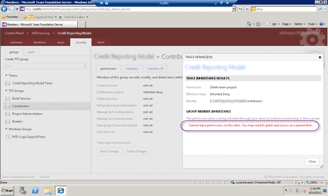
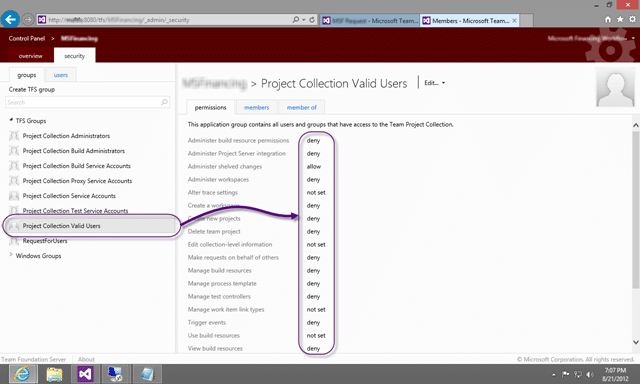

No matter what permissions you set or what permissions you have you get a “TF30063: You are not authorized to access /Services/v3.0/LocationService.asmx” in SharePoint 2010.

  
{ .post-img }
**Figure: Errors on the TFS components**

And you have checked all of the usual suspects and even use the new TFS 2012 permission tracing features to no avail.

  
{ .post-img }
**Figure: Cannot trace permissions on this item**

### Applies to

- Visual Studio 2012 Team Foundation Server
- Microsoft SharePoint 2010

### Findings

I don't know how unique my case is, but if you have searched the heck out of “[TF30063: You are not authorized to access LocationService](http://bit.ly/NzeeoM "http://bit.ly/NzeeoM")” and you still can’t find the issue then it is simple.

You do not have permission to read items in TFS from SharePoint!

  
{ .post-img }
**Figure: Ahhhhhhhhhh**

But I am logged in as the TFS Service account, TFS Administrator account and a SharePoint Farm Admin… how many more permission do I need! Here is the deal… you have a “deny” in your permission list somewhere. Deny takes presidence over any other permission. So if you have a deny high up but an allow lower down then this is just tough… denied. And if it is doing this for all of your users regardless of permissions or groups then I have a suspension that there is some deny high up in TFS. There are only two groups that apply to everyone…

  
{ .post-img }
**Figure: \[TEAM FOUNDATION\]Team Foundation Valid User**

There are two places to look for global deny’s and that is the “Valid User” groups at either the server or at the collection level.

  
{ .post-img }
**Figure: \[DefaultCollection\]Project Collection Valid Users**

In this case we upgraded from Team Foundation Server 2008 to 2012 so any permissions carried over would be at the Collection level, so lets start there…

  
{ .post-img }
**Figure: Really… denied at the Project Collection Level**

I can’t imagine what was trying to be achieved by this… so I will leave you with…

{ .post-img }

