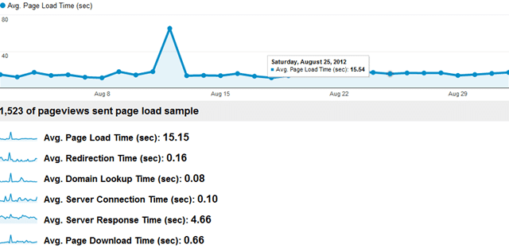
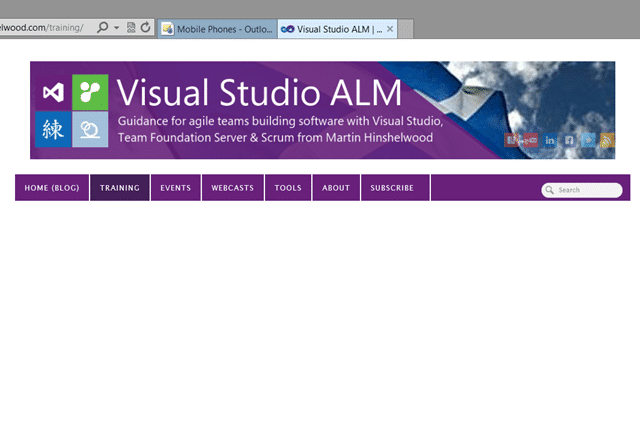

You may have noticed a little down time today. Thanks to the folks who emails to let me now of problems, some I was already on top of… others needed a good poking. The downtime was due to me moving my hosting provider. This blog has had a few homes over the years (my goodness…6 years!) and as it has grown so it has slowed. My site is image heavy and I also make poor choice of plugins in favour of features. It has been a constant annoyance for me that my blog has had abysmal loading times of late.
{ .post-img }

  
{ .post-img }
**Figure: An average of 15s in the last month sucks**

I think you can see my issue… and often I have been hit by shared server syndrome with the only response from support being “someone must be running a process on the server” and “it will probably end soon” with a little bit of “well we cant kill someone else's process!” and I think that was the final straw. If I am on a shared environment I expect my provider to protect me from the other Muppets kicking the box as well as myself.

So my blog has gone through many iteration:

1. **Move from GeeksWithBlogs to Wordpress on DiscountASP.NET ($3 per month)**  
   This was a features issue as I was happy with the speed from GWB
2. **Moved from DiscountASP.NET to GoDaddy ($5 per month)**  
   Unless you want to spring $100 per months for a dedicated server DiscountASP.NET is not good for hosting a production site. It was sllowwww…
3. **Moved from GoDaddy to [WPEngine](http://wpengine.com/?SSAID=687520) ($29 per month)  
   **GoDaddy have a little better support but still with the slow.

And now I have moved to WPEngine. Although they offer a service to move you blog for you for $200, but I am hard-core and wanted to feel the pain myself 
{ .post-img }

But nicely enough the provide some [awesome instructions](http://support.wpengine.com/migration-process/?SSAID=687520) that gave me an almost seamless migration. Luckily I have had to debug crappy plugins doing weird stuff before and I have my own crazy DNS setup that I have had for a few years…

  
{ .post-img }
**Figure: W3 Cache plugin messing up my site**

While there are many awesome plugins you can often have a little trouble with installing, activating and deleting in the right order across a Multi-Site implementation of Wordpress, but there is now hope!

The nice folks over at WP Engine have a list of [disallowed plugins](http://support.wpengine.com/disallowed-plugins/?SSAID=687520) that they absolutely will delete from the site of anyone that implements them. These are plugins that they have identified as just plain sucking form a performance standpoint and I salute them for laying down those terms… we users need protection from the evils that we do not fully understand and this helps a little. So what do I get at WP Engine that I did not get elsewhere?

1.  **Dedicated support for word press and most plugins**
        In the 3-4 hours it took to get all my ducks in a row for moving my site I had 5 support tickets knocked off. Each and every one was answered within 15 minutes and dealt with within 60. Not bad 
    { .post-img }
2.  **Snapshots**

    Going to change some settings? Try something out? Create a Snapshot at the click of a button and have it restored at another click… Awesome.

3.  **Staging Area**

    Going to do something even more dangerous that you are not sure will work? Click the Staging button and WP Engine will create a duplicate of your site for you to practice with. You get one staging area and can over write it any time you like.

4.  **Speed…**

    This is the biggest one for you. Promises for you to have a faster site.

After looking at the list of “disavowed” plugins I decided to kill the ones that I was using on GoDaddy and I got a %50 increases or more on my site just with that. So the following comparison is plugin neutral. Check out the screenie from Google Analytics above for the “before” the great plugin cull of August 2012.

My homepage lists the short form of the posts and has a couple of controls that help folks navigate and has been reduced from 8s to 2s.. that's 4 times faster.

  
{ .post-img }
**Figure: Homepage Before (GoDaddy)**

  
{ .post-img }
**Figure: Homepage After (WP Engine)**

As the aggressive caching kicks in these numbers will only improve, but my Events page, which makes use of a lot of data has gone from 10s to 5 seconds… 2 times faster.

  
{ .post-img }
**Figure: Events page Before**

  
{ .post-img }
**Figure: Events Page After**

And I picked a significantly large post with lots of images to get 6s before and ~2s after… that's nearly a 3 times improvement.

  
{ .post-img }
**Figure: Big post before**

  
{ .post-img }
**Figure: Big Post After**

But its not the number that matter. My blog now feels responsive and I don’t roll my eyes every time I want to view another page. This is what I am happy with…and all of the pain of moving was worth the result..so far 
{ .post-img }
