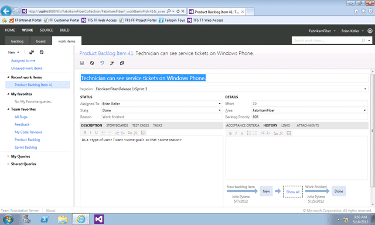
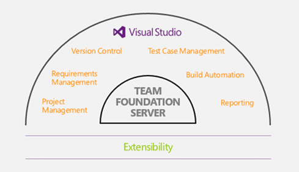
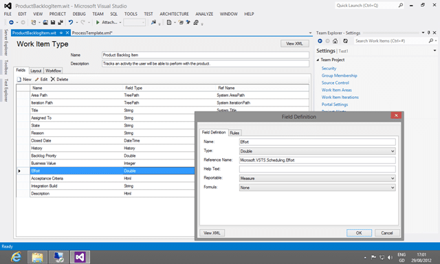
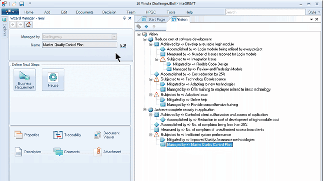

Managing requirements is hard and no single tool can tell you how to achieve that within your organisation. To that end, Visual Studio 2012 TFS stays out of the “where do your requirements come from” world and firmly in the “i have my requirements.. .what now?” world and indeed the tools built on top of the requirement management system stay in one niche.

- Update 2013-01-08 - Featured in [ALM Mag Vol 1 Issue 1](http://blog.hinshelwood.com/files/2013/02/Hinshelwood-ALMMag-Vol1Issue1.pdf). If you want to subscribe to future editions I have a [discount subscription](http://www.member.almmag.com/sales.php?coupon=foundingmember) that you can use.
- Update 2012-09-11 - I have updated the list of tools available

  
{ .post-img }
**Figure: Requirement Management is part of Define / Ideation**

Team Foundation Server aims to become your matter of record or single-point-of-truth for what state your requirements are in, what the details of that requirement are, who is currently working on it and who changed what when.

The system has lists of work item that can have any number of fields with configurable forms and permissions along with many other features out-of-the-box and you can store data against these fields with TFS storing a revision history so we can get back to any version that we like. All users authenticate is some way with a single unified authority so we get [full digital signature traceability through the system](http://www.google.com/url?sa=t&rct=j&q=&esrc=s&source=web&cd=2&cad=rja&ved=0CCkQFjAB&url=http%3A%2F%2Fblog.hinshelwood.com%2Fhow-visual-studio-2010-and-team-foundation-server-enable-compliance%2F&ei=_bU7UIrYIIfiiALryID4BQ&usg=AFQjCNFmVLQ2iTi2XqYLms_BQRgbYYKP6w&sig2=w4hPuSCv18tlH7ba5iNEcg) which allows TFS to fully support and comply with [Sarbanes-Oxley](http://msdn.microsoft.com/en-us/library/gg983694), [FDA](http://msdn.microsoft.com/en-us/library/hh134108) and [PCI-DSS](http://msdn.microsoft.com/en-us/library/hh327801) to name but a few.

  
{ .post-img }
**Figure: Storing data in forms and state transition**

But while Team Foundation Server fully supports that recording and traceability there are only a few tools for figuring out where the requirements come from.

  
{ .post-img }
**Figure: T**raceability** of every change to every field**

### The Problem

The problems that TFS can’t solve for you, and no other tool out there can either, is that creating clear and actionable requirements is hard. Capturing requirements is so hard that most, if not all, software created today does not meet the value expectations of the customer. Part of this is due to a gap between the customers understanding of what was asked for and IT’s interpretation of that requirement but much of it is the inability for requirements to be captured in a timely and well documented fashion.

  
{ .post-img }
**Figure:** [**Code does not meet requirements**](http://thedailywtf.com/Articles/The-Race-Case.aspx)

We need to be able to reduce the requirements definition cycle time and much more effectively capture the details of those requirements so that we can execute. To achieve this we need more than a matter of record and while there are a number of awesome tools out of the box, Microsoft has recognised that it cant be all things to all men, and cant build all tools for all situation. They have encouraged an ecosystem of partners that can fill these gaps and provide value to customers.

### Integration Points for Requirement Management

There are many integration points with Visual Studio 2012 Team Foundation Server but the key here is the TFS API and its flexible Work Item Tracking model. The Work Item Tracking system that contains Work item Type Definitions (Requirement, PBI, User Story, Bug, Task, Test Case, etc.) that have Field Definitions (Title, Description, Effort, Remaining Work, State, etc.) all of which can be customised.

  
{ .post-img }
**Figure: Custom Link Types**

There is a built in linking system that allows not just hierarchical lists, but the ability to create your own bi-directional linking taxonomy. For example the existing process templates contain a “tests / tested by” relationship that allows you to have a directional relationship between a bug and a test case. i.e. a Bug is “tested by” one or more Test Case(s) and visa versa. These links can be between any of the built in artefact types and indeed you can link to your own external artefacts to enable deeper integration with the product.

  
{ .post-img }
**Figure: Team Foundation Server Overview**

The revision history is atomically stored for each change but also allows for merging as long as there are no individual field conflicts. This revision history allows for rich reporting that is configurable for each field and you can set the reportability of each of the fields which enables the data they contain to be visible as a detail in the Data Warehouse for lists or indeed as a Measure / Dimension in an Analysis Services Cube for trend analysis.

  
{ .post-img }
**Figure: Customize Work Item Types**

Because everyone is authenticated the same across all parts of the system you have a single model for identifying an individual, their permissions and their actions. You can add custom fields to an individual Work Item Type Definition or globally to to all Work Item Type Definitions on the Team Foundation Server.

So the Key Integration Points are:

- **Linking**  
   One or more work items in TFS link by unique identifier to one or more items in the partner system but no sync of data takes place or a one-time only sync occurs (copy). This is the
- **Syncing**  
   A copy of the work item data resides in both TFS and the Partner system allowing for tight bi-directional integration.
- **Loading**  
   The partner system does not store any data directly but instead exclusively stores all of its data in TFS.

These integration points represent a tightening of the gap between products and as partner products move from Lining through Synching to Loading they become able to provide a much richer feature set to their users. Products that get all the way to Loading can concentrate on adding value to their customers while not having to build all of the infrastructure required to deliver it.

### Solution: Team Companion from Ekobit (Partner)

If you don’t know Team Companion then you should. It is by far the best of breed in integrating Team Foundation Server and Outlook. It lets your team members and managers that spend their lives in Outlook work with Work Items, manage Sprints / Iteration and report right from the familiar ground of Outlook.

  
{ .post-img }
**Figure: Work Items from Team Foundation Server In Outlook**

By allowing folks to work directly in Outlook the guys at Ekobit have maintained the fluent paradigms from Outlook which manifests in making Work Items “feel” like emails with history and a purpose. In addition you can create Work items form emails and emails from work items with the ability for Team Companion to track that history through both products.

  
{ .post-img }
**Figure: Access you reports**

And its not just work item, you can access both Team Companion real-time reporting as well as surface the reports provided out of the box in TFS.

  
{ .post-img }
**Figure: Even interact with SharePoint**

Just as TFS talks and stored documents in SharePoint so does Team Companion again allowing everyone to collaborate against this single point of truth for all data regarding the product. Team Companion integrates with a hybrid Syncing / Loading interaction that is made possible through adding the capabilities of Outlook and its offline capability to the mix. Yes, you can go offline, update you workl items and sync when you come back online and if you are using TFS 2012 you can take advantage of the field collision model that allows for merging of work item changes. Much more flexible…

I use Team Companion and so should you…

### Solution: Caliber from Borland (Partner)

If you have enterprise teams that require more structure while still allowing teams to decide hoe best to build and deliver the software that they are building then you need a tool that embodies that vision so that it will grow into that space as you do.

  
{ .post-img }
**Figure: Ideation and **traceability** in Caliber**

Caliber is best for organisations that need more viability from inception to delivery of a requirement and especially when there are compliance requirements as there are in many industries. I had the opportunity to meet some of the developers and the tooling and interaction was pretty cool. The are using a “Linking” style integration that allows them to interoperate with multiple systems this gives you the flexibility of Business Analysts using one tool even across multiple development teams building in multiple technologies on multiple ALM platforms. Awesome…

### Solution: Agile Project Management Tools from Microsoft (OOB)

The Product Team is betting on its “Agile Project Planning” tools to support the majority of teams. Most teams are not large and most teams out in the wild either are doing agile or want to be. If you are a team that works in the pure agile world or your want to just start understanding what you have in inventory then vanilla Visual Studio 2012 Team Foundation Server is for you.

These tools fit into the “Lightweight requirements gathering” category and provide an integrated methods od doing Story Boarding that allows you to create animations and shapes to represent your ideation with ease. You can link these documents to Work Items and break them down into something that can fit into a sprint.

  
{ .post-img }
**Figure: PowerPoint Storyboarding**

In addition to story boarding Microsoft has also provides an integrated feedback mechanism to allow someone in the Product Owner role to solicit constructive and rich feedback from their stakeholders.

  
{ .post-img }
**Figure: Constructive Feedback**

These feedback responses are stored in a work item in TFS and can again be broke down into actionable requirements or bugs.

  
{ .post-img }
**Figure: Product Backlog Management**

Once you have a backlog you need to be able to manage it. It is an asset of your project and an unmaintained asset will atrophy and depreciate.

### Solution: InteGREAT from eDev (Partner)

If you want to achieve more Formal Requirements within Team Foundation Server then you should be looking towards eDev’s InteGREAT product. This tool is designed for Business Analysts that want to do formal requirement gathering It integrates well with the new Visual Studio 2012 Agile Planning tools to allow your team to agilely deliver incremental and continuous value while your analysts maintain your vision and processes. It even has questionnaires so that you can get make sure that you always capture all of the relevant information during your analysis.

  
{ .post-img }
**Figure: Manage you Vision**

Being able to draw and maintain your business processes all linked to the individual items being delivered by your software teams is invaluable.

  
{ .post-img }
**Figure: Business Process Diagrams**

Not only that but its built in reporting tools can help you generate the documentation that you require for audit or just to read.

  
{ .post-img }
**Figure: Generate Word documents**

In addition and almost best of all it will allow you to build out all of your pre-identified Test Cases that you can then add to as your teams deliver product.

InterGREAT fills that niche of being able to capture all of the information required, analyse it and present it for teams to effectively execute and deliver. As it links all of the items together and integrates with TFS it reduces the requirements definition cycle by reducing the overall total-cost-of-ownership of your inventory of requirements and the vision that goes into them.

### Conclusion

While TFS has built in support and tools for many situations the front end tools can’t support everyone. They are building their tooling to support the common cause and that common cause is agile. While I have mentioned only four solutions above that are many other solutions like **TeamPulse** from Telerik and **Specklog** from TechTalk and I will be delving into these products in the future.

- **[**InteGREAT** from eDev](http://www.edevtech.com/integreat-ultimate.html)**
- **[**Agile Project Management Tools** from Microsoft](http://www.microsoft.com/visualstudio/en-us)**
- **[**Caliber** from Borland](http://www.borland.com/products/caliber/)**
- **[**Team Companion** from Ekobit](http://www.teamcompanion.com/)**
- **[**TeamPulse** from Telerik](http://www.telerik.com/agile-project-management-tools/)**
- **[**Specklog** from TechTalk](http://www.speclog.net/)**
- **[**PowerStory** from PowerStory](http://blog.power-story.com/2012/09/11/extending-a-great-article-on-using-tfs-for-requirements-management/ "http://blog.power-story.com/2012/09/11/extending-a-great-article-on-using-tfs-for-requirements-management/")**
- [**Requirements Definition & Management** from Blueprint Software](http://www.blueprintsys.com/products/)

  
{ .post-img }
**Figure: 35% are doing agile, 30.6% want to**

More and more organisations are moving towards a more agile approach in order to jumpstart their business to support the constant shift in the market place. As more and more companies become more agile, consumers are coming to expect frequent iterations or they will go else where. This may seam like an attention disorder, but their needs are constantly changing in todays world. As consumers begin to expect this model the rolling affect is that the business community is to. Your customers are also consumers and they want their iPad on the corporate network.

Just look at [Brian Harry’s](http://blogs.msdn.com/b/bharry) recent post on the new [TFS Shipping Cadence](http://blogs.msdn.com/b/bharry/archive/2012/08/28/tfs-shipping-cadence.aspx) and I hope you will see that continuous deliver and the pursuit of tighter feedback loops is an inevitability not an optional exercise or a tend that will go away.

The partners and products above will help you on that road to agility and bridge that gap between what you need to do and what the product does in your particular circumstances. Think of the tools above as extensions of Team Foundation Server tailored to fit a niche and indeed all of the above partner products are shipping simultaneously with Visual Studio 2012.
