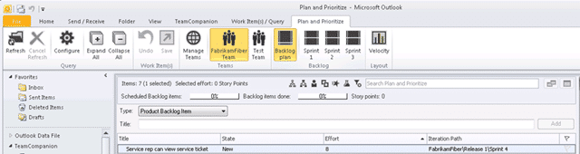

I recently posted on [Requirement management in the modern application lifecycle](http://blog.hinshelwood.com/requirement-management-in-the-modern-application-lifecycle/) and in that post I mentioned a product called Team Companion from Ekobit. Well, to celebrate its 5th anniversary and the launch of Visual Studio 2012 the awesome folks at Ekobit have decided to give away a whole bunch of licences for that fantastic tool completely free! Starting 8am (PDT) tomorrow you will have 3 days to claim your personal copy…
{ .post-img }

  
{ .post-img }
**Figure: New Team Companion theme**

### How do I get my free licence for Team Companion?

There are three ways to get your free licence for Team Companion depending on which social platform is your bivouac. So on Wednesday, September 12th and through that Friday all you need, do is one of:

- Follow [@TeamCompanion on twitter](https://twitter.com/TeamCompanion) and retweet the announcement
- Like [Team Companion on Facebook](https://www.facebook.com/TeamCompanion) and then share the announcement
- Join [Team Companion’s circle of friends](https://plus.google.com/u/0/107769216893251692897) and then share the announcement

Once you have completed the aforementioned task you will be contacted by the nice folks at Team Companion to get the information they need to get you a licence.

### How do I get Team Companion?

Wither you have a licence or not you can download Team Companion for a 90 day trial (3 months is enough time to get addicted to anything) and they have released [TeamCompanion v4.7](http://ow.ly/dCOhp) today.

Team Companion is a fantastic product that I have been using for years in production. It makes that email communication with the customer slick and integrated to TFS with features like “Reply to Work Item” and “Done”. I love it…

