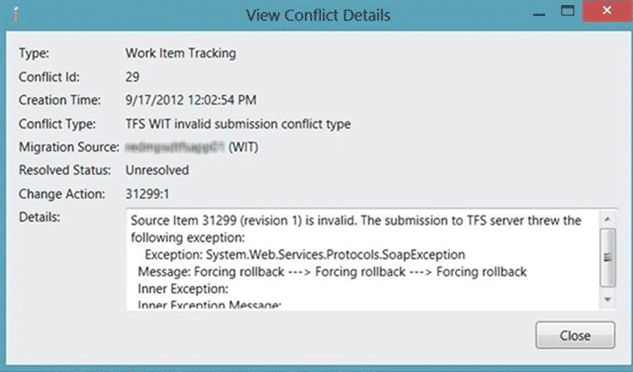
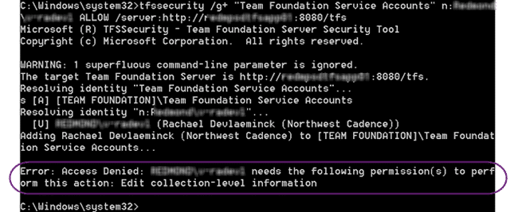

Immediately after configuring the TFS Integration Tools you receive a  TFS WIT invalid submission conflict type that states that the source item is invalid.

  
{ .post-img }
**Figure: The source item is invalid**

There is no further debug information.

### Applies to

- TFS Integration Tools, version 2.2, March 2012

### Findings

While this immediately looks like a problem with the configuration and can indeed be related to [a configuration or date conversation issue](http://blog.hinshelwood.com/creating-a-wit-adapter-for-the-tfs-integration-platform-for-a-source-with-no-history/) if you have just installed the TFS Integration Tools there may be a simpler resolution.

The first thing to do is to enable [TFS WIT bypass-rule submission rule](http://blog.hinshelwood.com/tfs-integration-tools-issue-tfs-wit-bypass-rule-submission-is-enabled/) in the configuration and make sure that your account is in the “Service Accounts Group”.

  
{ .post-img }
**Figure: Access Denied**

If however you get “Access denied” with you account not having “Edit collection-level information” then the account that you are using to access TFS does not have the correct permission.

### Solution

You need to make sure that the account under which you are running the TFS Integration Tools is at least a “Collection Administrator” and preferably a “Team Foundation Administrator”. There are many things that the TFS Integration Tools do that requires this level of permission.

note: I recommend building and testing all of your scripts/configurations against a test server, or at the very least a throw-away collection before you work against production.

You should now be able to successfully run your configuration although I can’t guarantee further errors 
{ .post-img }
