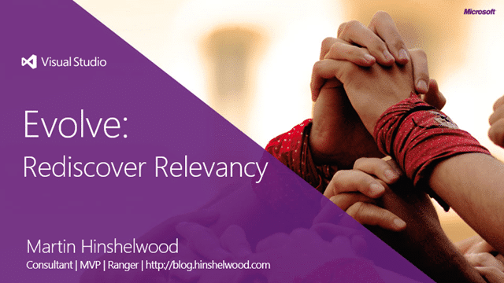

Unless you have been living under a rock you might have noticed [a little launch event](http://www.microsoft.com/visualstudio) recently. Well to complement the launch Microsoft is running a bunch of Visual Studio 2012 Launch RoadShows around the world:

- [**Visual Studio 2012 Launch RoadShow UK**](http://blogs.msdn.com/b/ukmsdn/archive/2012/09/06/event-visual-studio-2012-launch-roadshow.aspx) (Edinburgh | Manchester | London | Reading)
- [**Visual Studio 2012 Launch RoadShow US**](http://blogs.msdn.com/b/dajung/archive/2012/09/20/visual-studio-2012-launch-roadshow.aspx) (Lehi | Tempe | San Diego | Irvine | Mountain View | San Francisco | Portland | Boise)
- [**Visual Studio 2012 Launch RoadShow Netherlands**](http://www.clemensreijnen.nl/post/2012/09/22/Visual-Studio-Launch-Roadshows-and-Workshops-in-the-Netherlands.aspx)

If you are going to be in California around the 9th and 10th of October then you might catch me doing two sessions each in San Diego and Irvine.

### Keynote – Evolve: Rediscover Relevancy

Organizations need to be aware that the New Normal is a world where the Consumer is now in the drivers seat and that the [consumerisation of IT](http://blog.nwcadence.com/consumerization-of-it-and-my-cup-of-coffee/) is rendering yesterday’s development practices obsolete.

  
{ .post-img }
**Figure: Evolve: Rediscover Relevancy**

Have you adapted your development practices and strategies to ensure you are maintaining your relevancy?

### Session – Revolution: The Agile Developer

With this new normal the quality level expected of engineers is much higher than ever before and we need to rise to the challenge. We ill be required to produce better software with quality built in rather than the avoidable expense of testing quality in.

  
{ .post-img }
**Figure: Revolution: The Agile Developer**

The engineering half of the Agile Developer needs tools to help them make life that much easier on their tester alter ego and on the businesses pocket book.

Join me on [9th/10th of October in San Diego or Irvine](http://blog.hinshelwood.com/events/) to usher in a new era of software quality and delivery…
