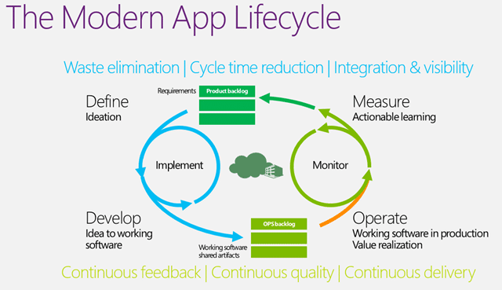
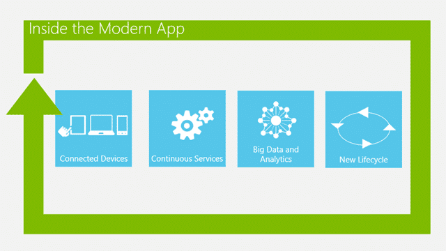
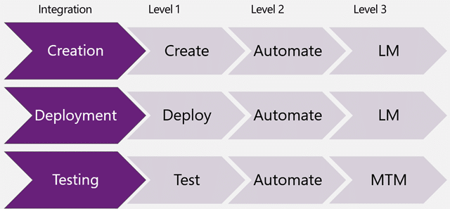

In the world of modern application development we have many more moving parts than we ever did before and it has become increasingly difficult for organisations to effectively simulate their environments with virtual labs.

Add to that the demand from Development Teams to be able to have many times the environments that they ever had before and that they also want the ability to engage with any version of the software being supported. Both Operations Teams and Development Teams are already suffering under the yoke of complexity that modern applications demand and we are now bombarding them with an even greater immediacy of that need. As most organisations move towards delivering software to production at least every 30 days, with the increasing likelihood of continuous delivery both of these teams are ready to implode. While inevitable and required for survival, agility has a heavy price in change for your organisation, people, processes and tools.

Are you ready to rise to the challenge?

  
{ .post-img }
**Figure: Virtual Lab is part of the ALM Infrastructure that make it all happen**

The advent of automated testing and virtualisation has gone a long way to help teams circumvent some of the complexities that building modern interconnected applications has brought. Indeed the Visual Studio 2012 platform has been designed to help these Development and Operational teams take back the team rooms and not just catch up, but get out ahead of the curve and deliver the value that the companies and consumers so desperately desire. Visual Studio 2012 Team Foundation Server has continued to improve and simplify the Development Teams needs by integrating with Hyper-V directly.  However Hyper-V is but one of the many virtualisation platforms available on the market and there is ample room for partners to pick up the slack. Microsoft is putting its skills to work where it is needed most: in enhancing its own platform integration and providing the API’s necessary for partners with expertise and dedication to other platforms to flourish in that space.

  
{ .post-img }
**Figure: The modern application is always connected**

These modern applications that we are envisaging and consumers (including your employees) are demanding are increasingly difficult to simulate as they are:

- **Always on** – There is no safe time to down the servers
- **Accessible anywhere** – Not just global, but any device, any platform
- **high scale data management** – Today you have 10k users, tomorrow its 100k
- **Constantly evolving**  - You will be updating frequently. At least every 30 days..

Enabling these traits successfully without inherent abilities internally is not just tough, it is an impossible challenge.

### The Problems that Virtual Labs solve

There are many issue that Engineering and Operations face on a near daily basis that are massively wasteful and that we should be able to at least alleviate with a clever application of existing and mature technology, however that technology is vastly complex and differs wildly in implementation.

- Plethora of instances
- False Positives
- Automation maintenance

Lets look at each of these in turn.

#### Problem: Plethora of instances

The number of instances that one is required to make available at any one time may be extremely prohibitive for even large organisations; thus inflating the cost of development beyond all sense with the additional equipment and manpower required. If you deploy thick clients to users desktops you may additionally have some varied lag in when those users update to the latest version. This may require that you support more than one version of your systems at a time; and it does not stop there. Lets imagine that you support **vCurrent** and **vLast** but lets say that you have one large customer still on **v**[**Shonkie**](http://www.urbandictionary.com/define.php?term=shonky) then we have 3 environments we need to be able to deploy and test for. What if two of your **vCurrent** customers have special and specific hotfixes (Call them **vCurrent+FlavourA** and **vCurrent+FlavourB**) for their wacky systems and while these hotfixes are just baked into **vNext** you still need to find out when a bug was introduced and how far reaching it is… that's now 6 environments… and we have not even started to count what we need for the Development Team and what about that new patch was in the news breaking everyone's software.

1. Time spent wiping and reinstalling environments
2. Time spent waiting for environments

Not only is this a nightmare for the Development Teams it makes your Operations teams have heart attacks and your customers unhappy with the time it takes to get that new version ready..

#### Problem: False Positives

An issue that you can run into pretty early on, depending on the number of testers that you have, is that of “false positives”. False positives are things that look like a bug to Tester A, but it is in fact the result of an action by Tester B whom is testing in the same environment, neither of which are aware of the issue. You then have two distinct bugs to investigate, plan and ultimately one will get fixed before the other leaving a developer flummoxed around trying to reproduce a bug that no longer exists. These collisions can multiply exponentially as the number of testers increases.

There are a number of areas of waste here:

1. More than one team member is spending time documenting a bug
2. There may be some investigation by the team to figure out how big the problem is
3. Inclusion and understanding of the product owner to effectively order this on the backlog
4. Development Team time in fixing and validating the problem

In the initial bug instance there may be a solid linear resolution of the engineer and tester working together to fix the issue. Additional incidental bugs however can result is substantial waste as the engineer and testers struggle to reproduce a bug that no-longer exists and prove beyond doubt that it does not. Proving a negative is next to impossible.

#### Problem: Automation maintenance

A big issue is the time it takes to create automation and more than that, the time it takes to maintain it once it has been created. The time that it takes to create an automation should be … well… automatic, but the engineering effort that needs to be put into making your automation work against multiple environments can be immeasurable. This substantial effort includes parameterising your data, parameterising your environmental configuration and re-doing / updating everything when your software changes, which if at least every 30 days in the modern lifecycle. Most automation tools allow you to easily generate your automation, but they then force you to spend more effort maintaining that automation with far more skilled workers than you ever envisioned.

There are many external factors that can render current automation efforts ineffectual and expensive:

1. Multiple data sets that require post generation parameterisation of your automated tests
2. Changes in environments and configurations between test runs
3. New features that invalidate tests

While we can never get away from having to redo much of our automation when the product that we are automating changes, we can at least prevent the need to cater for environmental differences that may include DNS, IP Addresses and accounts through ought your entire stack.

### Integration Points for Virtual Labs

There are three main integration points for any Virtual Lab environment to weave itself into the Visual Studio Team Foundation Server systems. We start with Creation move on to Deployment and end up at Testing.

  
{ .post-img }
**Figure: Virtual Lab Integration points**

In each of these flows of integration there are three levels that the vendors can achieve. The first two already exist but the last would require some additional API’s in the product to support. One of the reasons that the team has not built these in is that there are currently no partners trying to integrate at this level.

  
{ .post-img }
**Figure: Team Foundation Server Overview**

Conversely partners need to know what the goal of integration is in order to support modern application development so that they can rise to the challenge and encourage the product team to prioritise those PBI’s that achieve these capabilities.

#### Integration Level 1 (Create | Deploy | Test)

The first stage can  be achieved by any partner in the virtualisation space already. In fact there are a number of partners that have started to even provide level 2 support and still more that provide support for #3 outside of Microsoft Test Manager. However we want to be able to use Test Professional’s Lab Manager and Test Manager to orchestrate and control all of these things. There are some configurations that would by necessity, as one would already have to do with load tests, be outside of the tool although the day-to-day work should be in the tool.

At this level partners would allow a user to:

1. **Create** – Create environments on-demand
2. **Deployment** – Deploy their software to these environments
3. **Testing** – Perform tests from these environments

In #3 above the provider would be able to open a couple of ports to allow the installation and use of Microsoft Test Manager from inside of these environments to push the results of the manual testing back to Team Foundation Server. These are all things that do not require the partner to write a single line of integration for.

#### Integration Level 2 (Creation Automation | Deployment Automation  | Testing Automation)

Once you have the ability to perform the first set of create, deploy and test we can then move onto the automation of those capabilities. We now want to be able to use the orchestration capabilities of workflow within Team Foundation Build to automate the process of spinning up new virtual environments and even deploying ones software to those environments so that I do not need to be present or interact to come into the office in the morning with a deployed and working environment.

1. **Create Automation** – Provide build activities to allow creation
2. **Deployment Automation** – Provide build activities for deployment
3. **Testing Automation** – provide activities for test orchestration

To achieve this the partner can leverage the capabilities of Team Foundation Build provided by Windows Workflow and create Activities that can be slotted into a .xaml build workflow to provide the automation required. And advanced solution from a partner would include full build workflow templates for users to just pick up and use. As part of enabling the deployment automation of #2 the likelihood is that it would be a short leap to the automated testing of #3 as the technology used is identical.

While the partner would need to invest some not insignificant development effort in providing a robust set of Windows Workflow Activities and Build Automation Templates all of the API’s and capabilities are built into the product for them to take advantage of this.

note: The automatic installation capabilities of MTM and Lab Management currently rely on the “File and Print Sharing” API’s in Windows to enable some of the automation. This will not work in the cloud and it is likely that the product team is looking to replace much of this functionality with purpose-built custom extensible framework.

note: Some partners are providing awesome third-party automation tooling that can simulate many users accessing your application. These tools are outside of the Virtual Labs topic but provide tremendous value to the subscribers.

#### Integration Level 3 (Creation via Lab Management| Deployment by Lab Management  | Testing via Microsoft Test Manager)

The third level of integration is, as you can imagine, the tightest of all and would provide the users with a seamless experience whither they are using Hyper-v or some other services as the virtualisation platform. There are many value adds that the individual partners can provide and many of the customers just want things to work out-of-the-box before they take on that additional functionality.

1. **Create from Test Manager**– Provide the MTM hooks to allow it to spin-up and configure your environments
2. **Deploy from Test Manager** – Allow user to deploy a version of their software directly from MTM
3. **Testing from Test Manager** – Allow users to connect to your environment from MTM and run manual tests

The only currently supported virtualisation technology underpinning Lab Manager is Hyper-V, but with the push towards cloud support it does not take a stretch of the imagination to believe that the product team are working to allow support for Azure. In working on this we now no longer have a single, but two interchangeable layers between on-premises and cloud which to me means that the API’s required to have any underlying infrastructure supported would need to exist. This would then open the way for partners to create support for Amazon AWS or Rackspace Cloud and indeed allow for first level support of automation for partners that currently support scale out testing and infrastructure options.

### Solution: Hyper-V (OOB)

The implementation of Lab Management that comes out of the box is with Hyper-V. This is designed for teams building software that is deployed locally on Microsoft technologies. For most teams it will suit there needs even if they are used to implementing VM Ware as this new environment is dedicated to the development teams. You would not expect there to be a copy of TFS that runs on Oracle 
{ .post-img }

The integration of Lab Management and Hyper-V from the product team also augments many of the base capabilities to

- **Creation** – Our environments are packages with many components
- **Snapshot** – A point in time across the board
- **Deployment** – Getting our build output into play

There are additional capabilities provided by the Test Agents and Build Agents of Team Foundation Server but they are not specific to the Hyper-V integration. Indeed you can create “environments” for Lab Management from what Lab Management calls “physical” machines but more accurately is made up of “Unmanaged” machines.

### Solution: Cloudshare

CloudShare are providing the ability to spin up infrastructure and environments for your development & testing needs very quickly with preconfigured environments. These environments may be used for building, unit-testing or functional testing via TFS Lab Manager that allow you to integrate their environments with your local workflow.

CloudShare specialise in SharePoint environments and with the new features coming in Visual Studio 2012 Team Foundation Server Update 1 for CodedUI and Manual Testing in SharePoint 2010 their solution becomes even more relevant. They are currently only offering:

- **Creation** – Manually create environments
- [**Manual Deployment**](http://blog.cloudshare.com/2012/06/18/using-tfs-service-preview-for-sharepoint-team-development-with-cloudshare/) – Deploy from Visual Studio only
- **Manual Testing** – Use Microsoft Test Manager (MTM) to perform tests
- **Automated Test** – Allow automated tests to be run in Visual Studio

These are all currently “level 1” integration features and I am looking forward to tighter integration coming from CloudShare in the future.

### Conclusion

In order to continuously monitor the progress of the project we need to be able to auto-magically build and deploy our software to multiple elastic environments that are then tested before a human being pulled in to either fix an issue or move forward with the known working build. The only way to achieve this is to make software available to Development Teams using virtual images that collect all of the data required to not only monitor the health of our project constantly, but also to have all of the data to hand when a rich actionable bug needs to be created.

This allows us to integrate both the Development and Operations teams to achieve a regularly high velocity while simultaneously reducing the mean time to repair and the operations cycle time. But what does that give us… well it allows us to build more software, faster with a higher built-in quality with less technical debt dragging us down.

- **Hyper-V** from Microsoft
- [**Cloudshare**](http://www.cloudshare.com/)
- **Lab Manager** from VMWare
- **AWS** from Amazon
- **Azure** from Microsoft

I hope that in the near future all of the products above will be able to be plugged into Visual Studio 2012 Team Foundation Server’s Lab Management capability to make them seamless to the development teams. I want to be able to create an environment in Lab Manager and have the backing store be any of the above services.

Are you ready to rise to the challenge of building modern applications?
