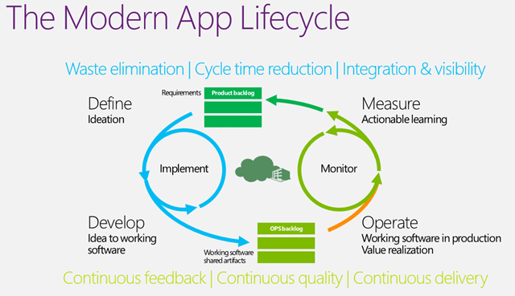
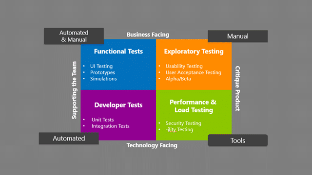

If we are building software in a modern application lifecycle there is no way that we would be able to deliver modern applications without some form of automated testing. Automated testing is the one thing that makes sure that we are able to deliver working software that meets the quality bar while still keeping the cycle time at an acceptable level.

While we spend a disproportionate amount of time in manual testing we also spend an obscene amount of time maintaining and supporting any code automation that we create. These automated tests can represent at least the same amount of code that is required for our application but is often dismissed as an overhead to the solution.

  
{ .post-img }
**Figure: Automated Testing in a modern application lifecycle**

If we have fear of changing our code because of the impact to our testing infrastructure we will always fail to deliver quality software.

### The Problem that automated testing solves

We often have more tests than we can hope to run in a single iteration once we get passed the first initial pass and it is no longer acceptable for software to spend weeks or months in testing before being released. In a modern application lifecycle we tend to have small teams that create more and more tests cumulatively iteration on iteration. To still be able to deliver high quality value to our customers while maintaining the same level of coverage for our application requires automation, ideally we have automation for every test that is now passing. While initially hard, especially if we have an existing application, we need to bite the bullet and accept that it is no longer optional to refrain from contributing to our technical debt and start making bigger repayments.

> Software is an organizational asset and decisions to cut quality must be made by executive management and reflected in the financial statements.
>
> Ken Schwaber in Professional Scrum Master Training

While we need that automation to be a success, we also need to make sure that it is the right sort of automation for the goal. A sure indication that something is not quite right is that you spend too much time maintaining your automation. This usually means that you have not yet surmounted your technical debt gremlins.

  
{ .post-img }
**Figure: How automated testing fits into a modern application lifecycle**

You can find many classifications of automated tests from all over the internet and this is just a simple grouping classification rather than a definitive list:

- **Unit Tests** – Discreet developer tests that exercise a single thing in isolation
- **Integration Tests** – Discreet developer tests that exercise more than one thing working with other things
- **UI Testing** – Indiscreet functional tests that exercise the User Interface directly

The rest are mainly manual or based on highly complex tooling that is run against your software to determine things that can be done better and not on a constant basis.

### The integration of automated testing

The integration with Visual Studio and Team Foundation Server is achieved simply by implementing a Test Adapter to allow your tests to be catalogued and executed from within the Visual Studio Test Runner.

While this looks like a small thing initially, and especially as the code necessary to achieve it is fairly simple, it opens the door for a whole bunch of interactions. First is the ability to surface the pass/fail state of the tests in the Visual Studio Test Runner. This then enables one to have those tests executed either as the result of a user action, or as part of an automated build in Team Foundation Build.

  
{ .post-img }
**Figure: Axe from Odin Tech showing how it is done**

This on its own would be awesome, but then you add the ability to associate any automated test that Visual Studio understands any MS Test Unit Test with a Test Case in Team Foundation Server and you are suddenly able to push those test results into Team Foundation Server and surface them in reporting.

Now we know what tests we have, what the last result was and against which build…

### The solutions for automated testing

There are many way in which to create automated tests and just about as many solutions. You should look for something that is easy to maintain, but don’t be afraid to make changes to your software to allow that to happen.

The value of automated testing is to reduce the effort required by your Development Teams to produce a fully tested version of your software every iteration. As our Development Team is delivering value we need to make sure that we are meeting the criteria by which the customer will accept that the product is complete as well as the engineering assurance that the technical details are correct.

#### Unit Testing

The value in unit testing is to have built in validation that your developer not only created the correct functionality, but that any refactoring work did not impact that existing functionality. Think of it as a safety belt for engineers.

- [**Unit Testing**](http://www.microsoft.com/visualstudio) from Microsoft – Create unit tests in almost any framework and use a unifies test runner to manage and run them all
- [**SpecLog**](http://www.speclog.net/) from Techtalk – Turn your acceptance criteria in TFS into executable specifications that are still legible to the business and synced with TFS.

However you do Unit Testing it is the choice of the engineers as professionals to implement it and not an organisations decision. You cant consider yourself a modern software engineering professional with out having what amounts to executable specification of what the software was supposed to do and thus proving that it does indeed do it with passing Unit Tests.

#### UI Testing

Just as the modern professional engineer does Unit Testing the modern Test Engineer requires to automate all of the testing that they do. While optional in yesteryear there is no way to build modern applications without the kind of UI automation that is readily available. These UI Automation technics either takes the form of generating code from manual tests, or from recording of automation directly against an application and often involves both.

- [**Coded UI**](http://www.microsoft.com/visualstudio) from Microsoft - Coded UI takes Action Recordings from a manual tester and allows an engineer to generate the code required to test and assert that the UI works
- [**Experitest**](http://experitest.com/) - Records tests from mobile devices including Android, iOS, Windows Mobile and Blackberry
- [**Axe**](http://www.axetest.com/) from Odin Software – Stores test steps in Excel, generates automation and connects those automations to Test Cases in TFS
- [**CloudTest**](http://www.soasta.com/products/cloudtest-lite/) from Soasta – Delivers functional test automation capabilities for multi-touch, gesture-based applications.
- [**TestArchitect**](http://www.testarchitect.com/) from LogiGear – Create reusable keyword-based automations that allow testers to build tests like a jigsaw.
- [**Squish**](http://www.froglogic.com/squish/) from FrogLogic  - Create cross platform user interface testing for Java, Windows, iOS, Mac and web.

### Conclusion

Automated Testing is something that is no longer the purview of the larger development shops but part of the basic needs of any organisation building modern software. There is also no one tool to fit all of your scenarios and you may find yourself working with many of the products and solutions listed above. However all of these solutions integrate with both the Visual Studio IDE or Team Foundation Server to give you a consistency of design, execution and reporting that can’t be surpassed by any other product. If you have created your own tools for automated testing for your software then they can be easily incorporated by crating a simple Test Adapter.
