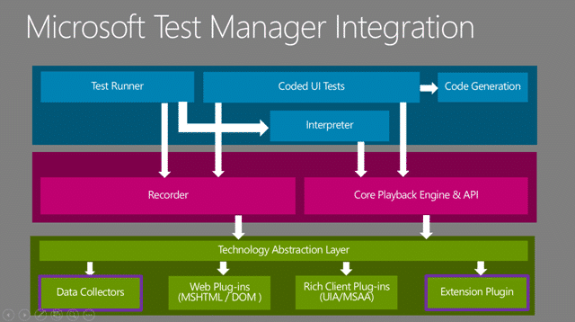
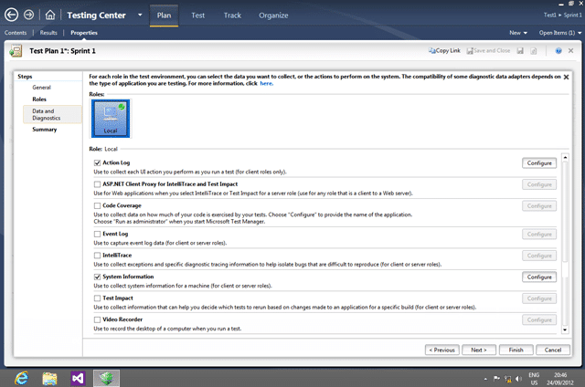
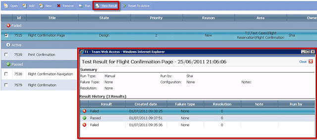

Manual Testing in this new age of the modern application lifecycle has taken on new complexities that make it even more difficult to track and identify which tests are passing, which are failing and to which environment that data should be associated.

- Update 2013-02-19 - Featured in [ALM Mag Vol 1 Issue 2](http://blog.hinshelwood.com/files/2013/02/Hinshelwood-ALMMag-Vol1Issue2.pdf). If you want to subscribe to future editions I have a [discount subscription](http://www.member.almmag.com/sales.php?coupon=foundingmember) that you can use.

As we move into, or you might already be there, the era of agile and the delivery timetable shrinks to only a few weeks we can no longer do all of our testing in isolation. We need to work with the Engineers, Analysts and Operations on Development Teams and effectively swarm to solve the problems. Wither that problem is adding new features, fixing a bug or deploying to an environment it is now in the scope of all the departments and this new world does not recognise even the idea of the silo.

  
{ .post-img }
**Figure: Manual Test makes sure that we build what we need and no more**

It is no longer acceptable to “_test quality In_” as this is far too expensive and we need to move to a model of iteratively “_building quality in_” so that each and every iteration outputs working software that is of releasable quality. The only way to do this is to be able to test, measure and learn with very tight feedback loops…

### The Problem

There are a number of key ailments that when one tries to deliver fully tested software at least every 30 days become  acute problems and blockers. Many teams fail because they do not realise that all of their process will need to change in order to achieve agility of purpose. The three main stumbling blocks are:

- **Where am I?** – What has been tested and what has not
- **Actionable Bugs** – Collecting enough information to reproduce
- **Automation Generation** – Code generation from the recorded data

This things however are not insurmountable, but do need defined.

#### Where am I?

It is hard for testing teams in this new era to even know where they are in the testing cycle. To be honest they found it hard even in the world of linier testing as the shear amount of data collected cam be monstrous. The traditional method would be to have a document that contains the test itself and some sort of spread sheet that allows them to track progress.

But if you have a multitude of flat data sheets to record your test status it is at most impossible and at least incredibly time consuming to formulate any sort of reporting from the desperate data sources. It is hard enough to know which tester is taking which tests let alone which tests have been run against which version of the software under test. This cam make testing incredibly opaque and more of an art than a science.

#### Actionable Bugs

When a bug is found it is eminently more difficult to figure out where it is and what to fix it if you lack even the most basic information on out it came to pass. If we do not have the steps that were followed then reproducing all but the simplest of issues can be impossible resulting in wasted time fro both the developer and the tester as they go back and fourth in a kind of bug ping-pong that gets nothing done.

Reducing the cycle time of bugs is equally hard and the more information that we have we collect during the lead up to the failure greatly increased the likelihood that we will be able to find and fix the issue.

#### Automation Generation

Regardless of finding a test while proving a bug exists or does not, or if that test verifies that a feature now correctly exists if we are to attain agility with quality we need to be able to always run this test. This poses a problem as our tests multiply iteration on iteration and very quickly to a point where we can only pick and choose which tests need to be run.

To combat this it would be awesome if we could take all of the data collected and generate an automation that can be run time and again to verify that we have not broken anything. This automation needs to be easily regenerated so that we do not spend large amounts of time maintaining it in the scope of a continuously evolving  application.

Achieving quality product with ought automation generation can make testing very expensive and can even put the road to “testing quality  in” beyond the means of many organisations.

### The Integration

There are a number of points within which you can integrate your tools with Microsoft test Manager and give users a seamless experience across a multitude of technologies.

  
{ .post-img }
**Figure: Microsoft Test Manager Architecture**

These integration points currently cover two areas, collecting data and recording and playback.

- **Data Collector** – Extending a data recorder
- **Recorder /Playback** – Extend the recording an playback features
- **Test Runner** – Building a custom Test Runner

#### Integration: Data Collector

Microsoft Test Manager provides a bunch of data collectors out of the box for collecting information to both create actionable bugs and to enable the recording / playback functionality. You can create your own data collectors to capture whatever you want as part of the manual test run. These collectors can run on the client or any of the machines under test via the test agent.

#### Integration: Recorder / Playback

Being able to extend the recording / playback functionality means that applications that might traditionally not work with the standard recorder. The standard recorder is based on the same technology that enables a screen reader to work and if those features are not present in the application under test it will fail. To make it work you would need to create an extension that would allow you to for example, testing using Chrome or on a Java application.

#### Integration: Test Runner

There may indeed be the need to replicate a subset of or the entire functionality of Microsoft Test Manager in order to run in environments and systems not currently supported by MTM. This can be done using the rich set of API’s that allow you to import test results and interact with any of the Test Case and Test Result data.

### The Solutions

In order for testers to become first class citizens in the Development Team we need to be able to be able to effectively turn the quagmire that is traditional test tracking into a well oiled repeatable machine that takes all of the mundane tasks away from testers and let them concentrate on validating the delivery of value to the customer.

Microsoft Test Manager provides a framework to achieve this by allowing you to easily:

1. Create and Manage your many Test Cases
2. Build Test Suites out of queries, requirements or manually
3. Execute those test cases and collect data on which tests have been executed against which builds
4. Know and understand your test matrix
5. Collect enough data automatically to be able to reproduce issues
6. Collect enough data to create throw away automation

These things alone would be enough to make it a must have solution, but add to that the integration described above, mix in a few partners and you have the ambrosia of tests management systems.

#### Solution: Microsoft Test Manager from Microsoft

Microsoft Test Manager provides support for some pretty advanced testing technics and while it is limited to Windows host it can be used against almost any application. It has some limitations on unmanaged and java application, but even most old web application can be fully tested. There are some features, like Intellitrace and Test Impact Analysis that are only supported on managed code, but really those are value adds rather than the core reason to move to MTM.

  
{ .post-img }
**Figure: Manage your Microsoft Test Manager Data Collectors**

That said some of the built in data collectors in there are pretty cool:

- **Video Recording** – Simply a video of the test session indexed by step
- **Intellitrace** – like tivo for developers… debugging forward, backward and sideways
- **Code Coverage** – Even for manual test you collect code coverage data
- **System Information** – Windows version, running application
- **Event Log** – Scrape specified events
- **Test Impact Analysis** – log every method hit by your manual test so that we can match that to code paths changed and reduce our test matrix

These features are awesome additions to the platform but they pale in comparison to the cop de resistance which is the **Action Recorder**. The action test recorder allows you to fast-forward you manual tests and gives one the ability to generate Coded UI tests.

  
{ .post-img }
**Figure: Test Manager allows you to manage the Test Steps**

The abilities allow us to both manage our test cases and to record the data, and the test runner allows us to record the results and create actionable bugs. You see all the while that one is executing the tests the data recorders are collecting all of that lovely data and storing it.

  
{ .post-img }
**Figure: Microsoft Test Runner in action**

And if while running one of your test cases you encounter a nasty little bug, you can have a rich actionable bug generated automatically making it easy for developers to isolate and find the problem.

  
{ .post-img }
**Figure: Microsoft Test Runner created Bugs from nowhere**

The tool is in fact that good, as long as you are using managed code. The further you get from the modern development tools the less of these features will be available although you will always get the ability to run test cases and record the data.

This is one of the best test tools in the industry and one of the few that help the manual tester.

#### Solution: Web Test Manager from Sela

In an effort to allow user more flexibility in managing their test cases and to allow your test cases to be run against any environment Sela have created their Web Test Manager which takes the entire Test Runner into the web.

  
{ .post-img }
**Figure: Managing your Plans and Suites from the web**

Not only can you manage your plans and suits but they have also built a platform independent test runner so you can run your tests on Linux and against any browser.

  
{ .post-img }
**Figure: Edit and Run test cases from the web**

And what solution would be complete without the ability to see which tests have been passing and failing.

  
{ .post-img }
**Figure: View test runs and results in the web**

There are still some rough edges, but Sela shows what can be done for testers leveraging the rich data management system within Team Foundation Server that links our Test Runs to Builds and requirements.

### Conclusion

Even if you are only interested in moving away from Excel and Word for your test management Microsoft Test Manager is the best Manual Testing Management system. The integration that it has with build and Work Item Tracking will make it invaluable for those teams seeking to increase their agility. Do not think that these are in any way silver bullets and while the features are fantastic you may need to make subtle changes to your workflow or your software to take advantage of all of the awesomeness.

The ultimate goal is to try and reduce the all to common scenario that we have not met the requirements or that we have not met the users expectations. The Manual Testing tools in Team Foundation Server can help you be providing a framework to have acceptance criteria begin to drive your engineering efforts and more frequently meet your customers expectations and reduce the waste inherent in software development.
