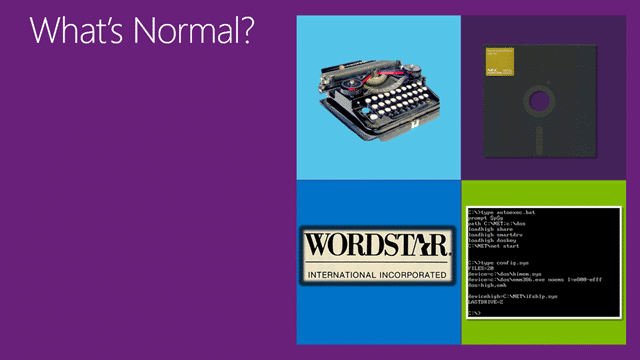
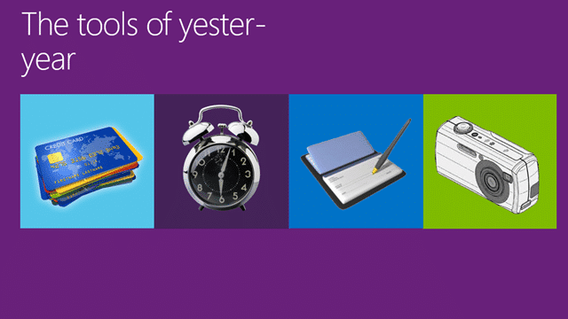
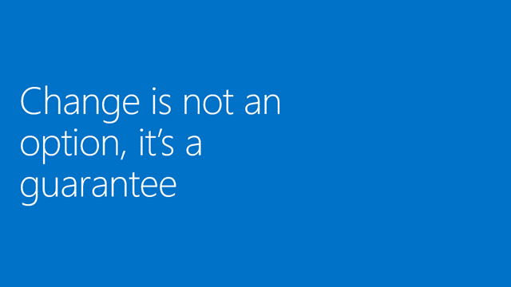
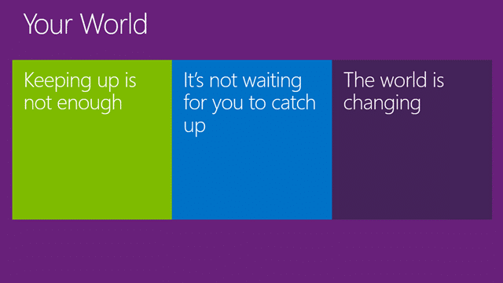
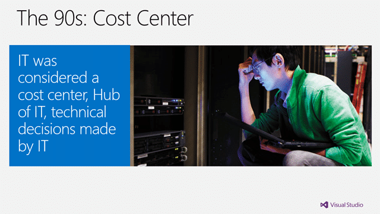
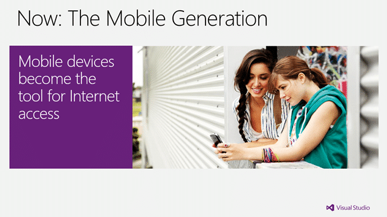
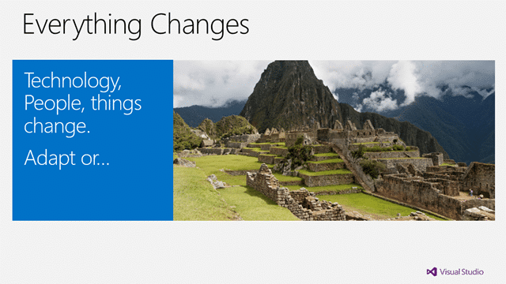
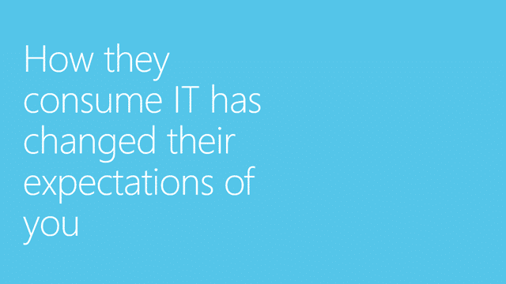
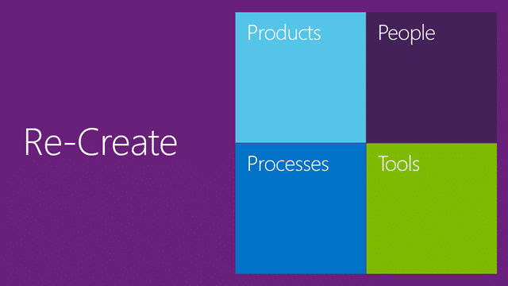
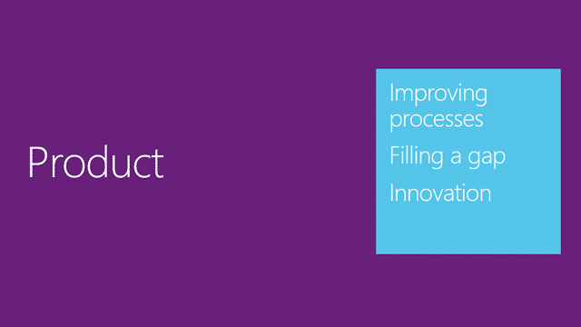

The new normal for software development is the theme for the keynote at the [Visual Studio Launch Roadshows](http://blog.hinshelwood.com/visual-studio-2012-launch-roadshow-in-san-diego-and-irvine/) that I will be speaking at this week I have been doing a little research.

It seams that there is, especially in the USA, an imperative to not push a message that you don’t think that the audience is ready for. Indeed I have heard of a few folks doing the keynote and not believing the message themselves. Well, I do and I also firmly believe that there is value in sowing the seeds of knowledge wherever it is lacking regardless of the likelihood of initial acceptance.

  
{ .post-img }
**Figure: The new normal of the modern application lifecycle**

Where am I going with this? Well, look at the industries efforts to deliver software over the last 60 years. In fact I could be safe in saying that very little software in the last 60 years has been delivered by good process and planning, but instead by herculean efforts of the participants to avoid a death march. What does this tell us about the industry? I think that it tells us that we have our heads dug deep in the sand and are refusing to admit that we suck.

### I am doing agile? Really?

Look at the recent figured quoted by [Ken Schwaber of 80%](http://kenschwaber.wordpress.com/2012/09/23/culture-change-a-new-viewpoint/) of companies “doing agile”. Really! There is no way that 80% of organisations are _doing_ agile, maybe they _say_ they are doing it, but there is more to agility than lip service.

Agile or the permit of agility in your IT organisation is something that is so widely known as imperative to survival that every IT executive worth a paycheck is telling his subordinates that this is what we need. The problem is that there is no strive to commit and achieve true agility and they pay lip service only to the terms and ideals while bastardising and castrating the core concepts making them unworkable for delivering any real value, and then complain when they cant deliver. This is a frustration of all ALM Consultants, Agilest and Process Improvement gurus everywhere.

- [The Decline and Fall of Agilists](http://www.noop.nl/2009/02/the-decline-and-fall-of-agilists.html) by Jurgen Appelo
- [Culture Change: A new viewpoint](http://kenschwaber.wordpress.com/2012/09/23/culture-change-a-new-viewpoint/) by Ken Schwaber

But there are companies out there that are actually changing and being hugely successful for it. Look at the changes rattling Microsoft right now with the demise of the Service Pack and the rise of continuous delivery. Indeed if you have to deliver to production every 3 months where as before you only delivered every two years you need to change to do things a little differently.

- [TFS Shipping Cadence](http://blogs.msdn.com/b/bharry/archive/2012/08/28/tfs-shipping-cadence.aspx) by Brian Harry

Its not just Microsoft that are benefiting for this shift, indeed it is much harder for them than nearly every company on earth as they are a behemoth of and entity. Look at products like Google Chrome that ships continuously to production. I am calling out these apps as they are large applications delivered as thick client apps to local computers that need to work and upgrade seamlessly. Can you do that?
{ .post-img }

The frustrating thing is that the understanding of what needs to be done to achieve agility is still niche knowledge and for many folks the light bulb has not yet gone on.

So instead of talking to companies about agile or lean or even Scrum we need to express upon them the understanding of what in now normal for software and IT teams in this brave new world of consumerisation post iPhone and how it will affect them.

- [Consumerization of IT and My Cup of Coffee](http://blog.nwcadence.com/consumerization-of-it-and-my-cup-of-coffee/) by Lori Borg

Time for a little truth:

> If you can’t deliver software to your customers every 30 days today then you will find it increasingly difficult to compete and keep customers engaged. Within 5 years you will either have adapted your development and release processes or you will be at a significant disadvantage (if not out of the business completely).  
> \-Zephan Schroeder

We have reached a tipping point of change and your are either in, or you are out, and if you are out, you are done.

### The Keynote

And that is the reasoning behind the keynote, but what of the keynote itself. Well, its a “canned” presentation with a specific message that is designed to wrap the themes of the day but I still need to understand and present the content. What follows is what I can only describe as a record of my though processes and what I hope to say and remember. If you can figure it out it may be useful…

#### The New Normal

Its hard to pin down what the new normal is without looking at what normal used to be. Not so long ago if you wanted to type a letter you had to use a typewriter. In fact I learned to type on a typewriter and the keyboard layout  is a direct result of deliberately slowing down the typist so as to not have the letter arms jam.

  
{ .post-img }
**Figure: The old normal had typewriters and 8” floppy disks**

Although my first PC was a Pentium 90 with Windows 95, I had a “Commodore 64” and a “BBC B+ Microcomputer” prior to that. I still remember having to open up my BBC to insert a microchip that gave me the awesome power of word processing. And getting that dos game to work properly on my P90 required manually managing the memory (phew.. I am glad we don’t have to do that any more.)

  
{ .post-img }
**Figure: More modern things on the way out**

There are many more modern things that are either gone, or are on the way out. In the US you can now take a picture of your check to deposit it and If you go to the United Kingdom don’t expect to be writing any checks at all. You can’t pay with them at the store and as banks don’t want to mess around processing them so they charge you extra for having, let alone writing them. You can however transfer money digitally from any account to any other for free.

Do you have a clock by your bed? I don’t… I use my phone… what about a camera? Phone again… and now your credit and debit cards are about to be replaced by… yes.. again, with your phone.

  
{ .post-img }
**Figure: The only constant is change**

From the 70’s with the advent of the microprocessor to the 80’s Personal Computers and the graphical-user-interfaces of the 90 we have made computers smaller and smaller. Laptops became not only common but the standard in the business world of the early 00’s where they totally eclipsed PC sales. Not only has the computer changed dramatically, but how we interact with them and what we do with them has changed. We now carry them, talk to them and play with them, oh how the world has changed. What is it that you have in your pocket but a super-computer by all but the most modern standards.

Other industries are changing along with the computer industry. Look at the way the newspaper, magazine and book industry are struggling to reinvent themselves. Where is Borders? Indeed the TV industry's is still trying to figure out how to compete with Netflix, HULU and Amazon in the aftermath of the ease of peer-to-peer downloads of the last 10 years.

  
{ .post-img }
**Figure: Change is not an option, its a guarantee**

In this new world of the modern application lifecycle change is normal and we can benefit from it. It happens all of the time and we mustn't be afraid of it.

  
{ .post-img }
**Figure: Your world is changing around you**

The world is constantly and continuously changing and it is not going to wait for you. Your competitors are not going to stand still either, they are innovating and are you keeping up?

#### The IT Department in the new normal

The role and scope of the IT department has also changed dramatically over the years.

  
{ .post-img }
**Figure: IT making all of the key decisions was the new normal**

In the 90’s the IT department was considered a cost centre and a drain on any  company resources. In many organisations, especially large ones, this attitude perused it into the early 00’s where IT was the hub of technical decision making and spent a budget that was allocated to them. They made the technical decisions on behalf of the muggles.

  
{ .post-img }
**Figure: Management owning the technical decisions became the new normal**

As we move into the 21st century IT aligned much more closely with their businesses in an effort to reengage and better understand the values of the organisation and deliver on that value. Indeed the technical decision were now driven by management as we saw from the proliferation of the Blackberry throughought the 00’s.

  
{ .post-img }
**Figure: IT driven by customers is the new normal**

More and more organisations are recognising the importance of IT and the software that it delivers to their bottom line. Indeed many organisations are realising that their success is directly attributed to the technology provided by IT and are looking at it more and more as a profit centre rather than the cost centre that they once though it was. Indeed can you name an organisation that could survive without the technology provided by IT?

#### The developer in this new normal

Even the developers role has changed over the last 20 years along with the world of every technologist.

  
{ .post-img }
**Figure: The developer evolved into this new normal**

20 years ago it was the developer that made the technical decisions, designing and building solutions to solve business problems often in isolation. As organisations have matured they have implemented more structure with those same developers beginning to work together with Testers, Infrastructure and business owners to define and deliver the right value.

Today, developers who want to stay in business find themselves working directly with their customers to deliver that value.

#### The consumer in the new normal

What about the consumer, have they changed? They are the ones that are demanding our services and buying our products so they can’t have changed that much can they?

  
{ .post-img }
**Figure: Owning a PC became the new normal**

The 90’s was the time of the rise of the personal computer. By the end of the 90’s more than 51% of households in the US had a personal computer. This was not just the technologists that were buying computers, with over 54 million computers in circulation it was the average person, and this changed the world for ever.

  
{ .post-img }
**Figure: Access to the internet became the new normal**

With access to the internet in the early part of the 21st century becoming commonplace the world seamed to become a much smaller place. The internet brought companies, people and families together and more and more people started shopping online.

This was the birth of the internet generation and with the internet becoming such a fundamental part of our lives it heralded the beginning of the battle between the consumer and IT.

  
{ .post-img }
**Figure: A mobile phone in every pocket has become the new normal**

With a mobile device in every pocket the consumer now has the internet in the palm of their hands and are no-longer tethered to the desk. How many times have you won or lost an argument to Wikipedia within seconds. Around 25% of US internet users are mobile-only and there is an expectation that, as happened with laptops in the early 00’s, mobile internet use will eclipse desktop use within the next two years.

- [The mobile-only internet generation](http://www.slideshare.net/OnDevice/the-mobile-only-internet-generation)
- [Morgan Stanley: Internet Trends](http://www.morganstanley.com/institutional/techresearch/pdfs/Internet_Trends_041210.pdf)

#### Change in the new normal

Things are a changing.

  
{ .post-img }
**Figure: Everything changed and adaption is key**

Technology changes, people change and as things change we can either adapt of become a relic of the past…

  
{ .post-img }
**Figure: Can’t see the forest for the trees**

IT Organisations are focusing so much on what they are doing and the changes that are impacting them that they are not seeing the driving forces behind the change.

This mobile movement is a symptom of a greater driving force behind it and it is veiled behind this and similar symptoms. Sometimes people know exactly what they want, and sometimes we have to show them. The problem is that they want access and they want convenience and they want it their way.

#### The consumerisation of IT

With the successful proliferation of mobile devices and apps, many of which run in the cloud the consumer is now in the driving seat. In fact for the first time ever the technology and internet speed that consumers have at home far surpasses anything that they have in the office.

  
{ .post-img }
**Figure: The consumerisation of IT**

With I.T. becoming much more accessible, meaningful and relevant to the consumer they are embracing it with gusto. With the technology now in the pockets, hands and purses they are feeling empowered as never before.

I.T. has now become consumerised!

  
{ .post-img }
**Figure: Who is the consumer of this new normal?**

The consumer is not just the customer that buys products or services from us, it is also the employees that work for us and use our line-of-business apps. And the hard truth is that…

  
{ .post-img }
**Figure: How they consume IT has changed their expectations of you**

How they consume IT has changed their expectations of you, forever.

- [Wikipedia: Consumerisation of IT](http://en.wikipedia.org/wiki/Consumerization)
- [How to successfully manage the consumerization of IT](http://gigaom.com/2012/01/22/how-to-successfully-manage-the-consumerization-of-it/)
- [The consumerization of IT- The next-generation CIO](http://www.pwc.com/us/en/technology-innovation-center/consumerization-information-technology-transforming-cio-role.jhtml)

This thing that is the consumerisation of IT was a battle waged in secret between the consumer and IT and I am sorry to report that IT lost, completely and dramatically.

The consumer is now driving the changes in our world and they expect much of technology. They have expectations of reliability, mobility, frequent updates and that they can use their own devices. The vast majority of companies already allow employees to use their personal devices at work and on top of that they expect it all to just work.

This is the consumerisation of I.T. …

  
{ .post-img }
**Figure: The New Normal**

… And this is what we are calling “The New Normal”.

#### Staying Relevant in the new normal

In order to be successful you need to remain relevant and in order to stay relevant you need to engage with the consumer in this new normal or you might find your self relegated to obscurity or worse… irrelevance.

  
{ .post-img }
**Figure: Time to reflect & re-evaluate in the new normal**

Although you may be in a strong position in your market the good time never last forever. If you loose your edge and don’t reflect and re-evaluate your position you may end up like Kodak or Blockbuster. Irrelevant in your time with new competitors running rings around you.

You need to look at where you came from, what brought you together in the first place? What was the strength of your people? What were your development practices? What methodologies di you use? What tools?

What was special about you and the way that you did things that allowed you to get to your current position. Is what you are currently doing good enough for the new normal?

  
{ .post-img }
**Figure: Time to re-invent yourself for the new normal**

It is time to get down to some serious corporate evolution and try to keep up with your consumers who are out in front.

Don’t get left behind…

  
{ .post-img }
**Figure: Adapt your product in the new normal**

You need to look at what you do as a business and the purpose of your technologies, your processes and your tools.

If you are creating software that you sell to consumers your success is directly linked to to how quickly you can respond to the market, the new normal.

If however you are building line-of-business applications while they may not be directly linked to your profitability, your consumer, your employees can only be as effective as the software that you deliver for them. If they need to respond to the market then you need to support them in that endeavour be delivering value to them as quickly as possible.

Regardless of who your consumer is the quicker you get value to them the better off your company will be. Your success is about your people, your processes and your tools.

  
{ .post-img }
**Figure: Adapt your people in the new normal**

You need your teams and your consumers to work together to make sure that you are delivering the most relevant value to your business and that your ensure that your products align with the company goals.

You should measure your software teams success in the same way that you measure the success of the consumer, or as close as you can. If you are building software for the public, measure by sales. If you are delivering internally then measure the success of the team by the success of that consumer.

Your warehouse team has measure they need to meet. Should your software teams building the  inventory control system not be measured in the same way?

  
{ .post-img }
**Figure: Adapt your process in the new normal**

Is your software release cycle based on a solar cycle? Are you confident that the software you will be delivering in 6 months time is going to meet the needs of your business in 6 months?

What do your ALM practices look like?  Can your current ALM practices support the “i want it now” mentality that your consumers are now demanding?

In the past we focused on each individual task within your application lifecycle, like Source Control or Testing. In the 21st century, better activities and ideals for software development such as Agile, Scrum, XP and Kanban led to an increase of ALM tools to help manage the development cycle as well as helping you build a methodology that works for you.

In this changing word your software development cycle needs to be much shorter which means you need a greater amount of transparency to ensure adequate quality.

  
{ .post-img }
**Figure: Adapt your tools in the new normal**

In order to be successful at building modern applications you need the right tools, the right process and the right platform.

You must be able to support DevOps to ensure that your systems support it. You must be able to build quality in and not just test it in. You need to be able to work in hybrid environments of on-premises and cloud. And above all you need to be able to support cross-platform which means developing for Windows, Android and IOS.

- [Testing in the modern application lifecycle](http://blog.hinshelwood.com/testing-in-the-modern-application-lifecycle/)
- [Automated Testing in a modern application lifecycle](http://blog.hinshelwood.com/automated-testing-in-a-modern-application-lifecycle/)
- [Deploy from Visual Studio 2012 to iOS, Windows Phone, Android and Windows](http://blog.hinshelwood.com/deploy-from-visual-studio-2012-to-ios-windows-phone-android-and-windows/)
- [Virtual Labs in the modern application lifecycle](http://blog.hinshelwood.com/virtual-labs-in-the-modern-application-lifecycle/)

  
{ .post-img }
**Figure: Evolve – Rediscover relevancy and rise to the new normal**

Now is the time to Rise up and begin the evolution to the new normal

### Conclusion

It has been an interesting journey learning this content and exploring the Launch in a Box and I hope that I can do it justice tomorrow at the [Visual Studio 2012 Launch Roadshow](http://blog.hinshelwood.com/visual-studio-2012-launch-roadshow-in-san-diego-and-irvine/). I will have this in my session tomorrow as well, but you can [sign up to get the decks](http://eepurl.com/qhsTn) that I will be presenting. I will be doing both the “Keynote: Evolve - Rediscover Relevancy” and the “Revolution: The Agile Developer” both in San Diego and Irvine.

