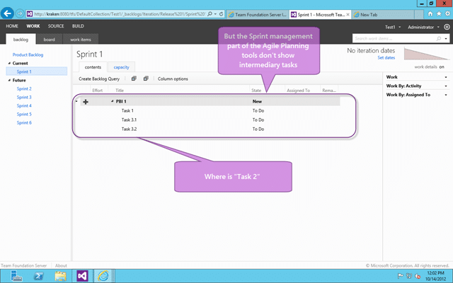

nested-tasks-makes-the-parent-task-disappear
- /blog/tfs-2012-agile-planning-tools-issue---nested-tasks-makes-the-parent-task-disappear
tags:
- agile
- agile-planning-tools
- process
- puzzles
- tfs
- tfs2012
- tools
categories:
- problems-and-puzzles
preview: metro-problem-icon-8-8.png

---
You should use nested PBI’s and never nested Tasks when you are using the Visual Studio 2012 Team Foundation Server Agile Planning Tools and here is why.

At some point you take your “Product Backlog Item” and break it down into sub items as part of your development process. This is part of the creation of a Plan to complete those Backlog Items and that plan reflects the best guess of the Team in what needs to be done to achieve those backlog items.

  
{ .post-img }
**Figure: In Team Foundation Server you can have nested tasks**

In the pursuit of this you may feel that it is a good idea to create nested tasks and using the Work Item Tracking in both Visual Studio and the Web Access you will be able to created these nested tasks.

  
{ .post-img }
**Figure: Agile Planning tools do not support nested tasks the way you think**

However when you view the Sprint Backlog you don’t see the in-between nested tasks, instead you only see a flat list of tasks.

  
{ .post-img }
**Figure: Agile Boards do not support nested tasks**

In addition to the Agile Planning tools the Agile Boards also do not show the intermediary nested tasks.

### Applies to

- Visual Studio 2012 Team Foundation Server
- Visual Studio 2012 Team Foundation Server Update 1

### Steps to Reproduce

You can replicate this fairly easily by following these steps to reproduce:

1.  Add PBI called “PBI 1”
2.  Add child Task to “PBI 1” called “Task 1”
3.  Add child Task to “PBI 1” called ‘Task 2”
    
    { .post-img }
    **Figure: Result as expected with “Task 1” and “Task 2” visible  
     **
4.  Add child Task to “Task 2” called “Task 3”
    
    { .post-img }
    **Figure: Not expected to see “Task 1” & “Task 3”**

### Findings

This is essentially us hitting up against the ideals of the tool. While the Work Item Tracking and Query system built into TFS is designed to handle and sort of work style the Agile Planning Tools are optimised to work with… well… and “agile” flow.

With almost 80% of companies saying that they “do agile” it only makes sense for Microsoft to concentrate on the biggest chunk of customers. If you are not in that 80% then you should take a look at [Requirement management in the modern application lifecycle](http://blog.hinshelwood.com/requirement-management-in-the-modern-application-lifecycle/) for solutions that will fit your needs while still maintaining the data integrity and reporting that is the cornerstone of TFS.

> _Do, or do not…. there is no try!_  
> **\-Yoda**

If however you are really trying this “agile” thing and are running into issues like this with the tool then you may need to change your workflow.

### Solution

If it needs broken down then it is likely not a Task at all, but a Product Backlog Item masquerading as a Task. The best solution is to ask yourself when you are breaking down your “Product Backlog Items” if the unit you are breaking it down into may need broken down further. If it does then it is probably a “Product Backlog Item” and not a Task.

Now while [stack ranking hierarchical work items](http://blog.hinshelwood.com/you-cant-stack-rank-hierarchical-work-items/ "You can’t stack rank hierarchical work items?") makes life difficult and does lead to the dark side, it is supported by the Agile Planning tools and the Agile Boards.

  
{ .post-img }
**Figure: You can see nested PBI’s on the Agile Planning tools**

You will find that when you try to drag the parent into a Sprint you will be prevented and you need to drag the individual PBI’s instead.

  
{ .post-img }
**Figure: You can see correctly the parent is not listed**

This is the same behaviour as we saw on the tasks, but it now makes sense as we no longer care about delivering the parent PBI.

If you break down a Product Backlog Item into more granular Product Backlog Items those sub items should reflect the entirety of the work that needs to be done to achieve the parent and thus rendering the parent superfluous for all but upstream reporting. If you break a Product Backlog Item down into Tasks those Tasks should represent the Development Teams best guess at what actions / work needs to be undertaken to complete that Product Backlog Item.
